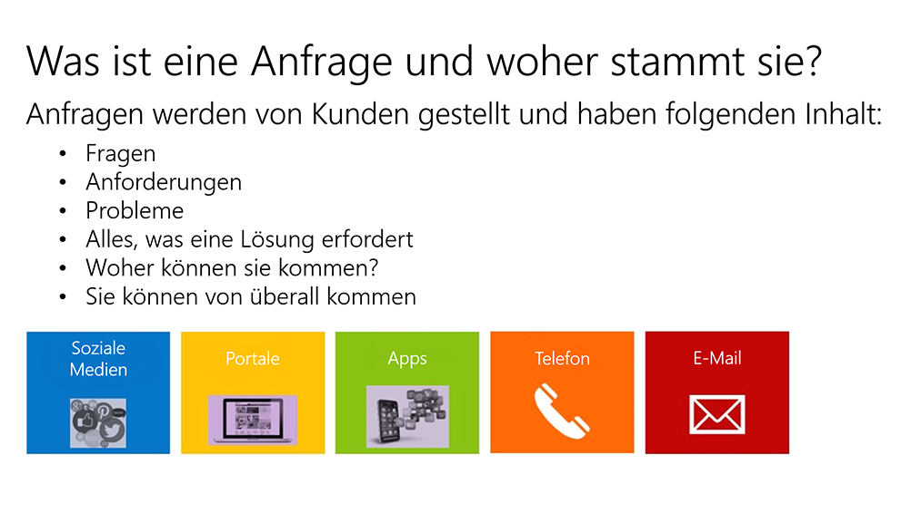

Cases are the fundamental record type in service management, and represent a single incident of service. Organizations may refer to cases using different terms, including *incident*, *ticket*, *service request*, and so forth. A customer can have many cases associated with their record at any time. Within Microsoft Dynamics 365 for Customer Service, users can see opened and resolved cases from the customer record.
 
Cases can also have knowledge base articles, subjects, products, and entitlements associated with them as related or dependent *record types*. In addition to these related entities, cases can have *activities* (such as any communication records) associated with them so that everyone in the organization can see what is happening with a case.

## Case Management and key performance indicators
By understanding how your organization measures success with customers, you gain insight into core priorities and drivers. Only then can you understand what data modeling, security requirements, and customization must be done for case management.

Although every organization focuses on different items as part of its practice, here are some of the more common key performance indicators (KPIs) for customer service:

- **First Contact Resolution (FCR)**: FCR tracks how often an organization correctly addresses customer needs the first time a customer calls, so that the customer doesn't have to follow up with a second call.
- **Net Promoter Score (NPS)**: NPS is a management tool that can be used to gauge the loyalty of an organization's customers.
- **Customer Satisfaction (CSAT) and Customer Effort Score**: These scores describe many types of customer service survey questions. The goal of any CSAT score is to measure a customer's satisfaction level with a company's product. Customer Effort Score measures how much time and effort the customer spent getting an issue resolved. Customers aren't usually happy if they spend too much time resolving an issue. Customer Effort Score is a strong indicator of future customer loyalty.
- **Cost per Contact**: Cost per Contact is a call center metric that's calculated by dividing the total operational costs by the total number of calls for a given period (or the average, broken out by channels).
- **Wait Time and Backlog metrics**: Wait Time indicates the average time that customers spend on hold as they wait for an agent to take their call. Backlog metrics track the number of open cases or tickets for any period.
- **Average Handle Time**: Average Handle Time indicates the average duration of one transaction. Duration is typically measured from the customer's initiation of the call, and includes any hold time, talk time, and related tasks that follow the transaction.

## Work with case activities
Activities can be used to manage and report on interactions with customers and potential customers, like accounts, contacts, and leads. Activities can also be associated with most other record types in Customer Service, including cases.

Here are some examples of activities:

- E-mails
- Phone calls
- Appointments
- Faxes
- Service activities
- Campaign responses
- Letters

In addition, users who have the correct security privileges can create custom activity types. 

Sometimes, an activity already contains the information that's required to create a case. In these cases, it's easier to convert that information into a case than to create a new case and re-enter the information.