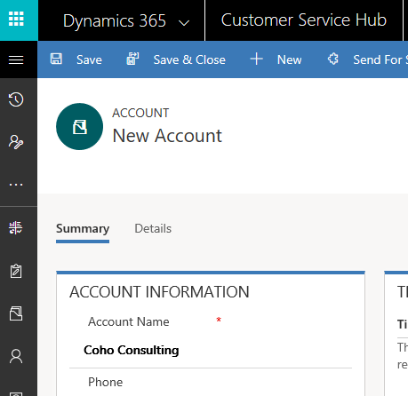
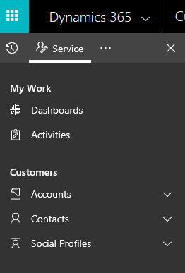
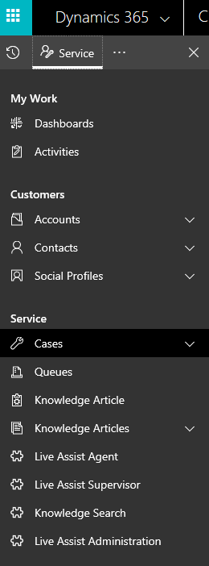
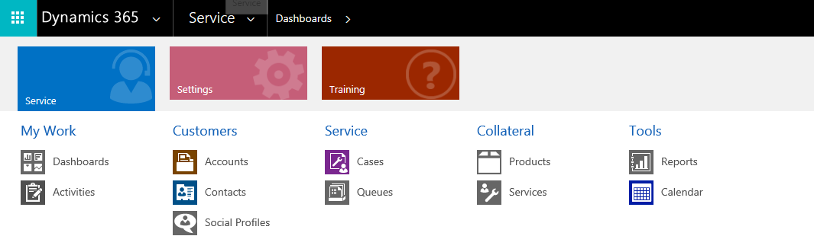
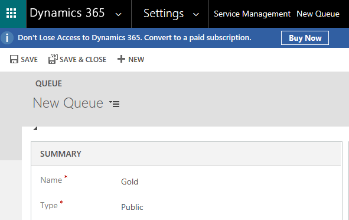

This lab will take you through the fundamentals of Dynamics 365 for Customer Service. After you complete the tasks in this lab, you'll be well on your way to helping your customers find solutions to issues with products and services.

For the following scenarios, you must have a trial experience or full instance of [Customer Service](https://trials.dynamics.com/Dynamics365/Signup/service).

You must also be a member of the Customer Service Manager or Customer Service Representative role, or equivalent permissions. [Find out if you have the correct permissions](https://docs.microsoft.com/en-us/dynamics365/customer-engagement/basics/view-your-user-profile).

## Scenario
All the following scenarios are based on the following premise. HCL is a professional services company, and most of its profits come from the support services that it offers to its customers. HCL offers help desk services to its customers during regular business hours, from 8:00 AM to 5:00 PM. For preferred customers, it offers 24/7 support.

Preferred customers are divided into three levels:

- **Gold**: These highest-priority customers are guaranteed a 15-minute response time.
- **Silver**: These customers are guaranteed a callback from a customer service representative within one hour.
- **Bronze**: These customers are entitled to 24/7 support and a two-hour response time.

HCL has identified two areas where it wants to focus its attention: 

- Each customer service representative should have a centralized dashboard that shows the representative's daily workloads. The dashboard should include the following information:

    - A list of all the open cases that are currently assigned to the customer service representative
    - A list of all the open activities that are assigned to the representative 
    - Cases by origin
    - Cases by priority

- Representatives can take cases from either new or existing customers. Before creating a case, representatives should be able to easily identify if the customer is new or existing:

    - If the customer is an existing customer, representatives can create the case directly.
    - If the customer is a new customer, representatives must first create a new record for the customer. They can then create a case for the customer.

### Scenario one: Create a new account

A new customer named Wendy Smith, who works for Coho Consulting, has just called HCL about the following issue:

- A network backup from the previous evening failed. 

Tasks to complete for this scenario:

1. Add a new account for Coho Consulting.
2. Add a contact record from Wendy Smith to Coho Consulting.
3. Create a new case for Coho Consulting. 

**Add a new account for Coho Consulting**

1. In the Customer Service Hub, go to **Service**, and then select **Accounts**.
1. On the command bar, select **New**.
1. Fill in information about the account.
1. Select **Save**.

   

**Add a contact record for Wendy Smith to Coho Consulting**

1. Find the **Contacts** table.
1. Select the plus sign (**+**) to add a new contact.
1. Fill in the contact information.
1. Select **Save**.

   

**Create a new case for Coho Consulting**

1. Go to **Service** &gt; **Cases**.
1. Select **New Case**.
1. For **Case title**, enter *Network Backup Failed*.
1. For **Customer**, enter *Coho Consulting*.
1. For **Contact**, enter *Wendy Smith*.
1. For **Origin**, enter *Phone*.
1. For **Priority**, enter *High*.
1. Select **Save**.

   

### Scenario two: Add detail to a case
HCL generally bills its customers based on the total amount of time an agent spends on a call. The total time spent is a summary of all the activities attached to a specific case. As agents work through calls, it's important that they document all activities that are related to a case.

After doing some research, the agent identifies that the customer's issue occurred because the previous day was a holiday. Because of the holiday, the previous backup media wasn't replaced. The backup job won't overwrite media that was written to in the last 48 hours.

Because no business was conducted on that day, the agent can skip the backup job.

Tasks to complete for this scenario:

1. Add a task to the case for an incoming phone call activity from Wendy Smith.
2. Add a task to the case to be performed by the agent.
3. Add an outgoing phone call activity to the task named *Inform Wendy of Resolution*.

**Add a task to the case for incoming phone call activity**

1. On the **Activities** tab in the center, click **Add Phone Call**.
1. Set the duration to 15 minutes.
1. Add the following note: *Initial call from Wendy to report the discovery of a failed backup*.
1. Select **OK**.

**Add a task to the case to be performed by the agent**

1. On the **Activities** tab, click the ellipses (**...**).
1. Select **Task**. 
1. Set the duration to 30 minutes.
1. Add the following note: *Because it was a holiday, the previous backup media wasn't replaced. The backup won't overwrite media that was written to in the last 48 hours*.
1. Select **OK**. 

**Add an outgoing phone call activity**

1. Find **Activities**.
1. Select **Add Phone Call**.
1. Set the duration to 15 minutes.
1. Add the following note: *Called Wendy to inform her of the resolution*.
1. Select **OK**. 

### Scenario three: Resolve a case
After a case is handled and completed, the agent needs to resolve the case. To resolve a case, agents must note what they did on the case. Agents must also account for the time they spent working on the case activities.

Tasks to complete for this scenario:

1. Make sure all case-related activities are completed.
2. Resolve the case.

**Mark all case related activities complete**

1. Open each activity on the case. Make sure all case-related activities are completed.
1. Select **Mark Complete**.

**Resolve the case**

1. On the command bar, click **Resolve case**.
1. In the **Resolve Case** dialog box, in the **Resolution Type** list, select how the case was resolved. 
1. In the **Resolution** box, type a short explanation of the resolution. 
1. Select **Resolve**.

### Scenario four: Route a case
HCL needs four queues that can be used to route cases for agents to work on:

- Gold 
- Silver 
- Bronze 
- Standard 

When a new case is created, the service level must be captured on it. Based on the service level, the case will automatically be routed to the correct queue. Here are the rules that must be created to do the automatic routing: 

- Route any cases with a service level of Gold to the Gold queue.
- Route any cases with a service level of Silver to the Silver queue.
- Route any cases with a service level of Bronze to the Bronze queue.
- Route any cases that don't have a service level defined to the Standard queue. 

Tasks to complete for this scenario:

1. Create the queues.
2. Create the rules.

**Create the queues**

Create four queues in the application: Gold, Silver, Bronze, and Standard.

1. Go to **Settings**, and then select **Service Management**. 
   
1. Select **Queues**.
1. Select **New**.
1. Enter the name of the first queue.
1. Select **Save**.
1. Repeat steps 3 through 5 for each additional queue you need to create.

    

**Create rules**

Create routing rules that route cases to the appropriate queues, based on the service level of the case. 

1. Go to **Settings**, and then select **Service Management**.
1. Select **Routing Rule Sets**.
1. Select **New**. 
1. Select **Rule Case Routing**.
1. Select **Save**. 
1. In the **Rule Items** section, select **Add Rule** to specify conditions for routing cases to a queue. 
1. In the **Rule Item** form, type a descriptive name for the rule item. For example, type *Gold*.
1. Under **Rule Criteria**, in the **If Conditions** section, specify the conditions that the case will be routed under. For example, specify *Case – Service Level – Equals - Gold*.
1. Under **Then Conditions**, specify the queue to route the case to. For example, select the **Gold** queue.
1. Select **Save** and then **Close**.
1. Repeat steps 6 through 10 for each additional queue you need to route items to.
1. On the **Routing Rule Set** record, select **Activate**.

### Scenario five: Manage a case

This scenario continues the previous scenario by applying the tasks to the Coho Consulting company. For this scenario, assume that Coho Consulting has just become a Gold customer with your company. Wendy Smith has once again called HCL. She's having an issue with a printer that was recently installed.

Because Coho Consulting is a Gold customer, the case that's created will need to be routed to the Gold queue.

Tasks to complete for this scenario:

1. Create the case.
2. Route the case to the Gold queue.
3. Work on the case.

**Create a case**

1. Go to **Service**, and then select **Cases**.
1. Select **New Case**. 
1. For **Case title**, enter *Printer Issue*.
1. For **Customer**, enter *Coho Consulting*.
1. For **Contact**, enter *Wendy Smith*.
1. For **Origin**, enter *Phone*.
1. For **Service Level**, enter *Gold*.
1. Select **Save**.

**Route the case to the Gold queue**

- On the command bar, select **Save** and then **Route**. 

**Work on the case**

You need to find the case in the Gold queue and pick it so that you can work on it.

1. Go to **Service**, and then select **Queues**.
1. Select a view and a filter to see the items that you want.
1. To see all cases in the selected queue, in the **View** list, select **All Cases in Selected Queues**.
1. In the **Queue** list, select the **Gold** queue.
1. Select the case or item to work on, and then, on the command bar, select **Pick**.