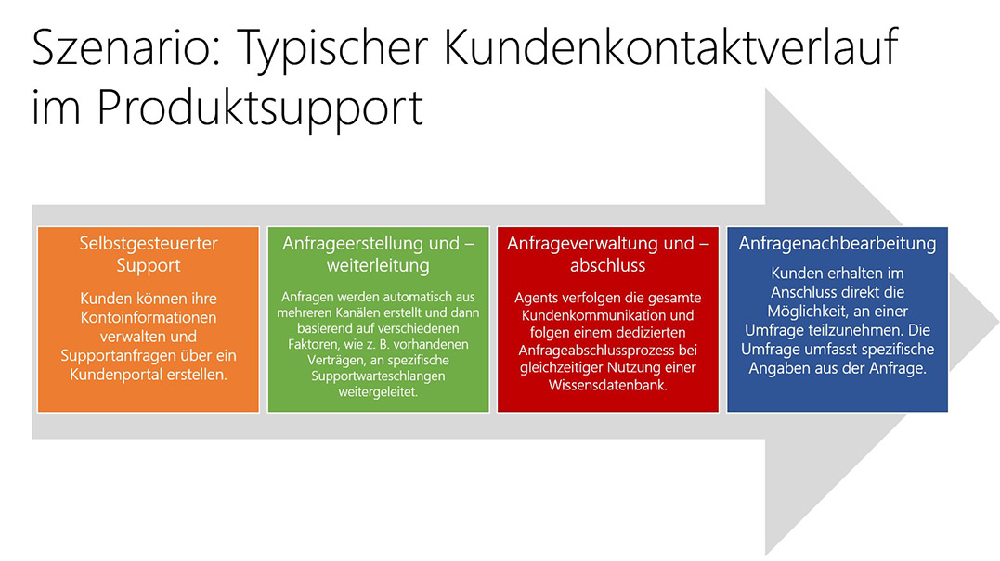

Der Service hast sich in den letzten fünf bis zehn Jahren drastisch verändert. Früher hat ein Kunde angerufen und wurde in die Warteschleife gestellt, bis jemand das Telefon abgehoben hat, um zu helfen. Heute sieht die Supportlandschaft anders aus.

> [!VIDEO https://www.microsoft.com/en-us/videoplayer/embed/RE2rlss]

 Der Kunde von heute kann einen Support-Kontaktverlauf von vielen verschiedenen Ausgangspunkten beginnen. Kunden bevorzugen verschiedene Kanäle und erwarten eine reibungslose Erfahrung auf allen Kanälen.

Durch das Aufkommen der Self-Service-Funktionen können Kunden sich nun selbst anhand einer der folgenden Ressourcen unterrichten:

- Portale mit interaktivem Bot
- Live-Chat-Funktion
- Interaktive Kioske
- Eine Mobile-App, die von der Organisation des Kunden bereitgestellt wurde
- Remote-Freigabe von Bildschirmen zwischen einem Service-Agent und dem Kunden
- Beliebige Anzahl sozialer Netzwerke, einschließlich Facebook und Twitter

Wie diese Liste zeigt, können wir niemals sicher sein, woher der Kunde kommt. Daher müssen wir vorbereitet sein. Sämtliche Kanäle und Medien müssen geöffnet sein und überwacht werden.

## Kundenperspektive und -erwartungen
Es reicht nicht aus, nur ein paar verschiedene Kanäle anzubieten. Die Serviceorganisation muss integriert sein, damit:

- Alle Supportkanäle dieselben Informationen aufweisen. Sie möchten nicht, dass sich Tipps von Ihren Bots von den Tipps unterscheiden, die der Kundenservicemitarbeiter geben würde.
- Ihre Supportkanäle sind nahtlos vernetzt. Sie möchten, dass Informationen einfach von einem Kanal in den anderen übertragen werden können.

Die Komplexität endet hier nicht. Im Allgemeinen muss das moderne Serviceunternehmen Folgendes berücksichtigen:

- **Soziale Medien**: Kunden sind in sozialen Medien äußerst aktiv. Sie hinterlassen nicht nur Kommentare zu den Dingen, die ihnen gefallen. Sie kommentieren auch laut, was ihnen nicht gefällt. Darüber hinaus lesen viele ihrer Freunde – Ihre potenziellen Kunden – diese Kommentare und bilden sich ihre eigene Meinung von Ihrem Unternehmen.
- **Unternehmensgröße**: Unternehmen richten sich oft über dieselben Kanäle gleichzeitig an Klein- und Unternehmenskunden.
- **Support für Kunden mit und ohne Vertrag**: Jeder Benutzer erhält Support, nicht nur die mit Vereinbarungen zum Servicelevel (SLA). Wiederum wissen Sie nicht, woher neue Kunden kommen.
- **Schnelle Antwortzeiten**: Kunden erwarten schnelle Antwortzeiten. Falls Sie keine zeitnahe Antwort geben können, gehen sie woanders hin. Vielleicht sogar zu Ihren Mitbewerbern, die möglicherweise einen besseren Supportkanal bieten.
- **Vor-Ort-Support**: Manchmal können Sie Kunden nicht online helfen. In diesem Fall wird häufig erwartet, dass das Serviceunternehmen sie am Unternehmenssitz oder unterwegs aufsucht, um ein Problem zu beheben. 

## Typischer Kundenkontaktverlauf

Der typische Kunde folgt einem bestimmten Weg, um eine Lösung zu einem Problem zu erhalten:

1. **Selbsthilfe**: Wenn Benutzer Hilfe brauchen, suchen sie zuerst im Internet nach einer Lösung, mit der sie das Problem selbst beheben können. Sie besuchen Foren und Newsgroups, stellen Fragen und hoffen auf eine schnelle Lösung. Sie rufen möglicherweise die Website des Unternehmens auf und recherchieren, während sie gleichzeitig in der Dokumentation suchen.
1. **Anfängliche Anfragenerstellung und -weiterleitung**: Anfragen werden von mehreren Kanälen aus erstellt. Sie können dann an spezifische Warteschlangen weitergeleitet werden, basierend auf Faktoren, wie etwa, ob ein Vertrag besteht, ob der Kunde ein bevorzugter Kunde ist oder ob ein für die Bearbeitung des Problems qualifizierter Techniker in einer bestimmten Warteschlange verfügbar ist.
1. **Anfragenverwaltung und -abschluss**: Ein Servicemitarbeiter erfasst nun jegliche Kommunikation mit dem Kunden und befolgt einen dedizierten Anfrageabschlussprozess, bei dem er eine interne Wissensdatenbank verwendet. Hier kann die Kundenkommunikation per E-Mail, Textnachricht oder Telefonanruf erfolgen. Anfragen werden in der Regel nachverfolgt, um ein Verlaufsprotokoll der Interaktionen mit dem Kunden zu erstellen. Zudem wird die Wissensdatenbank ausgebaut, damit andere Kundenservicemitarbeiter vom Wissen aus vergangenen Anfragen profitieren können.
1. **Aktivitäten zur Nachbearbeitung von Anfragen**: Kundenserviceorganisationen achten immer mehr auf die Aktivitäten *nach* dem Abschluss einer Anfrage. Diese Aktivitäten zur Nachbearbeitung von Anfragen werden mittlerweile als entscheidend betrachtet. Unternehmen möchten jetzt Feedback von Kunden über die Qualität der Interaktion erhalten, um Kanäle offen zu halten und den Kunden zu ermutigen, dem Unternehmen treu zu bleiben. Um weitere Erkenntnisse zur Anfrage zu erhalten und die Wissensdatenbank auszubauen, können Unternehmen Kunden eine Umfrage mit spezifischen Angaben der Anfrage senden.

In der modernen Welt interagieren Kunden auf diese Weise mit einer Supportorganisation innerhalb von Unternehmen.