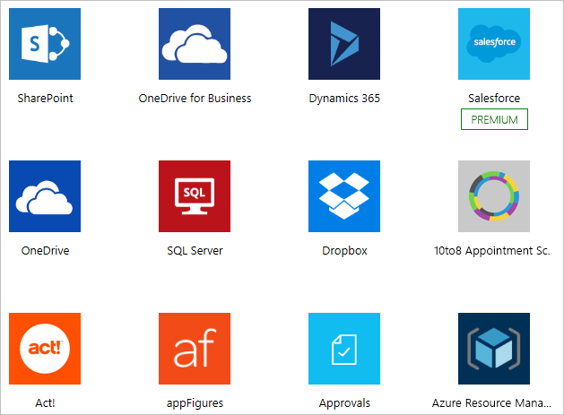
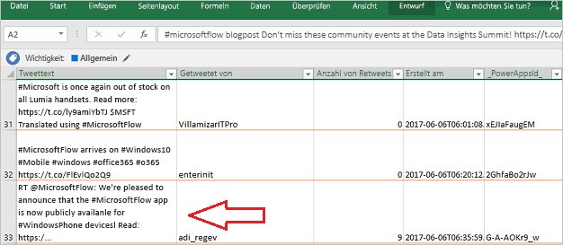
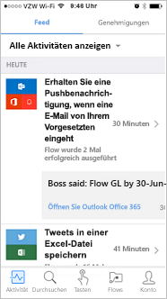

Willkommen bei Microsoft Flow!Welcome to Microsoft Flow! In diesem Modul erfahren Sie, wie Sie zwei Flows erstellen:In this module, you'll learn how to build two flows:

- Einen Flow, der E-Mail-Anlagen automatisch in Ihrem Microsoft OneDrive for Business-Konto speichert.A flow that automatically saves email attachments to your Microsoft OneDrive for Business account.
- Einen Schaltflächenflow, den Sie aus der Microsoft Flow-App erstellen, um nach zehn Minuten eine Erinnerung an Sie zu senden.A button flow that you create from the Microsoft Flow app to send you a reminder after 10 minutes.

Wenn Sie Microsoft Flow noch nicht kennen, ist dieses Modul ein guter Einstieg.If you're a beginner with Microsoft Flow, this module will get you going. Wenn Sie bereits über Erfahrung verfügen, verknüpft dieses Modul Zusammenhänge und schließt eventuelle Lücken.If you already have some experience, this module will tie concepts together and fill in the gaps.

## Was ist Microsoft Flow?What is Microsoft Flow?
Microsoft Flow ist ein Onlinedienst für Workflows, der Ereignisse (als *Workflows* bezeichnet) für die am häufigsten verwendeten Apps und Dienste automatisiert.Microsoft Flow is an online workflow service that automates events (known as *workflows*) across the most common apps and services. Sie können beispielsweise einen Flow erstellen, der immer dann einen Lead zu Microsoft Dynamics 365 und einen Datensatz zu MailChimp hinzufügt, wenn jemand mit über 100 Followern einen Tweet über Ihr Unternehmen postet.For example, you can create a flow that adds a lead to Microsoft Dynamics 365 and a record in MailChimp whenever someone with more than 100 followers tweets about your company.

Wenn Sie sich registrieren, können Sie eine Verbindung mit über 220 Diensten herstellen und Daten in der Cloud oder in lokalen Datenquellen wie SharePoint und Microsoft SQL Server verwalten.When you sign up, you can connect to more than 220 services, and can manage data either in the cloud or in on-premises sources like SharePoint and Microsoft SQL Server. Die Liste der Anwendungen, die Sie mit Microsoft Flow verwenden können, wird ständig erweitert.The list of applications you can use with Microsoft Flow grows constantly.

## Wozu kann ich Microsoft Flow nutzen?What can you do with Microsoft Flow?

Sie können Microsoft Flow zum Automatisieren von Workflows zwischen Ihren bevorzugten Anwendungen und Diensten, zum Synchronisieren von Dateien, zum Erhalten von Benachrichtigungen, zum Sammeln von Daten und für vieles mehr verwenden.You can use Microsoft Flow to automate workflows between your favorite applications and services, sync files, get notifications, collect data, and much more. 

Sie können beispielsweise folgende Aufgaben automatisieren:For example, you can automate these tasks:

* Automatische Antworten auf wichtige Benachrichtigungen oder E-MailsInstantly respond to high-priority notifications or emails.
* Erfassen und Nachverfolgen neuer VertriebsleadsCapture, track, and follow up with new sales leads.
* Kopieren aller E-Mail-Anlagen in Ihr OneDrive for Business-KontoCopy all email attachments to your OneDrive for Business account.
* Sammeln von Daten über Ihr Unternehmen und Freigeben dieser Informationen für Ihr TeamCollect data about your business, and share that information with your team.
* Automatisieren von GenehmigungsworkflowsAutomate approval workflows.

Microsoft Flow wird häufig für das Erhalten von Benachrichtigungen verwendet.A common use of Microsoft Flow is to receive notifications. Sie können beispielsweise sofort eine E-Mail oder eine Pushbenachrichtigung auf Ihr Smartphone erhalten, wenn ein Vertriebslead zu Dynamics 365 oder Salesforce hinzugefügt wird.For example, you can instantly receive an email or a push notification on your phone whenever a sales lead is added to Dynamics 365 or Salesforce.

Sie können auch Microsoft Flow verwenden, um Dateien zu kopieren.You can also use Microsoft Flow to copy files. Beispielsweise können Sie sicherstellen, dass jede Datei, die in Dropbox hinzugefügt wird, automatisch in SharePoint kopiert wird, damit Ihr Team sie finden kann.For example, you can ensure that any file that's added to Dropbox is automatically copied to SharePoint, where your team can find it.

 

 

Sie können überwachen, wie andere Personen sich über Ihr Unternehmen äußern, indem Sie einen Flow erstellen, der immer dann ausgeführt wird, wenn jemand einen Tweet mit einem bestimmten Hashtag postet.You can monitor what people are saying about your business by creating a flow that runs whenever someone sends a tweet with a certain hashtag. Der Flow kann nach Belieben Details zu jedem Tweet zu einem Facebook-Post, einer SQL Server-Datenbank, einer SharePoint-Liste oder einer auf OneDrive for Business gehosteten Microsoft Excel-Datei hinzufügen.The flow can add details about each tweet to a Facebook post, a SQL Server database, a SharePoint list, or even a Microsoft Excel file that's hosted on OneDrive for Business–-whichever service works for you. 

Sie können Aktionen erstellen, um die gesammelten Daten mit Microsoft Power BI zu verbinden, Trends in den Daten zu erkennen und Fragen zu den Daten zu stellen.You can create actions to connect the data you collect to Microsoft Power BI, spot trends in that data, and ask questions about it.

Das folgende Beispiel zeigt einen Flow, der Tweets mit dem Hashtag #MicrosoftFlow in einer Excel-Datei speichert.The following example shows a flow that saves tweets with the hashtag #MicrosoftFlow to an Excel file.

Schließlich können Sie Genehmigungsschleifen erstellen, z.B. für Urlaubsanträge in einer SharePoint-Liste.Finally, you can automate approval loops for things like vacation requests on a SharePoint list.

Durchsuchen Sie die Liste der Vorlage, wenn Sie weitere Anregungen benötigen.For more ideas, browse our list of templates. Mithilfe von Vorlagen können Sie Flows in wenigen Schritten erstellen.Templates help you build flows in just a few steps. Sie können beispielsweise Flows erstellen, um sich selbst Wettervorhersagen, Erinnerungen in regelmäßigen Abständen oder Benachrichtigungen auf dem Smartphone zu senden, wenn Ihr Vorgesetzter Ihnen eine E-Mail sendet.For example, you can easily build flows to send yourself weather forecasts, reminders at regular intervals, or phone notifications whenever your manager sends you mail.

Haben Sie eine Idee für einen Flow, der auf der Liste nicht vorhanden ist?Have an idea for a flow that you don't see in the list? Erstellen Sie nach Belieben einen eigenen von Grund auf neu, und geben Sie ihn für die Community frei!Create your own from scratch and, if you want, share it with the community!

## Wo kann ich Flows erstellen und verwalten?Where can I create and administer a flow?

Sie können einen Flow in einem Browser oder auf Ihrem Smartphone (wenn Sie die mobile Microsoft Flow-App heruntergeladen haben) erstellen und verwalten.You can create a flow and perform administrative tasks in a browser or, if you download the Microsoft Flow mobile app, on your phone.

Hier sind einige Aufgaben, die durchgeführt werden können:Here are some of the tasks you can perform:

* Aktivieren oder Deaktivieren von Flows unabhängig von Ihrem StandortTurn flows on or off from wherever you are.
* Anzeigen, ob ein Flow fehlgeschlagen istSee when a flow has failed.
* Anzeigen detaillierter Berichte zum AusführungsverlaufReview detailed run history reports.
* Anzeigen und Filtern von Ausführungen nach BenachrichtigungstypView and filter runs by notification type.

## Kurze Einführung in Microsoft FlowA brief tour of Microsoft Flow
Wir beginnen nun mit der Einführung in Microsoft Flow.Let's jump into Microsoft Flow, and we'll show you around. Wir haben zahlreiche Informationen zur Verwendung von Microsoft Flow für Sie.We have tons of information for you to learn about how to use Microsoft Flow.

Wenn Sie sich bei Microsoft Flow anmelden, sehen Sie die folgenden Menüs:When you sign in to Microsoft Flow, you'll find these menus:

* **Meine Flows:** Hier befinden sich Ihre Flows.**My flows**, where your flows reside.
* **Vorlagen:** Dort können Sie die beliebtesten Vorlagen auf einen Blick sehen.**Templates**, where you can take a look at some of the most popular templates. Die Vorlagen enthalten viele Anregungen für Flows, die Sie testen können.These should give you some great ideas for flows you want to try.
* **Genehmigungen:** Hier können Sie Genehmigungsprozesse automatisieren und optimieren.**Approvals**, where you can automate and streamline your approval process.
* **Connectors** (ehemals Dienste): Hier können Sie Dienste miteinander verbinden.**Connectors**, (formerly called Services), where you can connect from one service to another.
* **Info:** Hier finden Sie Informationen, die Ihnen einen schnellen Einstieg in Microsoft Flow ermöglichen.**Learn**, where you can find information that will help you quickly ramp up on Microsoft Flow.

Im Folgenden wird das Menü **Info** erläutert, das folgende Optionen enthält:For now, let's focus on the **Learn** menu, which has these options:

* Unter **Artikel** finden Sie Artikel zu weiterführenden Themen.**Documentation** is where our advanced topics reside. Wenn Sie sich genauer mit einem Feature oder einer Funktion auseinandersetzen möchten, können Sie Ihre Kenntnisse hier vertiefen.If you want to really understand a feature or function, you can do a deep dive here to figure things out.
* Unter **Lernen** finden Sie Lernpfade, mit denen Sie die Verwendung von Microsoft Flow von Methoden für Einsteiger bis hin zu erweiterten Szenarios durchlaufen können.**Learn** has learning paths to guide you through using Microsoft Flow, all the way from beginning techniques to advanced scenarios.
* Unter **Support anfordern** finden Sie zuverlässig Hilfe.**Support** is a great landing place to find help.
* Treten Sie der **Community** bei, um zu erfahren, wie andere Benutzer Microsoft Flow verwenden.**Community** is a place to plug into and find out how other people use Microsoft Flow.
* Über **Give Feedback** (Feedback geben) gelangen Sie in eine Community aus erfahrenen Benutzern und Entwicklern. Dort können Sie Kommentare schreiben und Fragen stellen.**Give Feedback** taps into a community of power users, and is where you can send comments and questions to developers and other experienced users.
* Der **Blog** hält Sie über die neuesten Entwicklungen und Releases für Microsoft Flow auf dem aktuellen Stand.**Blog** keeps you up to date about the most recent developments and releases in the Microsoft Flow ecosystem.
* Unter **Preise** können Sie den geeigneten Plan für Sie oder Ihr Unternehmen auswählen.**Pricing** can help you choose the right plan for you or your business.

## Wie geht es weiter?What's next?
Da Sie nun wissen, was Microsoft Flow ist und wofür es eingesetzt werden kann, wird im Folgenden erläutert, was einen Flow ausmacht.Now that you have a taste of what Microsoft Flow is and what it can do, let's take a look at what makes a flow.