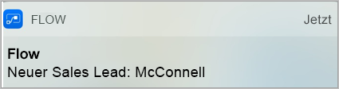
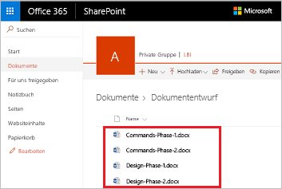
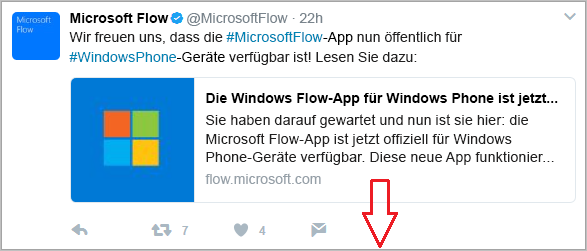
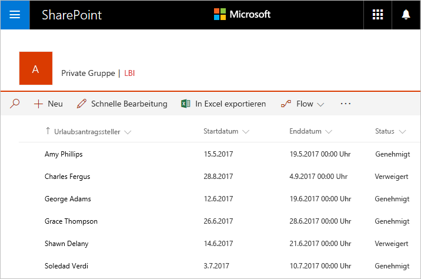
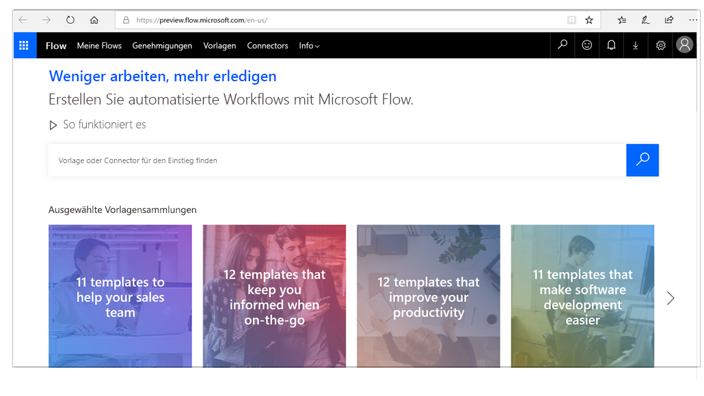

Willkommen bei Microsoft Flow! In diesem Modul erfahren Sie, wie Sie zwei Flows erstellen:

- Einen Flow, der E-Mail-Anlagen automatisch in Ihrem Microsoft OneDrive for Business-Konto speichert.
- Einen Schaltflächenflow, den Sie aus der Microsoft Flow-App erstellen, um nach zehn Minuten eine Erinnerung an Sie zu senden.

Wenn Sie Microsoft Flow noch nicht kennen, ist dieses Modul ein guter Einstieg. Wenn Sie bereits über Erfahrung verfügen, verknüpft dieses Modul Zusammenhänge und schließt eventuelle Lücken.

## Was ist Microsoft Flow?
Microsoft Flow ist ein Onlinedienst für Workflows, der Ereignisse (als *Workflows* bezeichnet) für die am häufigsten verwendeten Apps und Dienste automatisiert. Sie können beispielsweise einen Flow erstellen, der immer dann einen Lead zu Microsoft Dynamics 365 und einen Datensatz zu MailChimp hinzufügt, wenn jemand mit über 100 Followern einen Tweet über Ihr Unternehmen postet.

Wenn Sie sich registrieren, können Sie eine Verbindung mit über 220 Diensten herstellen und Daten in der Cloud oder in lokalen Datenquellen wie SharePoint und Microsoft SQL Server verwalten. Die Liste der Anwendungen, die Sie mit Microsoft Flow verwenden können, wird ständig erweitert.

## Wozu kann ich Microsoft Flow nutzen?

Sie können Microsoft Flow zum Automatisieren von Workflows zwischen Ihren bevorzugten Anwendungen und Diensten, zum Synchronisieren von Dateien, zum Erhalten von Benachrichtigungen, zum Sammeln von Daten und für vieles mehr verwenden. 

Sie können beispielsweise folgende Aufgaben automatisieren:

* Automatische Antworten auf wichtige Benachrichtigungen oder E-Mails
* Erfassen und Nachverfolgen neuer Vertriebsleads
* Kopieren aller E-Mail-Anlagen in Ihr OneDrive for Business-Konto
* Sammeln von Daten über Ihr Unternehmen und Freigeben dieser Informationen für Ihr Team
* Automatisieren von Genehmigungsworkflows

Microsoft Flow wird häufig für das Erhalten von Benachrichtigungen verwendet. Sie können beispielsweise sofort eine E-Mail oder eine Pushbenachrichtigung auf Ihr Smartphone erhalten, wenn ein Vertriebslead zu Dynamics 365 oder Salesforce hinzugefügt wird.

Sie können auch Microsoft Flow verwenden, um Dateien zu kopieren. Beispielsweise können Sie sicherstellen, dass jede Datei, die in Dropbox hinzugefügt wird, automatisch in SharePoint kopiert wird, damit Ihr Team sie finden kann.

 

 

Sie können überwachen, wie andere Personen sich über Ihr Unternehmen äußern, indem Sie einen Flow erstellen, der immer dann ausgeführt wird, wenn jemand einen Tweet mit einem bestimmten Hashtag postet. Der Flow kann nach Belieben Details zu jedem Tweet zu einem Facebook-Post, einer SQL Server-Datenbank, einer SharePoint-Liste oder einer auf OneDrive for Business gehosteten Microsoft Excel-Datei hinzufügen. 

Sie können Aktionen erstellen, um die gesammelten Daten mit Microsoft Power BI zu verbinden, Trends in den Daten zu erkennen und Fragen zu den Daten zu stellen.

Das folgende Beispiel zeigt einen Flow, der Tweets mit dem Hashtag #MicrosoftFlow in einer Excel-Datei speichert.

Schließlich können Sie Genehmigungsschleifen erstellen, z.B. für Urlaubsanträge in einer SharePoint-Liste.

Durchsuchen Sie die Liste der Vorlage, wenn Sie weitere Anregungen benötigen. Mithilfe von Vorlagen können Sie Flows in wenigen Schritten erstellen. Sie können beispielsweise Flows erstellen, um sich selbst Wettervorhersagen, Erinnerungen in regelmäßigen Abständen oder Benachrichtigungen auf dem Smartphone zu senden, wenn Ihr Vorgesetzter Ihnen eine E-Mail sendet.

Haben Sie eine Idee für einen Flow, der auf der Liste nicht vorhanden ist? Erstellen Sie nach Belieben einen eigenen von Grund auf neu, und geben Sie ihn für die Community frei!

## Wo kann ich Flows erstellen und verwalten?

Sie können einen Flow in einem Browser oder auf Ihrem Smartphone (wenn Sie die mobile Microsoft Flow-App heruntergeladen haben) erstellen und verwalten.

Hier sind einige Aufgaben, die durchgeführt werden können:

* Aktivieren oder Deaktivieren von Flows unabhängig von Ihrem Standort
* Anzeigen, ob ein Flow fehlgeschlagen ist
* Anzeigen detaillierter Berichte zum Ausführungsverlauf
* Anzeigen und Filtern von Ausführungen nach Benachrichtigungstyp

## Kurze Einführung in Microsoft Flow
Wir beginnen nun mit der Einführung in Microsoft Flow. Wir haben zahlreiche Informationen zur Verwendung von Microsoft Flow für Sie.

Wenn Sie sich bei Microsoft Flow anmelden, sehen Sie die folgenden Menüs:

* **Meine Flows:** Hier befinden sich Ihre Flows.
* **Vorlagen:** Dort können Sie die beliebtesten Vorlagen auf einen Blick sehen. Die Vorlagen enthalten viele Anregungen für Flows, die Sie testen können.
* **Genehmigungen:** Hier können Sie Genehmigungsprozesse automatisieren und optimieren.
* **Connectors** (ehemals Dienste): Hier können Sie Dienste miteinander verbinden.
* **Info:** Hier finden Sie Informationen, die Ihnen einen schnellen Einstieg in Microsoft Flow ermöglichen.

Im Folgenden wird das Menü **Info** erläutert, das folgende Optionen enthält:

* Unter **Artikel** finden Sie Artikel zu weiterführenden Themen. Wenn Sie sich genauer mit einem Feature oder einer Funktion auseinandersetzen möchten, können Sie Ihre Kenntnisse hier vertiefen.
* Unter **Lernen** finden Sie Lernpfade, mit denen Sie die Verwendung von Microsoft Flow von Methoden für Einsteiger bis hin zu erweiterten Szenarios durchlaufen können.
* Unter **Support anfordern** finden Sie zuverlässig Hilfe.
* Treten Sie der **Community** bei, um zu erfahren, wie andere Benutzer Microsoft Flow verwenden.
* Über **Give Feedback** (Feedback geben) gelangen Sie in eine Community aus erfahrenen Benutzern und Entwicklern. Dort können Sie Kommentare schreiben und Fragen stellen.
* Der **Blog** hält Sie über die neuesten Entwicklungen und Releases für Microsoft Flow auf dem aktuellen Stand.
* Unter **Preise** können Sie den geeigneten Plan für Sie oder Ihr Unternehmen auswählen.

## Wie geht es weiter?
Da Sie nun wissen, was Microsoft Flow ist und wofür es eingesetzt werden kann, wird im Folgenden erläutert, was einen Flow ausmacht.