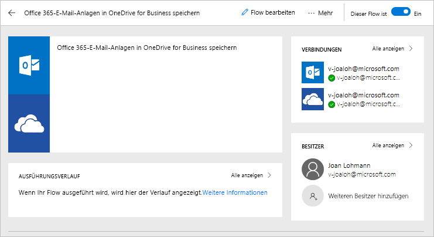
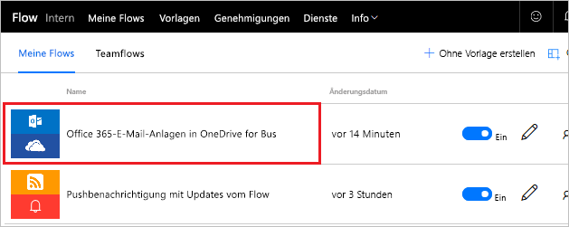
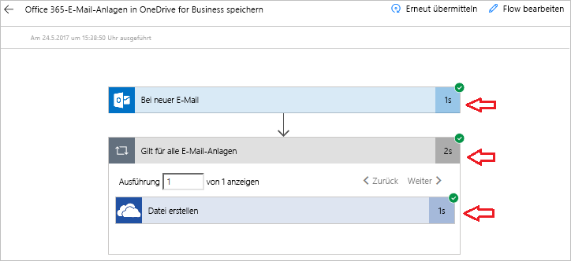

In this unit, you'll see more of the Microsoft Flow environment as you build your first flow.

It can be time consuming to search for attachments through email. The flow that you'll build saves time by storing all your email attachments in a folder on your Microsoft OneDrive for Business account.

## Choose a template
Our many templates will get your flows flowing quickly. They'll help you connect the services you're already using in more meaningful ways.

Go to the [Microsoft Flow website](https://ms.flow.microsoft.com), and select the **Templates** menu. As you scroll through the list, you'll see that Microsoft Flow lets you connect to many services.

Select the **Save Office 365 email attachments to OneDrive for Business** template.

## Create the flow
**Save Office 365 email attachments to OneDrive for Business** is one of our one-click templates, where you just answer questions that are necessary to build the flow, without having to write a single line of code.

On the template graphic, there's a description of what the template does and what it needs to succeed.

You're asked to provide credentials for the Microsoft Office 365 Outlook and Microsoft SharePoint services. If you regularly use both services, you'll already be signed in to them.

1. Select **Create Flow**.

    

    Flow creates a folder on your OneDrive for Business account and will now automatically put every attachment that's sent to your work email address in that folder.

    

2. Select the **My flows** menu.

    

3. Select the flow you just created to see how it works.

    

4. You see a green check mark, which indicates that the flow succeeded. 
5. Select **Edit** to see how the flow is defined.

     
 
6. Select **Succeeded** to see the run history and the results.

    

    In this cae, all parts of the flow were successful. 

    

## Important concepts in Microsoft Flow
Keep these concepts in mind when building flows: 

- Every flow has two main parts: a *trigger*, and one or more *actions*.
- You can think of the trigger as the starting action for the flow. The trigger can be something like a new email arriving in your inbox or a new item being added to a SharePoint list.
- Actions are what you want to happen when a trigger is invoked. For example, the new email trigger will start the action of creating a new file on OneDrive for Business. Other examples of actions include sending an email, posting a tweet, and starting an approval.

These concepts will come into play later, when you build your own flows from scratch. 

In the next unit, we'll look at the Microsoft Flow mobile app and its capabilities. 
