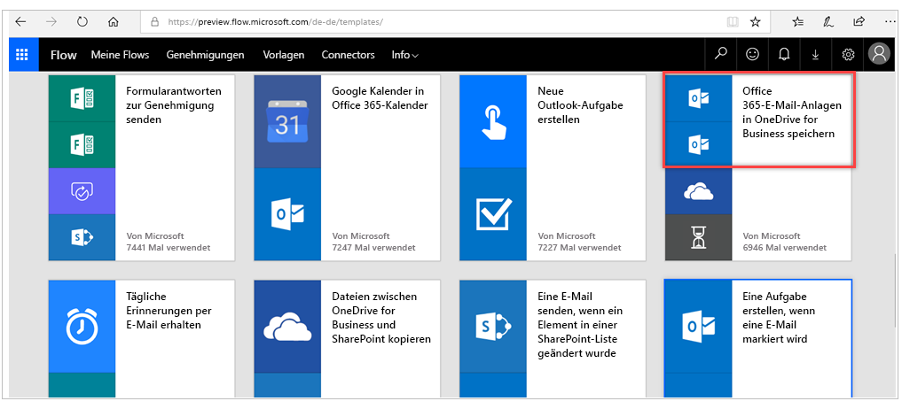
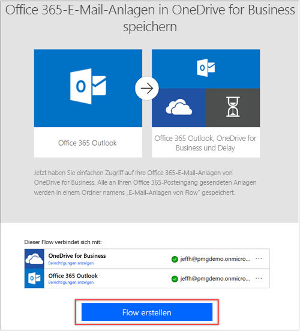
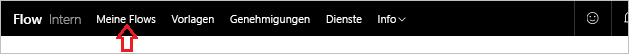
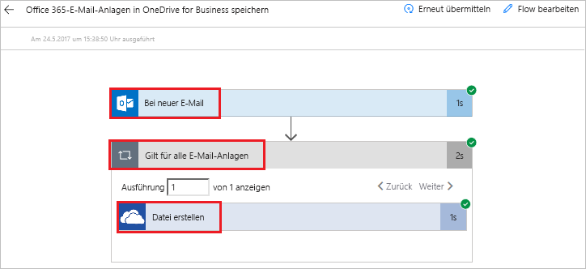
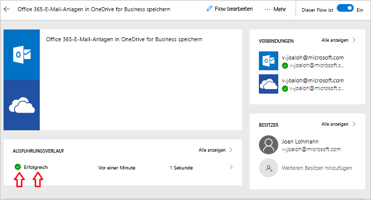

In dieser Einheit erfahren Sie mehr über die Microsoft Flow-Umgebung, während Sie Ihren ersten Flow erstellen.In this unit, you'll see more of the Microsoft Flow environment as you build your first flow.

Es kann zeitaufwändig sein, in E-Mails nach Anhängen zu suchen.It can be time consuming to search for attachments through email. Der Flow, den Sie im Rahmen dieser Einheit erstellen, spart Zeit, indem all Ihre E-Mail-Anhänge in einem Ordner in Ihrem Microsoft OneDrive for Business-Konto gespeichert werden.The flow that you'll build saves time by storing all your email attachments in a folder on your Microsoft OneDrive for Business account.

## Auswählen einer VorlageChoose a template
Mit vielen der Vorlagen können Sie im Handumdrehen Flows erstellen.Our many templates will get your flows flowing quickly. Diese unterstützen Sie beim Verknüpfen der Dienste, die Sie bereits auf bedeutsameren Weisen verwenden.They'll help you connect the services you're already using in more meaningful ways.

Öffnen Sie die [Microsoft Flow-Website](https://ms.flow.microsoft.com), und wählen Sie das Menü **Vorlagen** aus.Go to the [Microsoft Flow website](https://ms.flow.microsoft.com), and select the **Templates** menu. Wenn Sie durch die Liste scrollen, werden Sie bemerken, dass Microsoft Flow die Verknüpfung mit vielen Diensten ermöglicht.As you scroll through the list, you'll see that Microsoft Flow lets you connect to many services.

Wählen Sie die Vorlage **Office 365-E-Mail-Anlagen in OneDrive for Business speichern** aus.Select the **Save Office 365 email attachments to OneDrive for Business** template.

## Erstellen des FlowsCreate the flow
**Office 365-E-Mail-Anlagen in OneDrive for Business speichern** ist eine One-Click-Vorlage, für die Sie nur Fragen beantworten, die zum Erstellen des Flows erforderlich sind, ohne auch nur eine Codezeile schreiben zu müssen.**Save Office 365 email attachments to OneDrive for Business** is one of our one-click templates, where you just answer questions that are necessary to build the flow, without having to write a single line of code.

Auf der Vorlagengrafik finden Sie eine Beschreibung der Funktionsweise der Vorlage und was erforderlich ist, damit sie erfolgreich ausgeführt wird.On the template graphic, there's a description of what the template does and what it needs to succeed.

Sie werden dazu aufgefordert, Anmeldeinformationen für die Microsoft Office 365 Outlook- und Microsoft SharePoint-Dienste anzugeben.You're asked to provide credentials for the Microsoft Office 365 Outlook and Microsoft SharePoint services. Wenn Sie beide Dienste regelmäßig verwenden, werden Sie vermutlich bereits angemeldet sein.If you regularly use both services, you'll already be signed in to them.

1. Klicken Sie auf **Flow erstellen**.Select **Create Flow**.

    

    Flow erstellt einen Ordner auf Ihrem OneDrive for Business-Konto und speichert alle Anhänge, die an Ihre geschäftliche E-Mail-Adresse gesendet werden, in diesem Ordner.Flow creates a folder on your OneDrive for Business account and will now automatically put every attachment that's sent to your work email address in that folder.

    

2. Wählen Sie das Menü **Meine Flows** aus.Select the **My flows** menu.

    

3. Wählen Sie den soeben erstellten Flow aus, und machen Sie sich mit der Funktionsweise vertraut.Select the flow you just created to see how it works.

    

4. Ihnen wird ein grünes Häkchen angezeigt, das angibt, dass der Flow erfolgreich war.You see a green check mark, which indicates that the flow succeeded. 
5. Klicken Sie auf **Bearbeiten**, um zu sehen, wie der Flow definiert wird.Select **Edit** to see how the flow is defined.

     
 
6. Klicken Sie auf **Succeeded** (Erfolgreich), um den Ausführungsverlauf und die Ergebnisse anzuzeigen.Select **Succeeded** to see the run history and the results.

    

    In diesem Fall waren alle Komponenten des Flows erfolgreich.In this cae, all parts of the flow were successful. 

    

## Wichtige Konzepte in Microsoft FlowImportant concepts in Microsoft Flow
Beachten Sie diese Konzepte beim Erstellen von Flows:Keep these concepts in mind when building flows: 

- Jeder Flow enthält zwei Hauptkomponenten: einen *Auslöser* und mindestens eine *Aktion*.Every flow has two main parts: a *trigger*, and one or more *actions*.
- Sie können sich den Auslöser als Startaktion des Flows vorstellen.You can think of the trigger as the starting action for the flow. Der Auslöser kann eine neue E-Mail sein, die in Ihrem Posteingang ankommt, oder ein neues Element, das einer SharePoint-Liste hinzugefügt wird.The trigger can be something like a new email arriving in your inbox or a new item being added to a SharePoint list.
- Aktionen sollen ausgeführt werden, wenn ein Auslöser aufgerufen wird.Actions are what you want to happen when a trigger is invoked. Beispielsweise startet der Auslöser für neue E-Mails die Aktion zum Erstellen einer neuen Datei in OneDrive for Business.For example, the new email trigger will start the action of creating a new file on OneDrive for Business. Zu anderen Beispielen für Aktionen gehört das Senden einer E-Mail, das Veröffentlichen eines Tweets und das Starten einer Genehmigung.Other examples of actions include sending an email, posting a tweet, and starting an approval.

Diese Konzepte werden später aufgegriffen, wenn Sie Ihre eigenen Flows von Grund auf erstellen.These concepts will come into play later, when you build your own flows from scratch. 

In der nächsten Einheit erfahren Sie mehr über die Mobile App für Microsoft Flow und deren Funktionen.In the next unit, we'll look at the Microsoft Flow mobile app and its capabilities. 
