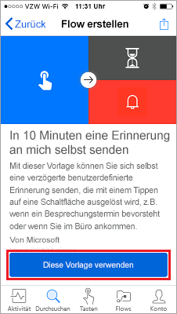

Of course we have an app! The Microsoft Flow mobile app. From this app, you can access these features:

- Activity Feed
- Browsing
- Buttons
- Managing Flows

First, you'll need to download and install the Microsoft Flow mobile app from your app store.

After it's installed, start it and sign in.

When you first start the app, you'll see the Activity Feed. The Activity Feed is the place to see what's happening with your flows. It won't be the full experience you'd expect from your PC, but it will show you useful details.

For example, you'll see the flow's last activity, as shown here. You can see whether the flow succeeded or failed to run. if it failed, you'll see which step it failed on.

If you select this flow, you'll see that it succeeded in both steps. 

## How flows are started
Buttons are flows that are started through a manual action. For example, you can create a button to send a "Working from home today" email to your manager. If you live far from your workplace, you can then use this button on days when the traffic is a mess!

- Select **Buttons** to use some of these flows.

    

- Select **Browse** to check out templates for more button flows that you can add to your collection.

    

To show you how you can use buttons, we'll use the **Send myself a reminder in 10 minutes button** flow.

1. Select **Buttons**, and then **Browse**.
2. Select the **Send myself a reminder in 10 minutes button** flow.
3. Select **Use this template**.

    

4. Select **Create**, and then select **Done**.

    

    The flow is saved.

    

5. On the Activity Feed screen, select **Buttons** to see the new flow. 

    

6. Select the flow. In 10 minutes, you'll get a reminder.

    

It's simple to add additional buttons to your collection.

## Modify or delete a flow
If you want to change or delete one of your flows, it's easy.

1. Select **Flows**.

    

2. Select one of your flows.

    

3. Select one of the options:

    * To enable or disable the flow, turn the **Enable flow toggle** option on or off.
    * To change the flow, select **Edit flow**. 
    * To get an idea of the successful and unsuccessful runs of the flow, select **Run history** to view the history of the flow.
    * To delete a flow, select **Delete flow**.

    

The next unit shows how to create a button flow for a team.
