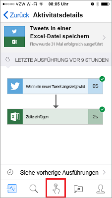
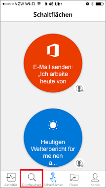
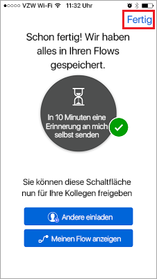
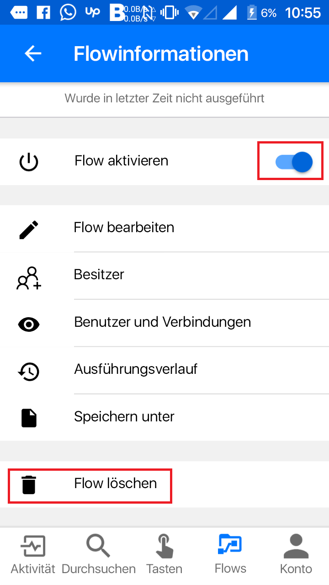

Natürlich gibt es eine App – die mobile Microsoft Flow-App!Of course we have an app -- the Microsoft Flow mobile app! Über die App können Sie auf folgende Features zugreifen:From this app, you can access these features:

- AktivitätsfeedActivity Feed
- DurchsuchenBrowsing
- SchaltflächenButtons
- Verwalten von FlowsManaging Flows

Zunächst müssen Sie die mobile Microsoft Flow-App über Ihren App Store herunterladen und installieren.First, you'll need to download and install the Microsoft Flow mobile app from your app store.

Starten Sie die App nach der Installation, und melden Sie sich an.After it's installed, start it and sign in.

Beim ersten Start der App wird der Aktivitätsfeed angezeigt.When you first start the app, you'll see the Activity Feed. Im Aktivitätsfeed sehen Sie, was in Ihren Flows geschieht.The Activity Feed is the place to see what's happening with your flows. Die Umgebung auf dem PC ist umfangreicher, die mobile App zeigt jedoch ebenfalls nützliche Details an.It won't be the full experience you'd expect from your PC, but it will show you useful details.

Wie Sie hier sehen, wird beispielsweise die letzte Aktivität eines Flows angezeigt.For example, you'll see a flow's last activity, as shown here. Sie können sehen, ob der Flow erfolgreich ausgeführt wurde oder nicht.You can see whether the flow succeeded or failed. Wenn der Flow nicht erfolgreich ausgeführt wurde, wird der Schritt angezeigt, in dem der Fehler aufgetreten ist.If it failed, you'll see which step it failed on.

## Starten von SchaltflächenflowsHow button flows are started
Schaltflächen sind Flows, die über eine manuelle Aktion gestartet werden.Buttons are flows that are started through a manual action. Sie können beispielsweise eine Schaltfläche erstellen, die eine E-Mail mit der Nachricht *Ich arbeite heute im Homeoffice* an Ihren Vorgesetzten sendet.For example, you can create a button to send a *Working from home today* email to your manager. Wenn Sie weit von Ihrem Arbeitsplatz entfernt leben, können Sie diese Schaltfläche beispielsweise verwenden, wenn Verkehrschaos auf dem Arbeitsweg zu erwarten ist.If you live far from your workplace, you can then use this button on days when the traffic is a mess!

- Tippen Sie auf **Schaltflächen**, um einige dieser Flows zu verwenden.Select **Buttons** to use some of these flows.

    

- Tippen Sie auf **Durchsuchen**, um Vorlagen für weitere Schaltflächenflows zu suchen, die Sie zu Ihrer Sammlung hinzufügen können.Select **Browse** to check out templates for more button flows that you can add to your collection.

    

Wir verwenden die Schaltflächenvorlage **In 10 Minuten Erinnerung an mich selbst senden**, um die Verwendung von Schaltflächen zu veranschaulichen.To show you how you can use buttons, we'll use the **Send myself a reminder in 10 minutes button** template.

1. Tippen Sie auf **Schaltflächen** und dann auf **Durchsuchen**.Select **Buttons**, and then **Browse**.
2. Wählen Sie den Flow **Send myself a reminder in 10 minutes button** (Schaltfläche „In 10 Minuten Erinnerung an mich selbst senden“) aus.Select the **Send myself a reminder in 10 minutes button** flow.
3. Tippen Sie auf **Diese Vorlage verwenden**.Select **Use this template**.

    

4. Tippen Sie auf **Erstellen** und dann auf **Fertig**.Select **Create**, and then select **Done**.

    

    Der Flow wird gespeichert.The flow is saved.

    

5. Wählen Sie **Schaltflächen** aus, um den neuen Flow anzuzeigen.Select **Buttons** to see the new flow. 

    

6. Wählen Sie den Flow aus.Select the flow. In 10 Minuten erhalten Sie eine Erinnerung.In 10 minutes, you'll get a reminder.

Es ist einfach, Ihrer Sammlung weitere Schaltflächen hinzuzufügen.It's simple to add more buttons to your collection.

## Ändern oder Löschen eines FlowsModify or delete a flow
Es ist einfach, einen Ihrer Flows zu ändern oder zu löschen.If you want to change or delete one of your flows, it's easy.

1. Tippen Sie auf **Flows**.Select **Flows**.

    

2. Wählen Sie einen Ihrer Flows aus.Select one of your flows.

    

3. Wählen Sie eine der folgenden Optionen aus:Select one of the options:

    * Zum Aktivieren oder Deaktivieren des Flows aktivieren bzw. deaktivieren Sie die Option **Flow aktivieren**.To enable or disable the flow, turn the **Enable flow** option on or off.
    * Tippen Sie auf **Flow bearbeiten**, um den Flow zu ändern.To change the flow, select **Edit flow**. 
    * Wenn Sie einen Überblick darüber erhalten möchten, ob Flows erfolgreich ausgeführt wurden oder nicht, tippen Sie auf **Ausführungsverlauf**, um den Verlauf des Flows anzuzeigen.To get an idea of the successful and unsuccessful runs of the flow, select **Run history** to view the history of the flow.
    * Tippen Sie auf **Flow löschen**, um einen Flow zu löschen.To delete a flow, select **Delete flow**.

    

In der nächsten Einheit wird erläutert, wie ein Schaltflächenflow für ein Team erstellt werden kann.The next unit shows how to create a button flow for a team.
