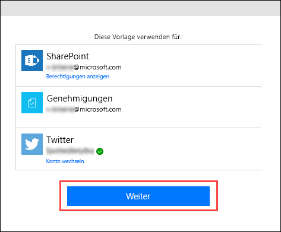
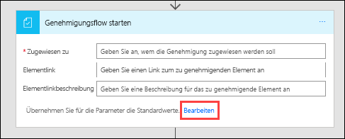
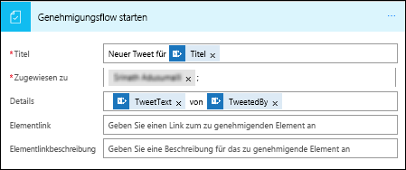
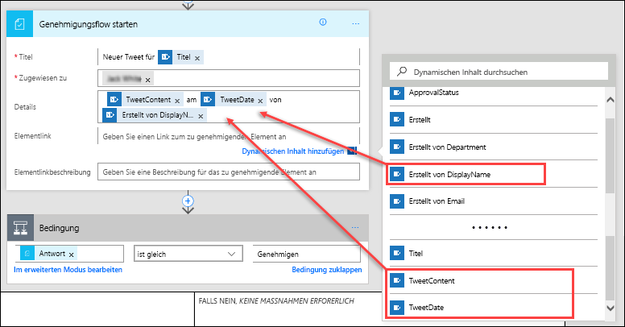
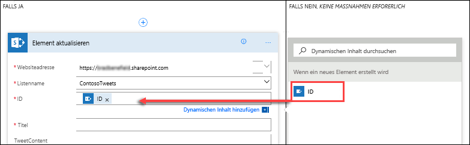
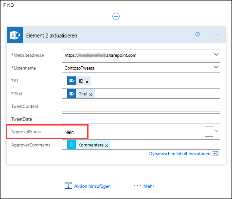

In dieser Einheit erfahren Sie, wie Sie ein für Unternehmen geeignetes Szenario erstellen, in dem Genehmigungen verwendet werden.In this unit, you'll learn how to build a business-friendly scenario that uses approvals.

In diesem Szenario kann jede Person mit Zugriff auf die Microsoft SharePoint-Liste Tweets verfassen, ohne mit Twitter vertraut zu sein.In this scenario, anyone who has access to the Microsoft SharePoint list can contribute tweets without knowing anything about Twitter. Das Social-Media-Team kann die Tweets anschließend genehmigen oder ablehnen.The social media team can then approve or reject those tweets. Dadurch wird die Kontrolle über das Konto und alle Inhalte sichergestellt, die für Kunden freigegeben werden.That team maintains control of the account and the content that goes out to customers. 

## Schritt 1: Erstellen einer SharePoint-Liste für TweetsStep one: Create a SharePoint list for tweets

Sie verwenden im Folgenden eine Vorlage, durch die ein Genehmigungsprozess gestartet wird, wenn ein neues Element in einer Liste erstellt wird.You'll use a template that starts an approval process whenever a new item is created in a specific list. Wird das Element genehmigt, wird ein Tweet auf Twitter gepostet.If the item is approved, a tweet is then posted to Twitter. In dieser Einheit ändern Sie den Vorgang, indem Sie Schritte hinzufügen, die die SharePoint-Liste mit der Genehmigungsantwort aktualisieren. Zusätzlich zeigen diese Schritte an, ob ein Element genehmigt wurde, und fügen Kommentare ein, die dem vorgeschlagenen Tweet von der genehmigenden Person hinzugefügt wurden.For this unit, you'll change the process by adding steps that update a SharePoint list with the approval response, indicate whether the item was approved, and add any comments that the approver added to the proposed tweet. 

Im Folgenden erstellen Sie zunächst die SharePoint-Liste.First, let's create the SharePoint list.

1. Erstellen Sie auf Ihrer SharePoint-Website eine SharePoint-Liste mit dem Namen **Contoso-Tweets**.On your SharePoint site, create a SharePoint list named **ContosoTweets**.
1. Öffnen Sie die Liste, und klicken Sie auf **Spalte hinzufügen**.Open the list, and select **Add column**.
1. Klicken Sie auf **+ Spalte hinzufügen**, um die folgenden Spalten hinzuzufügen:Select **+ Add column** to add the following columns:

    - Fügen Sie eine **Tweetinhalt**-Spalte hinzu, und legen Sie als Spaltentyp **Multiple lines of text** (Mehrere Textzeilen) fest.Add a **TweetContent** column, and set the column type to **Multiple lines of text**. Diese Spalte enthält den Inhalt der Tweets, die später genehmigt werden müssen.This will contain the content of the tweets for later approval. Klicken Sie nach dem Erstellen einer Spalte immer auf **Speichern**.Select **Save** after each column you create.
    - Fügen Sie eine **Tweetdatum**-Spalte hinzu, und legen Sie als Spaltentyp **Datum und Uhrzeit** fest.Add a **TweetDate** column, and set the column type to **Date and Time**. Klicken Sie auf **More** (Weitere), damit der Typ **Datum und Uhrzeit** angezeigt wird.Select **More** to find the **Date and Time** type.
    - Fügen Sie die Spalte **Genehmigungsstatus** hinzu, und legen Sie als Spaltentyp **Ja/Nein** fest.Add an **ApprovalStatus** column, and set the column type to **Yes/No**. Die genehmigende Person kann dann **Ja** oder **Nein** auswählen, um den Tweet zu genehmigen oder abzulehnen.The approver can then select **Yes** or **No** to approve or reject the tweet.
    - Fügen Sie die Spalte **Kommentare der genehmigenden Person** hinzu, und legen Sie als Spaltentyp **Einzelne Textzeile** fest.Add an **ApproverComments** column, and set the column type to **Single line of text**. Die genehmigende Person kann dadurch einen Kommentar zum Genehmigungsstatus hinzufügen.The approver can then add a comment about the approval status.

    

1. Kopieren Sie die URL der SharePoint-Liste.Copy the URL of the SharePoint list. Die URL verwenden Sie bei der Erstellung des Flows.You'll use it when you create the flow.

## Schritt 2: Erstellen eines Flows für die GenehmigungsanforderungStep two: Create an approval request flow
1. Melden Sie sich bei [Microsoft Flow](https://ms.flow.microsoft.com) an, und wählen Sie **Genehmigungen** aus.Sign in to [Microsoft Flow](https://ms.flow.microsoft.com), and then select **Approvals**.

1. Klicken Sie auf **Genehmigungsflow erstellen**, scrollen Sie nach unten, und wählen Sie die Vorlage **Listenelemente nach Genehmigung in Twitter posten** aus.Select **Create approval flow**, and then scroll down and select the **Post list items to Twitter after approval** template. 

    

1. Stellen Sie sicher, dass Ihre Kontoanmeldeinformationen für **SharePoint**, **Genehmigungen** und **Twitter** richtig sind, und klicken Sie dann auf **Weiter**.Make sure your account credentials for **SharePoint**, **Approvals**, and **Twitter** are correct, and then select **Continue**. 

    

1. Geben Sie in Microsoft Flow in der Aktion **Wenn ein neues Element erstellt wird** die folgenden Werte ein:Back in Microsoft Flow, in the **When a new item is created** action, enter the following values:

    * **Websiteadresse:** Geben Sie die URL der SharePoint-Website Ihres Teams ein.**Site Address**: Enter the URL of your team's SharePoint site.
    * **Listenname:** Wählen Sie *ContosoTweets* aus.**List Name**: Select *ContosoTweets*.

    

1. Klicken Sie in der Aktion **Start an approval** (Genehmigungsflow starten) auf **Bearbeiten**, damit alle Felder angezeigt werden.In the **Start an approval** action, select **Edit** to show all the fields. 

    

1. Geben Sie *Neuer Tweet für* als **Titel** ein, und wählen Sie dann **Titel** in der Liste für dynamische Inhalte aus.For **Title**, enter *New tweet for*, and then select **Title** in the dynamic content list. 

    

1. Geben Sie bei **Zugewiesen an** entweder Ihren Namen oder den eines Testbenutzers ein, und wählen Sie diesen Namen aus.For **Assigned to**, enter and select either your name or a test user name. 

    

1. Entfernen Sie bei **Details** die Standardelemente, und fügen Sie **Tweetinhalt**, **Tweetdatum** und **Erstellt von Anzeigename** aus der Liste für dynamische Inhalte hinzu.For **Details**, remove the default items, and add **TweetContent**, **TweetDate**, and **Created by DisplayName** from the dynamic content list. Achten Sie bei der Eingabe darauf, Bezüge durch Wörter wie *von* deutlich zu machen, damit der Inhalt leichter verständlich ist.Be sure to add the words *on* and *by* to make the content more readable. 

    

1. Fügen Sie bei **Elementlink** die URL der SharePoint-Liste ein, die Sie in **Schritt 1** kopiert haben.For **Item Link**, paste the URL of your SharePoint list, which you copied in the procedure in **Step one**. Geben Sie *Contoso-Tweetliste* als **Beschreibung des Elementlinks** ein.For **Item Link Description**, enter *Contoso Tweet List*. 

    

1. Zeigen Sie in der Aktion **Bedingung** auf das Feld **WENN JA**, und klicken Sie anschließend zuerst auf das Pluszeichen (**+**) und dann auf **Aktion hinzufügen**.In the **Condition** action, hover over the **IF YES** box, select the plus sign (**+**), and then select **Add an action**. 

    

1. Suchen Sie nach *Element aktualisieren*, und klicken Sie anschließend zuerst auf den **SharePoint-Connector** und dann auf die Aktion **SharePoint – Element aktualisieren**.Search for *update item*, select the **SharePoint** connector, and then select the **SharePoint – Update item** action.

    

1. Geben Sie bei **Websiteadresse** und **Listenname** erneut die SharePoint-Website-URL des Teams und *Contoso-Tweets* ein.For **Site Address** and **List Name**, enter the URL of the team's SharePoint site and *ContosoTweets* again. Fügen Sie bei **ID** die **ID** aus der Liste für dynamische Inhalte hinzu.For **ID**, add **ID** from the dynamic content list. Mit dem **ID**-Feld wird versucht, für die Anforderung für den eigentlichen Tweet in der SharePoint-Liste eine Übereinstimmung zu ermitteln.The **ID** field is used to match the actual tweet request in the SharePoint list.

    

1. Klicken Sie auf das Feld **Titel**, und suchen Sie in der Liste für dynamische Inhalte nach *Titel*.Select the **Title** field, and then, in the dynamic content list, search for *title*. Fügen Sie das **Titel**-Element über die Aktion **Wenn ein neues Element erstellt wird** hinzu.Add the **Title** item from the **When a new item is created** action. 

    

1. Wählen Sie **Genehmigungsstatus** aus, und legen Sie als Wert **Ja** fest.Select **ApprovalStatus**, and set the value to **Yes**. Wählen Sie anschließend **Kommentare der genehmigenden Person** aus, und legen Sie den Wert über die Liste für dynamische Inhalte auf **Kommentare** fest.Then select **ApproverComments**, and set the value to **Comments** from the dynamic content list. 

    

1. Klicken Sie im unteren Bereich des Felds **IF NO, DO NOTHING** (WENN NEIN, KEINE AKTION AUSFÜHREN) auf **Aktion hinzufügen**.Near the bottom of the **IF NO, DO NOTHING** box, select **Add an action**.

    

1. Wiederholen Sie die Schritte 11 bis 14, um eine Aktion des Typs **SharePoint – Element aktualisieren** zu erstellen.Repeat steps 11 through 14 to create a **SharePoint – Update item** action. Legen Sie die gleichen Werte wie für die **WENN JA**-Bedingung fest.Set the same values you set for the **IF YES** condition. Die einzige Ausnahme ist **Genehmigungsstatus**, da Sie für diesen **Nein** festlegen.The only difference is that you should set **ApprovalStatus** to **No**. 

    

1. Wählen Sie die Aktion **Tweet posten** aus, klicken Sie auf **Bearbeiten**, und legen Sie mithilfe der Liste für dynamische Inhalte für **Tweettext** den Wert **Tweetinhalt** fest.Select the **Post a tweet** action, select **Edit**, and set **Tweet text** to **TweetContent** from the dynamic content list. Dadurch wird der eigentliche Tweet erstellt und nach dessen Genehmigung auf Twitter gepostet.This will create the actual tweet and then post it to Twitter when it's approved. 

    

1. Klicken Sie auf **Flow erstellen**.Select **Create flow**.

Herzlichen Glückwunsch!Congratulations! Sie haben Ihren ersten Flow erstellt.You just created your first flow. 

Microsoft Flow bietet Ihnen noch mehr Möglichkeiten, die Produktivität Ihres Teams zu steigern.This is just one way that Microsoft Flow can empower your team to be more productive. Ihr Team kann Vorschläge, wichtige Neuigkeiten oder Produktanleitungen bereitstellen. Dabei können Sie allerdings immer festlegen, welche Tweets für Kunden freigegeben werden.Your team can contribute ideas, relevant news, or product guidance, but you still maintain control over what's tweeted out to customers.

In der nächsten Einheit wird beschrieben, was geschieht, wenn die genehmigende Person eine neue Anforderung für einen vorgeschlagenen Tweet empfängt.In the next unit, you'll see what it looks like when an approver receives a new request for a proposed tweet.