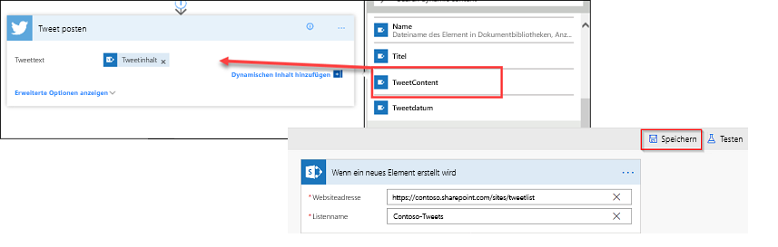

In dieser Einheit erfahren Sie, wie Sie ein für Unternehmen geeignetes Szenario erstellen, in dem Genehmigungen verwendet werden.

In diesem Szenario kann jede Person mit Zugriff auf die Microsoft SharePoint-Liste Tweets verfassen, ohne mit Twitter vertraut zu sein. Das Social-Media-Team kann die Tweets anschließend genehmigen oder ablehnen. Dadurch wird die Kontrolle über das Konto und alle Inhalte sichergestellt, die für Kunden freigegeben werden. 

## Schritt 1: Erstellen einer SharePoint-Liste für Tweets

Sie verwenden im Folgenden eine Vorlage, durch die ein Genehmigungsprozess gestartet wird, wenn ein neues Element in einer Liste erstellt wird. Wird das Element genehmigt, wird ein Tweet auf Twitter gepostet. In dieser Einheit ändern Sie den Vorgang, indem Sie Schritte hinzufügen, die die SharePoint-Liste mit der Genehmigungsantwort aktualisieren. Zusätzlich zeigen diese Schritte an, ob ein Element genehmigt wurde, und fügen Kommentare ein, die dem vorgeschlagenen Tweet von der genehmigenden Person hinzugefügt wurden. 

Im Folgenden erstellen Sie zunächst die SharePoint-Liste.

1. Erstellen Sie auf Ihrer SharePoint-Website eine SharePoint-Liste mit dem Namen **Contoso-Tweets**.
1. Öffnen Sie die Liste, und klicken Sie auf **Spalte hinzufügen**.
1. Klicken Sie auf **+ Spalte hinzufügen**, um die folgenden Spalten hinzuzufügen:

    - Fügen Sie eine **Tweetinhalt**-Spalte hinzu, und legen Sie als Spaltentyp **Multiple lines of text** (Mehrere Textzeilen) fest. Diese Spalte enthält den Inhalt der Tweets, die später genehmigt werden müssen. Klicken Sie nach dem Erstellen einer Spalte immer auf **Speichern**.
    - Fügen Sie eine **Tweetdatum**-Spalte hinzu, und legen Sie als Spaltentyp **Datum und Uhrzeit** fest. Klicken Sie auf **More** (Weitere), damit der Typ **Datum und Uhrzeit** angezeigt wird.
    - Fügen Sie die Spalte **Genehmigungsstatus** hinzu, und legen Sie als Spaltentyp **Ja/Nein** fest. Die genehmigende Person kann dann **Ja** oder **Nein** auswählen, um den Tweet zu genehmigen oder abzulehnen.
    - Fügen Sie die Spalte **Kommentare der genehmigenden Person** hinzu, und legen Sie als Spaltentyp **Einzelne Textzeile** fest. Die genehmigende Person kann dadurch einen Kommentar zum Genehmigungsstatus hinzufügen.

    

1. Kopieren Sie die URL der SharePoint-Liste. Die URL verwenden Sie bei der Erstellung des Flows.

## Schritt 2: Erstellen eines Flows für die Genehmigungsanforderung
1. Melden Sie sich bei [Microsoft Flow](https://ms.flow.microsoft.com) an, und wählen Sie **Genehmigungen** aus.

1. Klicken Sie auf **Genehmigungsflow erstellen**, scrollen Sie nach unten, und wählen Sie die Vorlage **Listenelemente nach Genehmigung in Twitter posten** aus. 

    

1. Stellen Sie sicher, dass Ihre Kontoanmeldeinformationen für **SharePoint**, **Genehmigungen** und **Twitter** richtig sind, und klicken Sie dann auf **Weiter**. 

    

1. Geben Sie in Microsoft Flow in der Aktion **Wenn ein neues Element erstellt wird** die folgenden Werte ein:

    * **Websiteadresse:** Geben Sie die URL der SharePoint-Website Ihres Teams ein.
    * **Listenname:** Wählen Sie *ContosoTweets* aus.

    

1. Klicken Sie in der Aktion **Start an approval** (Genehmigungsflow starten) auf **Bearbeiten**, damit alle Felder angezeigt werden. 

    

1. Geben Sie *Neuer Tweet für* als **Titel** ein, und wählen Sie dann **Titel** in der Liste für dynamische Inhalte aus. 

    

1. Geben Sie bei **Zugewiesen an** entweder Ihren Namen oder den eines Testbenutzers ein, und wählen Sie diesen Namen aus. 

    

1. Entfernen Sie bei **Details** die Standardelemente, und fügen Sie **Tweetinhalt**, **Tweetdatum** und **Erstellt von Anzeigename** aus der Liste für dynamische Inhalte hinzu. Achten Sie bei der Eingabe darauf, Bezüge durch Wörter wie *von* deutlich zu machen, damit der Inhalt leichter verständlich ist. 

    

1. Fügen Sie bei **Elementlink** die URL der SharePoint-Liste ein, die Sie in **Schritt 1** kopiert haben. Geben Sie *Contoso-Tweetliste* als **Beschreibung des Elementlinks** ein. 

    

1. Zeigen Sie in der Aktion **Bedingung** auf das Feld **WENN JA**, und klicken Sie anschließend zuerst auf das Pluszeichen (**+**) und dann auf **Aktion hinzufügen**. 

    

1. Suchen Sie nach *Element aktualisieren*, und klicken Sie anschließend zuerst auf den **SharePoint-Connector** und dann auf die Aktion **SharePoint – Element aktualisieren**.

    

1. Geben Sie bei **Websiteadresse** und **Listenname** erneut die SharePoint-Website-URL des Teams und *Contoso-Tweets* ein. Fügen Sie bei **ID** die **ID** aus der Liste für dynamische Inhalte hinzu. Mit dem **ID**-Feld wird versucht, für die Anforderung für den eigentlichen Tweet in der SharePoint-Liste eine Übereinstimmung zu ermitteln.

    

1. Klicken Sie auf das Feld **Titel**, und suchen Sie in der Liste für dynamische Inhalte nach *Titel*. Fügen Sie das **Titel**-Element über die Aktion **Wenn ein neues Element erstellt wird** hinzu. 

    

1. Wählen Sie **Genehmigungsstatus** aus, und legen Sie als Wert **Ja** fest. Wählen Sie anschließend **Kommentare der genehmigenden Person** aus, und legen Sie den Wert über die Liste für dynamische Inhalte auf **Kommentare** fest. 

    

1. Klicken Sie im unteren Bereich des Felds **IF NO, DO NOTHING** (WENN NEIN, KEINE AKTION AUSFÜHREN) auf **Aktion hinzufügen**.

    

1. Wiederholen Sie die Schritte 11 bis 14, um eine Aktion des Typs **SharePoint – Element aktualisieren** zu erstellen. Legen Sie die gleichen Werte wie für die **WENN JA**-Bedingung fest. Die einzige Ausnahme ist **Genehmigungsstatus**, da Sie für diesen **Nein** festlegen. 

    

1. Wählen Sie die Aktion **Tweet posten** aus, klicken Sie auf **Bearbeiten**, und legen Sie mithilfe der Liste für dynamische Inhalte für **Tweettext** den Wert **Tweetinhalt** fest. Dadurch wird der eigentliche Tweet erstellt und nach dessen Genehmigung auf Twitter gepostet. 

    

1. Klicken Sie auf **Flow erstellen**.

Herzlichen Glückwunsch! Sie haben Ihren ersten Flow erstellt. 

Microsoft Flow bietet Ihnen noch mehr Möglichkeiten, die Produktivität Ihres Teams zu steigern. Ihr Team kann Vorschläge, wichtige Neuigkeiten oder Produktanleitungen bereitstellen. Dabei können Sie allerdings immer festlegen, welche Tweets für Kunden freigegeben werden.

In der nächsten Einheit wird beschrieben, was geschieht, wenn die genehmigende Person eine neue Anforderung für einen vorgeschlagenen Tweet empfängt.