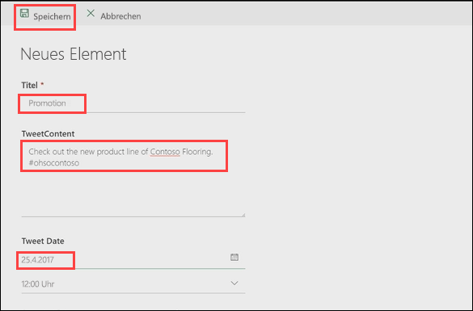
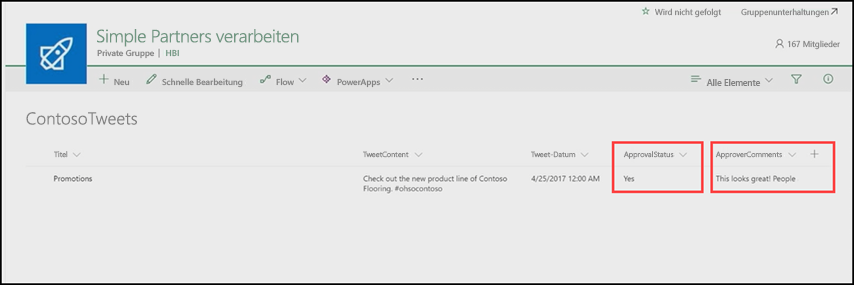

In the previous unit, you learned how to build an approval process for tweets that are stored in a Microsoft SharePoint list. In this unit, you'll see what the experience looks like when an approver receives a new approval request. 

## Step one: Change the SharePoint list
First, we need to add an item to our SharePoint list. We can then process an approval request for that item.

1. In SharePoint, open the **ContosoTweets** list you configured in the previous unit, and then select **New** to create a new list item (tweet). 

    

2. Enter the following values, and then select **Save**.

    - For **Title**, enter "Promotions".
    - For **TweetContent**, enter "Check out the new line of Contoso Flooring #ohsocontoso". Notice that the tweet contains a hashtag.
    - For **TweetDate**, enter today's date.

    

## Step two: Change the flow
1. In Microsoft Flow, select **My flows**. 
2. Select the **Post list items to Twitter after approval** flow you configured in the previous unit, and then, under **Run history**, select the running flow.

    

3. Select the **When a new item is created** trigger. Make sure that the information for the list item you just created is shown.

    

4. In Microsoft Outlook, open the automated approval mail in the inbox, and then select **Approve**. 

    

5. In the Approval Center, view the details of the request, add a comment, and then select **Confirm**. 

    

6. In SharePoint, refresh the **ContosoTweets** list. Make sure that **ApprovalStatus** is set to **Yes**, and that the comment you just entered is shown. 

    

In this unit, you saw the experience from the approver's point of view, from receiving an approval request email to processing the request in the Approval Center.