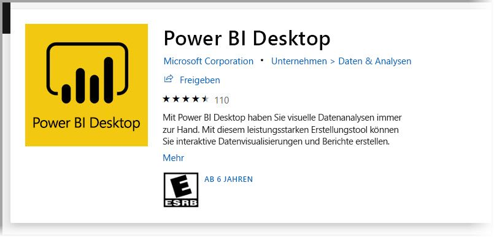

Willkommen beim Lernmodul, das Sie bei Ihrem Einstieg in das Arbeiten mit **Power BI Desktop** unterstützen soll. In diesem Modul lernen Sie, wie Sie durch Power BI Desktop navigieren, sich mit Daten verbinden, Visuals und Berichte erstellen und diese Berichte im **Power BI-Dienst** veröffentlichen.

Mit Power BI Desktop können Sie eine Sammlung von Abfragen, Datenverbindungen und Berichten erstellen, die problemlos für andere Benutzer freigegeben werden können. Power BI Desktop integriert bewährte Microsoft-Technologien (die leistungsstarke Power Query-Engine, Datenmodellierung und Visualisierungen) und arbeitet nahtlos mit dem online verfügbaren [**Power BI-Dienst**](https://app.powerbi.com/) zusammen.

Mit der Kombination aus **Power BI Desktop** (hier können Analysten und andere leistungsstarke Datenverbindungen, Modelle und Berichte erstellen) und dem [**Power BI-Dienst**](https://app.powerbi.com/) (über den Power BI Desktop-Berichte freigegeben werden können, damit Benutzer sie einsehen und mit ihnen interagieren können), lassen sich neue Erkenntnisse aus Daten leichter modellieren, erstellen, freigeben und ausbauen.

Datenanalysten kommen mit Power BI Desktop in den Genuss eines leistungsstarken, flexiblen und benutzerfreundlichen Tools, mit dem sie sich mit Daten verbinden und diese strukturieren, aussagekräftige Modelle erstellen und fundiert strukturierte Berichte anfertigen können.

## Funktionsweise von Power BI Desktop
Mit Power BI Desktop können Sie eine *Verbindung mit Daten* herstellen (normalerweise mit mehreren Datenquellen). Sie können diese Daten *strukturieren* (mit Abfragen, die aufschlussreiche, überzeugende Datenmodelle erstellen). Und Sie können mit diesem Modell *Berichte erstellen* (die andere nutzen, erweitern und freigeben können).

Wenn Sie die Schritte zu Ihrer Zufriedenheit erledigt haben (Verbinden, Strukturieren und Berichte erstellen) können Sie das Ergebnis im Power BI Desktop-Dateiformat mit der Erweiterung PBIX speichern. Power BI Desktop-Dateien können wie jede andere Datei freigegeben werden. Es wird jedoch empfohlen, sie in den [**Power BI-Dienst**](https://preview.powerbi.com/) hochzuladen (um sie dann freizugeben). 

Power BI Desktop zentralisiert, vereinfacht und optimiert den ansonsten unübersichtlichen, nicht vernetzten und mühsamen Prozess des Entwurfs und der Erstellung von Business Intelligence-Repositorys und -Berichten.

Sind Sie bereit, es zu versuchen? Fangen wir an.

## Installieren und Ausführen von Power BI Desktop
Sie können Power BI Desktop aus dem **Power BI**-Dienst herunterladen, indem Sie auf das **Zahnradsymbol** klicken und dann **Power BI Desktop** auswählen.

Sie können **Power BI Desktop** auch als App aus dem **Microsoft Store** herunterladen und installieren.

Power BI Desktop wird als Anwendung installiert und auf dem Desktop ausgeführt. Wenn Sie Power BI Desktop ausführen, wird ein Bildschirm mit einer *Begrüßung* angezeigt.

Sie können auf dem Bildschirm **Willkommen** direkt **Daten abrufen**, die **zuletzt verwendeten Quellen** anzeigen und **andere Berichte öffnen**, und zwar über die Links im linken Bereich. Wenn Sie den Bildschirm schließen (indem Sie rechts oben auf das **x** klicken), wird die Ansicht **Bericht** von Power BI Desktop angezeigt.

Power BI Desktop bietet drei Ansichten: **Bericht**, **Daten** und **Beziehungen**. Zu Power BI Desktop gehört auch der **Abfrage-Editor**, der in einem eigenen Fenster geöffnet wird. Im **Abfrage-Editor** können Sie Abfragen erstellen und Daten transformieren, das optimierte Datenmodell anschließend in Power BI Desktop laden und Berichte erstellen.

Auf dem folgenden Bildschirm sind die drei Ansichtssymbole auf der linken Seite von Power BI Desktop zu sehen: **Bericht**, **Daten** und **Beziehungen** (von oben nach unten). Die aktuell angezeigte Ansicht wird mit auf der linken Seite einer gelben Leiste angezeigt. In diesem Fall wird derzeit **Bericht** angezeigt. Sie können die Ansicht wechseln, indem Sie auf eines dieser drei Symbole klicken.

Wenn Sie Power BI Desktop installiert haben, können Sie sich mit Daten verbinden, Daten strukturieren und Berichte erstellen (normalerweise in dieser Reihenfolge). In den folgenden Einheiten erhalten Sie einen Überblick über jede dieser Aktivitäten.
