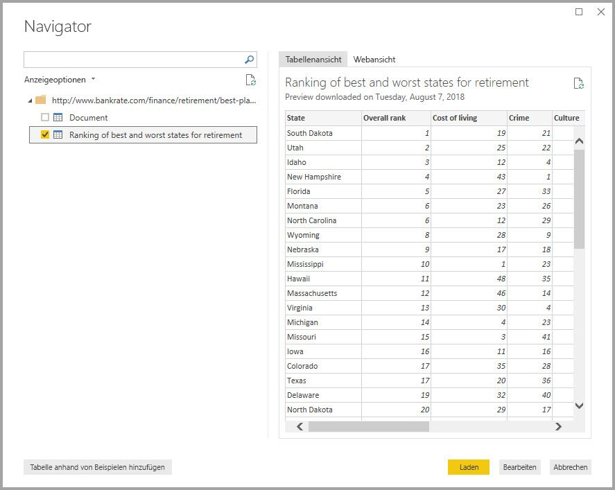
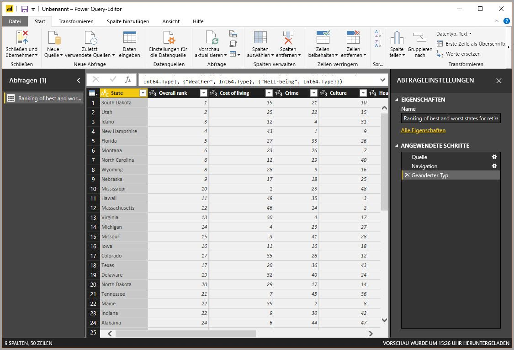

With Power BI Desktop installed, you’re ready to connect to the ever expanding world of data. There are *all sorts* of data sources available in the Power Query window. The following image shows how to connect to data, by selecting the **Home** ribbon, then **Get Data \> More**.

For this unit, we'll connect to a couple different **Web** data sources.

Imagine you’re retiring – you want to live where there’s lots of sunshine, preferable taxes, and good health care – or perhaps you’re a data analyst, and you want that information to help your customers. For example, perhaps you want to help your sunglasses retailer target sales where the sun shines most frequently.

Either way, the following Web resource has interesting data about those topics, and more:

[*http://www.bankrate.com/finance/retirement/best-places-retire-how-state-ranks.aspx*](http://www.bankrate.com/finance/retirement/best-places-retire-how-state-ranks.aspx)

Select **Get Data > Web** and paste the address.

When you select **OK**, the **Query** functionality of Power BI Desktop goes to work. Query contacts the Web resource, and the **Navigator** window returns what it found on that Web page. In this case, it found a table (*Table 0*) and the overall Web Document. We’re interested in the table, so we select it from the list. The **Navigator** window displays a preview.

At this point we can edit the query before loading the table, by selecting **Edit** from the bottom of the window, or we can load the table.

When we select **Edit**, Power Query Editor launches and a representative view of the table is presented. The **Query Settings** pane is displayed (if it’s not, you can select **View** from the ribbon, then **Show > Query Settings** to display the **Query Settings** pane). Here’s what that looks like.

In Power BI Desktop, you can connect to multiple data sources and combine them to do interesting things. 

In the next section, we adjust the data so it meets our needs. The process of adjusting connected data is called *shaping* data.