Nachdem wir uns über **Power BI Desktop** mit einer Datenquelle verbunden haben, müssen wir die Daten an unsere Bedürfnisse anpassen.Now that we’ve connected to a data source using **Power BI Desktop**, we need to adjust the data to meet our needs. Das Anpassen von Daten bedeutet mitunter das *Transformieren* der Daten, wie z.B. Umbenennen von Spalten oder Tabellen, Ändern von Text in Zahlen, Entfernen von Zeilen, Festlegen der ersten Zeile als Überschrift usw.Sometimes adjusting means *transforming* the data – such as renaming columns or tables, changing text to numbers, removing rows, setting the first row as headers, and so on.

Der **Power Query-Editor** in Power BI Desktop ermöglicht nicht nur das Ausführen von Aufgaben über das Menüband, sondern auch über zahlreiche Kontextmenüs.The **Power Query Editor** in Power BI Desktop makes ample use of right-click menus, in addition to having tasks available on the ribbon. Die meisten Optionen, die Sie auf dem Menüband **Transformieren** auswählen können, sind auch verfügbar, indem Sie mit der rechten Maustaste auf ein Element (z.B. eine Spalte) klicken und im angezeigten Menü die gewünschte Option auswählen.Most of what you can select in the **Transform** ribbon is also available by right-clicking an item (such as a column) and choosing from the menu that appears.

## Strukturieren von DatenShape data
Wenn Sie Daten im **Power Query-Editor** strukturieren, geben Sie eine Schritt-für-Schritt-Anleitung vor (die der **Power Query-Editor** für Sie umsetzt), um die Daten so anzupassen, wie sie vom **Power Query-Editor** geladen und präsentiert werden.When you shape data in the **Power Query Editor**, you’re providing step-by-step instructions (that **Power Query Editor** carries out for you) to adjust the data as **Power Query Editor** loads and presents it. Die ursprüngliche Datenquelle ist im Gegensatz zu dieser bestimmten Ansicht der Daten, die angepasst oder *strukturiert* wird, nicht betroffen.The original data source is not affected; only this particular view of the data is adjusted, or *shaped*.

Die von Ihnen angegebenen Schritte (z.B. Tabelle umbenennen, Datentyp transformieren oder Spalten löschen) werden vom **Power Query-Editor** aufgezeichnet. Jedes Mal, wenn sich diese Abfrage mit der Datenquelle verbindet, erfolgen diese Schritte so, dass die Daten immer wie von Ihnen angegeben strukturiert werden.The steps you specify (such as rename a table, transform a data type, or delete columns) are recorded by **Power Query Editor**, and each time this query connects to the data source those steps are carried out so that the data is always shaped the way you specify. Dieser Vorgang erfolgt immer bei Verwendung der Abfrage in Power BI Desktop oder für jeden, der Ihre freigegebene Abfrage verwendet, z.B. im **Power BI**-Dienst.This process occurs whenever you use the query in Power BI Desktop, or for anyone who uses your shared query, such as in the **Power BI** service. Diese Schritte werden im Bereich **Power Query-Einstellungen** unter **Angewendete Schritte** sequenziell erfasst.Those steps are captured, sequentially, in the **Power Query Settings** pane under **Applied Steps**.

Die folgende Abbildung zeigt den Bereich **Abfrageeinstellungen** für eine Abfrage, die bereits strukturiert ist. In den nächsten Abschnitten werden wir jeden dieser Schritte durchgehen.The following image shows the **Query Settings** pane for a query that has been shaped – we’ll go through each of those steps in the next few paragraphs.

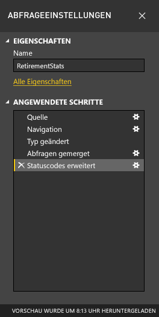

Kehren wir zurück zu den Daten für Pensionäre, die wir über die Verbindung mit einer Webdatenquelle gefunden haben. Lassen Sie uns nun die Daten so strukturieren, dass sie unseren Anforderungen entsprechen.Let’s get back to our retirement data, which we found by connecting to a Web data source, and now let's shape that data to fit our needs.

Für Einsteiger: Die meisten Bewertungen wurden in den **Power Query-Editor** als ganze Zahlen aufgenommen, aber nicht alle (eine Spalte enthielt Text und Zahlen, weshalb sie nicht automatisch konvertiert wurde).For starters, most ratings were brought into **Power Query Editor** as whole numbers, but not all of them (one column contained text and numbers, so it wasn't automatically converted). Power BI erkennt diese Änderungen häufig und führt automatisch den Schritt zum Ändern des Datentyps aus.Power BI often detects these changes and automatically performs the step of changing the data type. 

Wir benötigen die Daten als Zahlen.We need the data to be numbers. Kein Problem: Klicken Sie einfach mit der rechten Maustaste auf die Spaltenüberschrift, und wählen Sie zum Ändern des Datentyps **Typ ändern > Ganze Zahl** aus.No problem – just right-click the column header, and select **Change Type > Whole Number** to change the data type. Wenn wir mehr als eine Spalte auswählen müssen, können wir zuerst eine Spalte auswählen, dann die **UMSCHALTTASTE** drücken und gedrückt halten, weitere benachbarte Spalten auswählen und dann mit der rechten Maustaste auf eine Spaltenüberschrift klicken, um alle ausgewählten Spalten zu ändern.If we needed to choose more than one column, we could first select a column then hold down **SHIFT**, select additional adjacent columns, and then right-click a column header to change all selected columns. Bei gedrückter **STRG-Taste** können wir auch nicht benachbarte Spalten auswählen.You can also use **CTRL** to select non-adjacent columns.

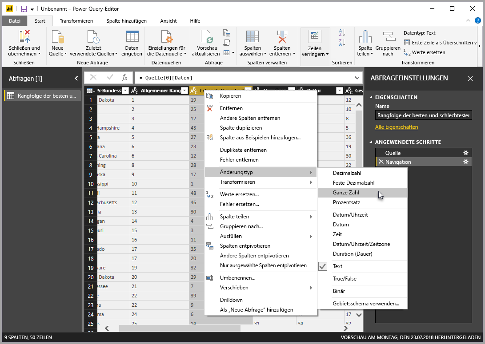

> Hinweis: Power Query erkennt oft, dass eine Textspalte aus Zahlen bestehen sollte, und ändert automatisch den Typ für Sie, wenn Sie die Tabelle in den Power Query-Editor übertragen.Note: Power Query often detects that a column of text should be numbers, and automatically changes the type for you upon bringing the table into Power Query Editor. Wenn dies der Fall ist, gibt es in **Anwendete Schritte** eine Einstellung, die angibt, was Power Query für Sie durchgeführt hat.If it does so, there will be a set in **Applied steps** that identifies what Power Query did for you.

Sie können den Typ dieser Spalten auch auf dem Menüband **Transformieren** von Text in Überschrift ändern bzw. *transformieren*.You can also change, or *transform,* those columns from text to header by using the **Transform** ribbon. Hier ist das Menüband **Transformieren** mit einem Pfeil, der auf die Schaltfläche **Datentyp** zeigt. Sie ermöglicht Ihnen, den aktuellen Datentyp in einen anderen zu transformieren.Here’s the **Transform** ribbon, with an arrow pointing toward the **Data Type** button, which lets you transform the current data type to another.

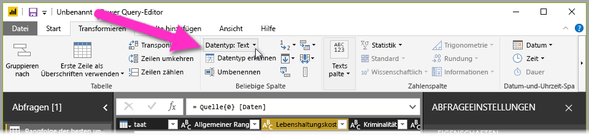

Beachten Sie, dass in **Abfrageeinstellungen** die vorgenommenen Änderungen unter **Angewendete Schritte** übernommen wurden.Note that in **Query Settings**, the **Applied Steps** reflect the changes that were made. Wenn ich einen Schritt aus dem Strukturierungsprozess entfernen möchten, wähle ich diesen Schritt einfach aus und klicke dann links neben dem Schritt auf das **X**.If I want to remove any step from the shaping process, I simply select that step, and then select the **X** to the left of the step.

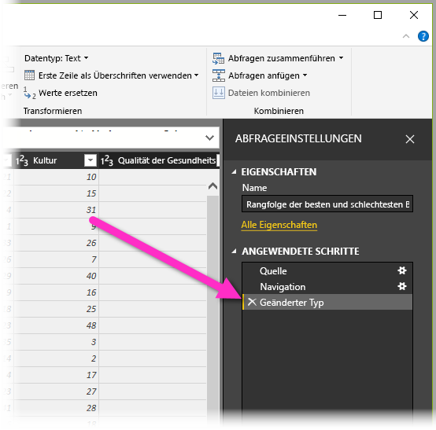

## Herstellen einer Verbindung mit DatenConnect to data
Diese Daten über verschiedene US-Bundesstaaten sind interessant und für zusätzliche Analyseaktivitäten und Abfragen nützlich.That data about various states is interesting, and will be useful for building additional analysis efforts and queries. Doch es gibt ein Problem: Bei den meisten Daten wird ein Kürzel aus zwei Buchstaben für US-Bundesstaatcodes verwendet, nicht der vollständige Name des US-Bundesstaats.But there’s one problem: most data out there uses a two-letter abbreviation for state codes, not the full name of the state. Wir benötigen eine Möglichkeit, Bundesstaatsnamen mit ihren Kürzeln zu verknüpfen.We need some way to associate state names with their abbreviations.

Wir haben Glück: Es gibt eine andere öffentliche Datenquelle, die genau diese Aufgabe erfüllt. Aber es bedarf einer gewissen Strukturierung, bevor wir sie mit unserer Pensionärstabelle verbinden können.We’re in luck: there’s another public data source that does just that, but it needs a fair amount of shaping before we can connect it to our retirement table. Unter dem folgenden Link finden Sie die Webquelle mit den US-Bundesstaatskürzeln:Here’s the Web resource for state abbreviations:

<http://en.wikipedia.org/wiki/List_of_U.S._state_abbreviations>

Wählen Sie im **Power Query-Editor** auf dem Menüband auf der Registerkarte **Start** die Optionen **Neue Quelle > Web** aus. Geben Sie die Adresse ein, und klicken Sie auf **OK**. Im Fenster **Navigator** werden anschließend die auf dieser Webseite gefundenen Ergebnisse angezeigt.From the **Home** ribbon in **Power Query Editor**, we select **New Source > Web** and type the address, select **OK**, and the **Navigator** window shows what it found on that Web page.

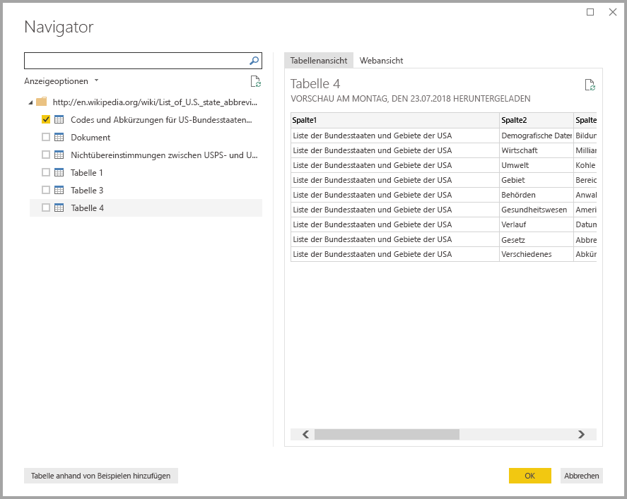

Wählen Sie **Codes and abbreviations...** aus, da diese Tabelle die gewünschten Daten enthält. Sie muss aber noch so strukturiert werden, dass sie nur noch die gewünschten Daten enthält.We select the **Codes and abbreviations...** table because it includes the data we want, but it’s going to take quite a bit of shaping to pare that table’s data down. Gehen Sie dafür so vor:Here's what we need to do:

Wir klicken auf **OK**, um die Daten in den **Power Query-Editor** zu übertragen und anschließend zu strukturieren. Fahren Sie dann so fort:We select **OK** to bring the data into **Power Query Editor** so we can shape it, then:

* *Entfernen Sie die ersten drei Zeilen*, die sich aufgrund der spezifischen Erstellung der Tabelle der Webseite ergeben haben und die wir nicht benötigen.*Remove the top three rows* – they’re a result of the way that Web page’s table was created, and we don’t need them. Wählen Sie dazu im Menüband auf der Registerkarte **Start** zuerst **Zeilen entfernen** und dann im unteren Menü **Erste Zeilen entfernen** aus.To accomplish that, select **Remove rows** from the **Home** ribbon, and select **Remove Top Rows** from the button menu. Geben Sie in dem angezeigten Dialogfeld, in dem Sie gefragt werden, wie viele Zeilen entfernt werden sollen, **3** ein.In the dialog that appears, type **3** when prompted how many rows to remove.

    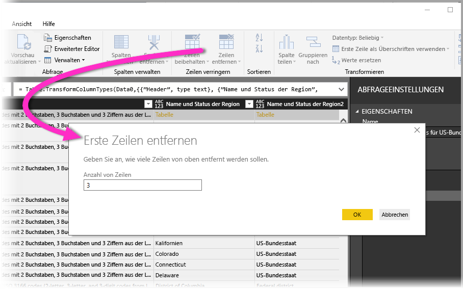

* *Entfernen Sie die letzten 26 Zeilen*, die alle zu Gebieten gehören, die wir nicht einbeziehen möchten.*Remove the bottom 26 rows* – they’re all the territories, which we don’t need to include. Der Prozess ist identisch, aber dieses Mal wählen Sie **Untere Zeilen entfernen** aus und fügen 26 als die Anzahl der Zeilen ein, die entfernt werden sollen.The process is the same, but this time we **Remove bottom rows** and put in 26 as the number of rows to remove.

    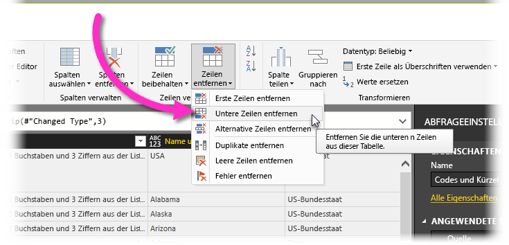
<!-- -->
<!-- -->
* *Filtern Sie Washington, D.C. heraus*. Die Tabelle mit den Statistiken für Pensionäre enthält diesen Bundesstaat nicht, weshalb wir ihn aus unserer Liste entfernen können.*Filter out Washington DC* – the retirement stats table doesn't include DC, so we'll exclude it from our list. Klicken Sie dazu auf den Dropdownpfeil neben der Spalte *Name and status of region2*, und deaktivieren Sie dann das Kontrollkästchen neben „Federal state“.To do that, select the drop-down arrow beside the *Name and status of region2* column, then clear the checkbox beside Federal district. 

    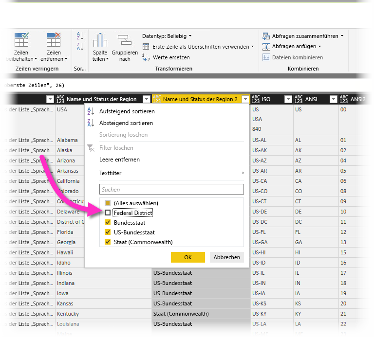
<!-- -->
<!-- -->

* *Entfernen Sie mehrere überflüssige Spalten*. Wir brauchen nur die Zuordnung des Bundesstaats zu seinem offiziellen Kürzel aus zwei Buchstaben, weshalb wir die anderen Spalten entfernen können. Wir behalten nur die zweite und fünfte Spalte.*Remove a few unneeded columns* – we only need the mapping of state to its official two-letter abbreviation, so we can remove the other columns: we'll keep only the second and fifth columns. Wählen Sie dazu die erste zu löschende Spalte und dann bei gedrückter STRG-TASTE die anderen zu löschenden Spalten aus (so können Sie mehrere nicht zusammenhängende Spalten auswählen).To do this, select the first column to be deleted, then hold down the CTRL key and select the other columns to be removed (this lets you select multiple, non-contiguous columns). Wählen Sie auf dem Menüband auf der Registerkarte „Start“ zunächst „Spalten entfernen“ und dann nochmals „Spalten entfernen“ aus.From the Home tab on the ribbon, select Remove Columns > Remove Columns.

    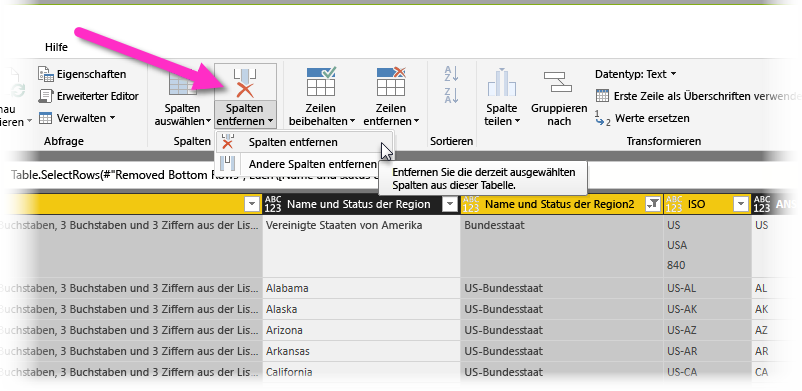
<!-- -->
<!-- -->

* *Verwenden Sie die erste Zeile als Überschrift*. Da wir die ersten drei Zeilen entfernt haben, wird die aktuelle oberste Zeile zur gewünschten Überschrift.*Use the first row as headers* – since we removed the top three rows, the current top row is the header we want. Klicken Sie einfach auf die Schaltfläche **Erste Zeile als Überschriften verwenden**.Just select the **Use first row as headers** button.

    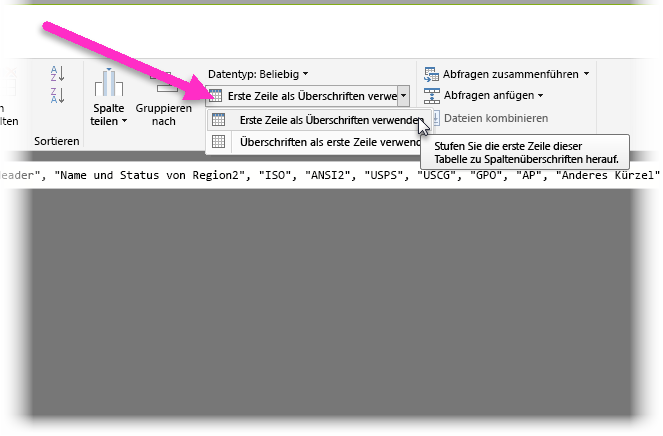

    >[!NOTE]
    >An dieser Stelle sei darauf hingewiesen, dass die *Reihenfolge* der im **Power Query-Editor** angewendeten Schritte wichtig ist und sich auf die Strukturierung der Daten auswirken kann.This is a good time to point out that the *sequence* of applied steps in **Power Query Editor** is important, and can affect how the data is shaped. Berücksichtigt werden muss auch, wie sich ein Schritt auf einen anderen, nachfolgenden Schritt auswirkt. Wenn Sie also aus **Angewendete Schritte** einen Schritt entfernen, verhalten sich nachfolgende Schritte wegen des Einflusses der Schrittreihenfolge der Abfrage ggf. nicht mehr so wie ursprünglich beabsichtigt.It’s also important to consider how one step may impact another subsequent step; if you remove a step from the **Applied Steps**, subsequent steps may not behave as originally intended, because of the impact of the query’s sequence of steps.

* *Benennen Sie die Spalten und die Tabelle selbst um*. Wie üblich gibt es mehrere Möglichkeiten, eine Spalte umzubenennen, von denen Sie sich die bevorzugte aussuchen können.*Rename the columns, and the table itself* – as usual, there are a couple ways to rename a column, you can choose whichever you prefer. Lassen Sie uns die Spalten *State Name* und *State Code* umbenennen.Let’s rename them to *State Name* and *State Code*. Um die Tabelle umzubenennen, geben Sie einfach im Bereich **Abfrageeinstellungen** den Namen in das Feld **Name** ein.To rename the table, just type the name into the **Name** box in the **Query Settings** pane. Wir nennen diese Tabelle **StateCodes**.Let’s call this table **StateCodes**.

    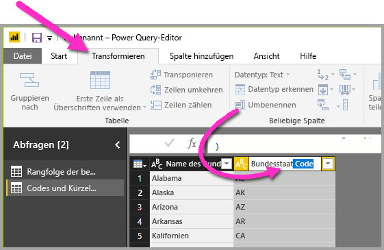

## Kombinieren von DatenCombine data

Nachdem wir nun die Tabelle *StateCodes* strukturiert haben, können wir die beiden Tabellen bzw. Abfragen kombinieren. Da die Tabellen, die wir jetzt haben, das Ergebnis der Abfragen sind, die wir auf die Daten angewendet haben, werden sie häufig auch als *Abfragen* bezeichnet.With the *StateCodes* table shaped, we can combine these two tables, or queries, into one; since the tables we now have are a result of the queries we applied to the data, they’re often referred to as *queries*.

Zum Kombinieren von Daten gibt zwei bevorzugte Möglichkeiten: *Zusammenführen* und *Anfügen*.There are two primary ways of combining queries – *merging* and *appending*.

Wenn eine oder mehrere Spalten zu einer anderen Abfrage hinzugefügt werden sollen, werden die Abfragen **zusammengeführt**.When you have one or more columns that you’d like to add to another query, you **merge** the queries. Wenn einer vorhandenen Abfrage zusätzliche Datenzeilen hinzugefügt werden sollen, wird die Abfrage **angefügt**.When you have additional rows of data that you’d like to add to an existing query, you **append** the query.

In diesem Fall möchten wir Abfragen zusammenführen.In this case we want to merge queries. Zum Einstieg wählen wir die Abfrage aus, *mit der* die andere Abfrage zusammengeführt werden soll. Anschließend klicken wir auf dem Menüband auf der Registerkarte **Start** auf **Abfragen zusammenführen**.To get started, we select the query *into which* we want the other query to merge, then select **Merge Queries** from the **Home** tab on the ribbon. Wir wählen zuerst unsere Abfrage von Pensionärsdaten aus.We want to select our retirement query first. Wenn wir schon mal dabei sind, benennen wir diese Abfrage in **RetirementStats** um.While we're at it, we'll rename that query **RetirementStats**.

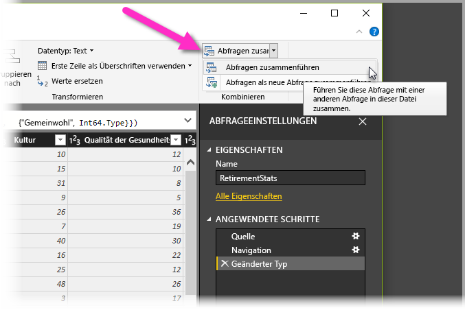

Im eingeblendeten Fenster **Zusammenführen** werden wir aufgefordert, die Tabelle auszuwählen, die mit der ausgewählten Tabelle zusammengeführt werden soll. Anschließend müssen wir die Spalten angeben, die für die Zusammenführung verwendet werden sollen.The **Merge** window appears, prompting us to select which table we’d like merged into the selected table, and then, the matching columns to use for the merge. 

Wählen Sie *State* in der Tabelle (Abfrage) *RetirementStats* und dann die Abfrage *StateCodes* aus. (Das ist in diesem Fall einfach, da es nur eine andere Abfrage gibt. Wenn Sie Verbindungen mit vielen Datenquellen herstellen, stehen hier viele Abfragen zur Auswahl.)Select *State* from the *RetirementStats* table (query), then select the *StateCodes* query (easy in this case, since there’s only one other query – when you connect to many data sources, there are many queries to choose from). Wenn Sie die übereinstimmenden Spalten (*State* aus *RetirementStats* und *State Name* aus *StateCodes*) richtig auswählen, sieht das Fenster **Zusammenführen** wie folgt aus, und die Schaltfläche **OK** ist aktiviert.When we select the correct matching columns – *State* from *RetirementStats*, and *State Name* from *StateCodes* – the **Merge** window looks like the following, and the **OK** button is enabled.

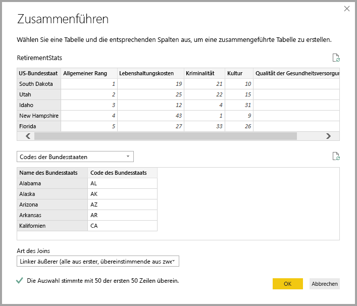

Am Ende der Abfrage wird eine neue Spalte namens **NewColumn** erstellt, die den Inhalt der Tabelle (Abfrage) enthält, die mit der vorhandenen Abfrage zusammengeführt wurde.A **NewColumn** is created at the end of the query, which is the contents of the table (query) that was merged with the existing query. Alle Spalten aus der zusammengeführten Abfrage werden auf die neue Spalte **NewColumn** reduziert. Sie können jedoch die Tabelle **erweitern** und gewünschte Spalten einbeziehen.All columns from the merged query are condensed into the **NewColumn**, but you can select to **Expand** the table, and include whichever columns you want. Um die zusammengeführte Tabelle zu erweitern und auszuwählen, welche Spalten einbezogen werden sollen, klicken Sie auf das Symbol „Erweitern“ (Symbol ).To expand the merged table, and select which columns to include, select the expand icon (). Das Fenster **Erweitern** wird geöffnet.The **Expand** window appears.

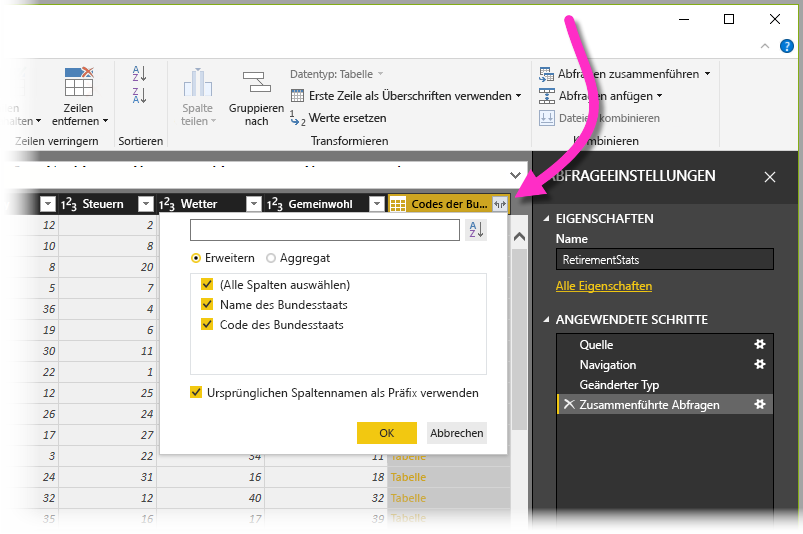

In unserem Fall benötigen wir nur die Spalte *State Code*, weshalb Sie nur diese Spalte auswählen und dann auf **OK** klicken.In this case, we only want the *State Code* column, so we select only that column and then select **OK**. Wir deaktivieren das Kontrollkästchen **Ursprünglichen Spaltennamen als Präfix verwenden**, da wir den ursprünglichen Spaltennamen nicht benötigen. Wenn das Kontrollkästchen aktiviert bleibt, erhält die zusammengeführte Spalte den Namen *NewColumn.State Code* (zusammengesetzt aus dem ursprünglichen Spaltennamen bzw. *NewColumn*, einem Punkt und dem Namen der in die Abfrage eingefügten Spalte).We clear the checkbox from **Use original column name as prefix** because we don’t need or want that; if we leave that selected, the merged column would be named *NewColumn.State Code* (the original column name, or *NewColumn*, then a dot, then the name of the column being brought into the query).

>[!NOTE]
>Möchten Sie ein wenig mit dem Einfügen der Tabelle *NewColumn* experimentieren?Want to play around with how to bring in that *NewColumn* table? Sie können ein wenig experimentieren. Wenn Ihnen die Ergebnisse nicht gefallen, löschen Sie diesen Schritt einfach im Bereich **Abfrageeinstellungen** in der Liste **Angewendete Schritte**. Ihre Abfrage wird dann wieder in den Zustand vor Anwenden des Schritts **Erweitern** zurückversetzt.You can experiment a bit, and if you don’t like the results, just delete that step from the **Applied Steps** list in the **Query Settings** pane; your query returns to the state prior to applying that **Expand** step. Auf diese Weise können Sie beliebig oft und solange experimentieren, bis die Erweiterung Ihren Vorstellungen entspricht.It’s like a free do-over, which you can do as many times as you like until the expand process looks the way you want it.

Wir haben jetzt eine einzelne Abfrage (Tabelle), in der zwei entsprechend den Anforderungen strukturierte Datenquellen miteinander kombiniert sind.We now have a single query (table) that combined two data sources, each of which has been shaped to meet our needs. Diese Abfrage kann als Grundlage vieler weiterer interessanter Datenverbindungen dienen, z.B. für Statistiken zu Wohnkosten, demografischen Daten oder Beschäftigungsmöglichkeiten in den US-Bundesstaaten.This query can serve as a basis for lots of additional, interesting data connections – such as housing cost statistics, demographics, or job opportunities in any state.

Um die Änderungen im **Power Query-Editor** zu übernehmen und sie in Power BI Desktop zu laden, wählen Sie auf dem Menüband auf der Registerkarte **Start** den Befehl **Schließen und übernehmen**.To apply the changes in **Power Query Editor** and load them into Power BI Desktop, select **Close & Apply** from the **Home** ribbon.

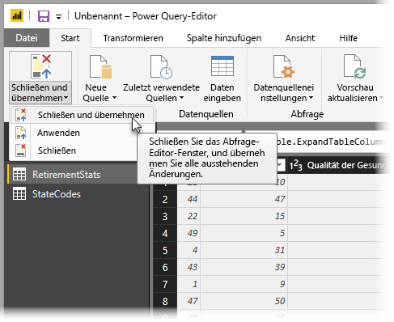

Nun können Sie in Ihrem Modell mit den Daten arbeiten.Now the data in your model is ready to work with. Als Nächstes befassen wir uns mit dem Erstellen von Visuals für Ihren Bericht.Next, let's see about creating some visuals for your report.

Im Moment haben wir genügend Daten, um in Power BI Desktop eine Reihe interessanter Berichte zu erstellen.For now, we have enough data to create a few interesting reports, all within Power BI Desktop. Da dies ein Meilenstein ist, speichern wir diese Power BI Desktop-Datei und nennen sie **Erste Schritte mit Power BI Desktop**.Since this is a milestone let’s save this Power BI Desktop file – we’ll call it **Getting Started with Power BI Desktop**. Wählen Sie auf dem Menüband auf der Registerkarte **Start** den Befehl **Datei > Speichern** aus.Select **File > Save** from the **Home** ribbon to save the report.

Prima.Great! Weiter zur nächsten Einheit, in der wir einige interessante Visuals erstellen.On to the next unit then, where we create some interesting visuals.
