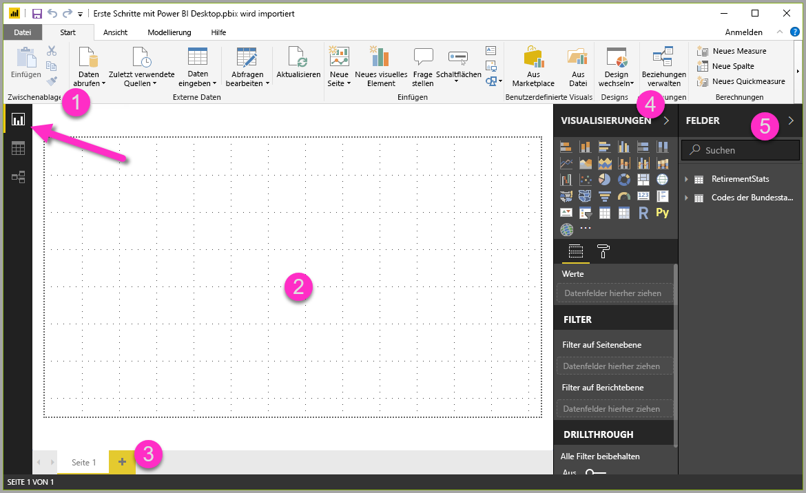
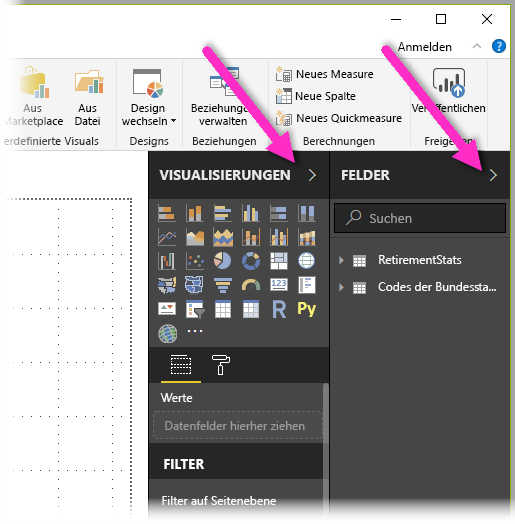
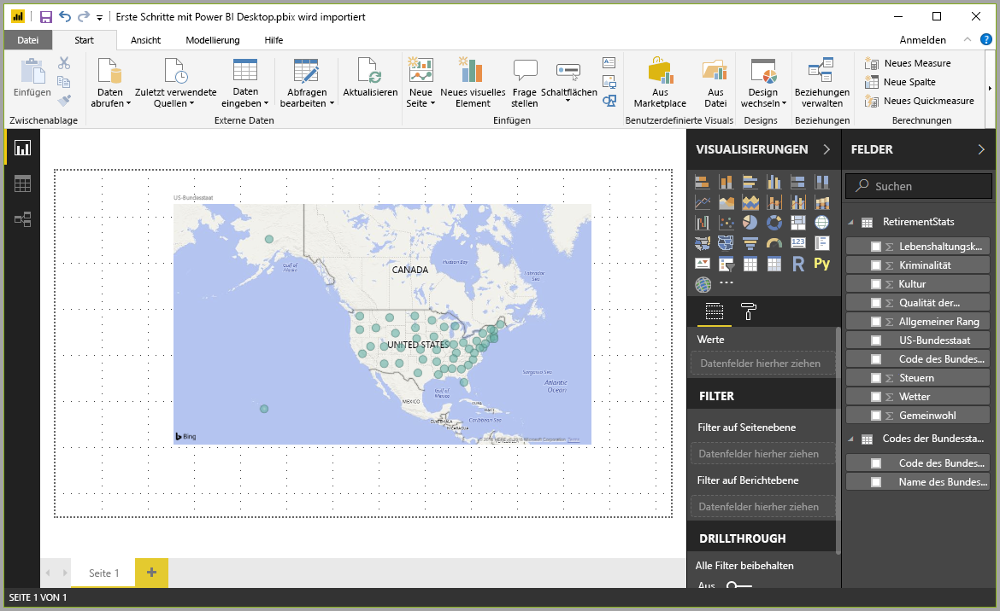
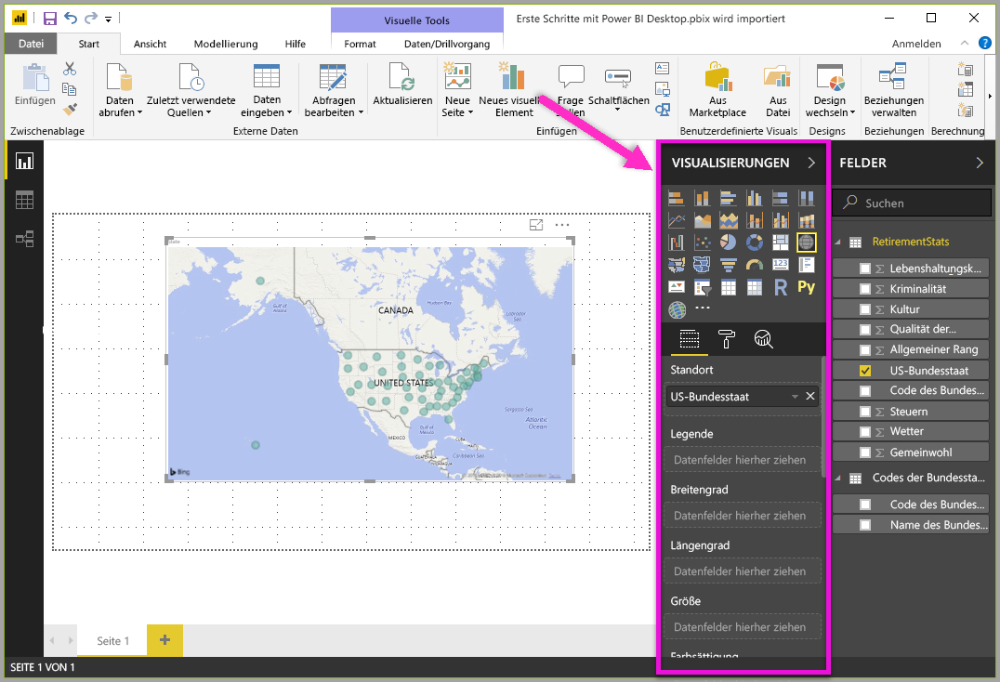
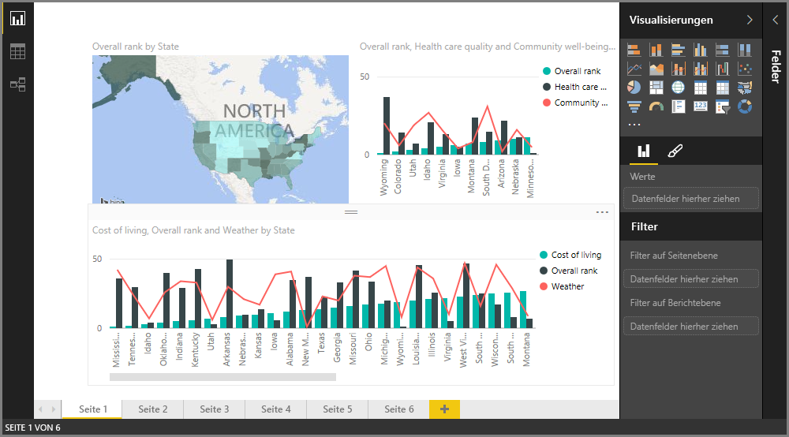
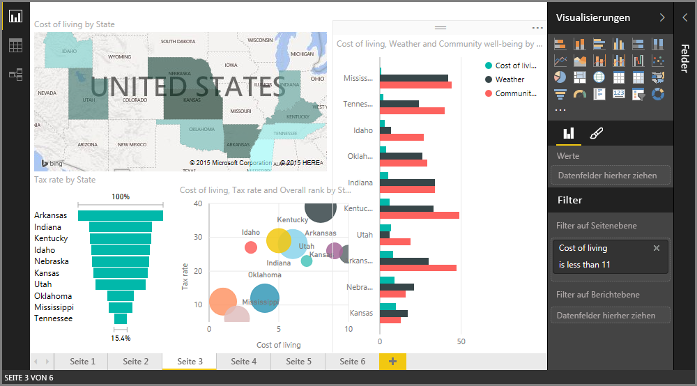

Additional changes can be made after the table is loaded, and you can reload a model to apply any changes you make. But for now this will do. In Power BI Desktop **Report** view, you can begin to build reports.

The **Report** view has five main areas:

1. The ribbon, which displays common tasks associated with reports and visualizations
2. The **Report** view, or canvas, where visualizations are created and arranged
3. The **Pages** tab area along the bottom, which lets you select or add a report page
4. The **Visualizations** pane, where you can change visualizations, customize colors or axes, apply filters, drag fields, and more
5. The **Fields** pane, where query elements and filters can be dragged onto the **Report** view, or dragged to the **Filters** area of the **Visualizations** pane
   

The **Visualizations** and **Fields** pane can be collapsed by selecting the small arrow along the edge, providing more space in the **Report** view to build cool visualizations. When modifying visualizations, you'll also see these arrows pointing up or down, which means you can expand or collapse that section, accordingly.

To create a visualization, just drag a field from the **Fields** list onto the **Report** view. In this case, let’s drag the *State* field from *RetirementStats*, and see what happens.

Look at that... Power BI Desktop automatically created a map-based visualization, because it recognized that the *State* field contained geolocation data.

Notice that in the **Visualizations** pane, I can select different types of visualizations, and in the area below those icons, I can drag fields to different areas to apply a Legend, or otherwise modify the visualization.

Let’s fast-forward a bit, and see what the **Report** view looks like after a handful of visualizations have been added, as well as a few new Report pages. For more information about reports, see [Report View in Power BI Desktop](desktop-report-view.md).

The first Report page provides a perspective of the data based on *Overall rank*. When we select one of the visualizations, the **Fields and Filters** pane shows which fields are selected, and the structure of the visualization (which fields are applied to the **Shared Axis**, **Column Values**, and **Line Values**).

There are six **Pages** in this Report, each visualizing certain elements of our data.

1. The first page, shown above, shows all states based on *Overall rank*.
2. The second page focuses on the top ten states based on *Overall rank*.
3. For the third page, the best 10 states for cost of living (and associated data) are visualized.
4. Weather is the focus of the fourth page, filtered to the 15 sunniest states.
5. On the fifth page, Community well-being is charted and visualized for the top 15 states.
6. Lastly, crime statistics are visualized, showing the best (and well, the last) ten states.

Here’s what the cost of living-focused Report page looks like.

There are all sorts of interesting reports and visualizations you can create. But what's best about creating reports is sharing them with others. In the next unit, we see just how easy it is to share Power BI reports.
