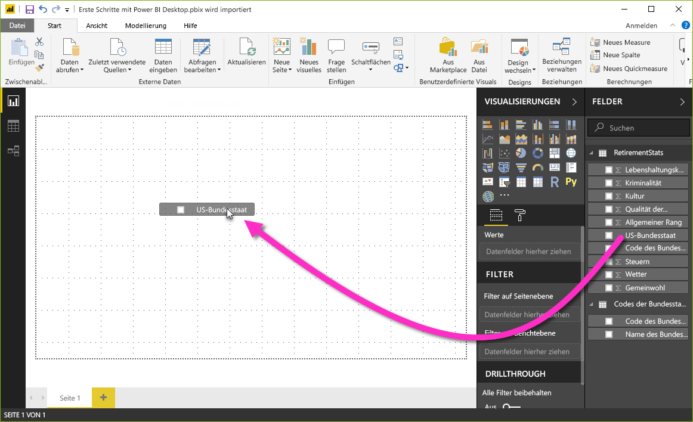
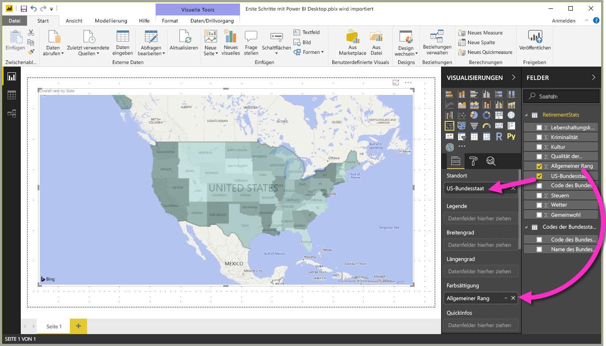
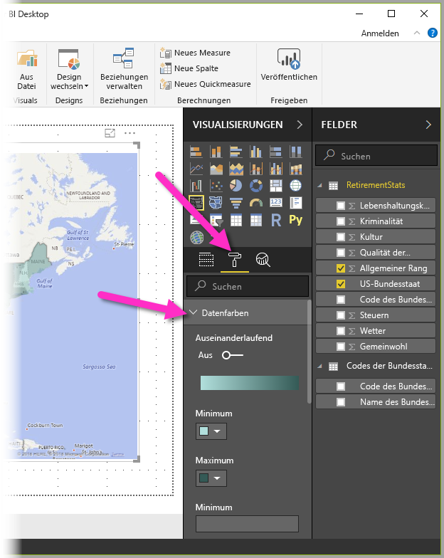
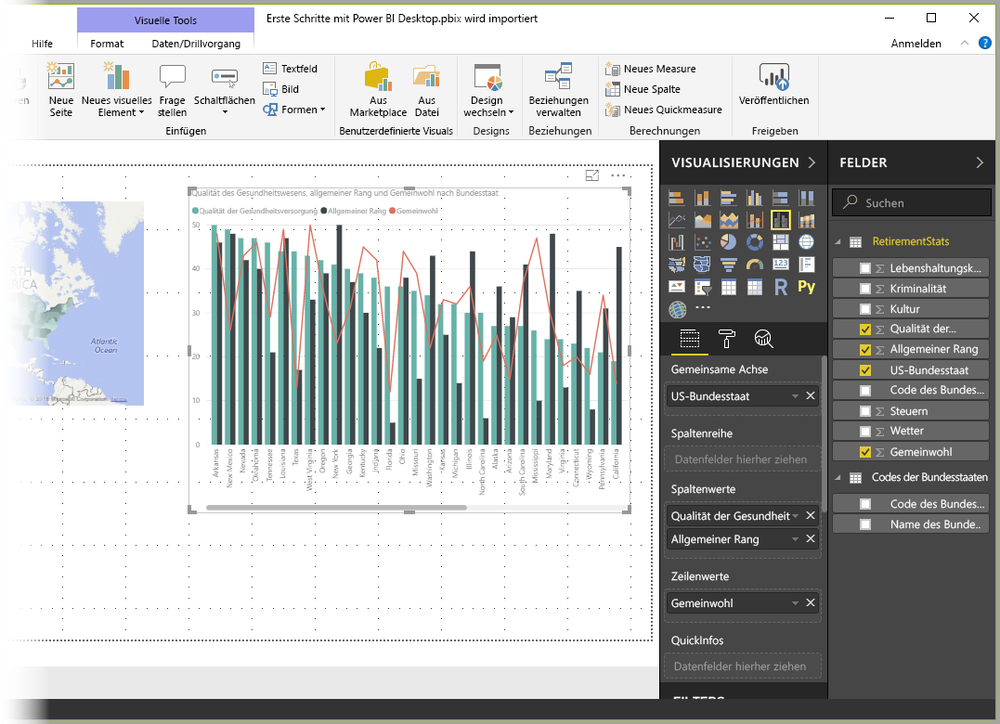
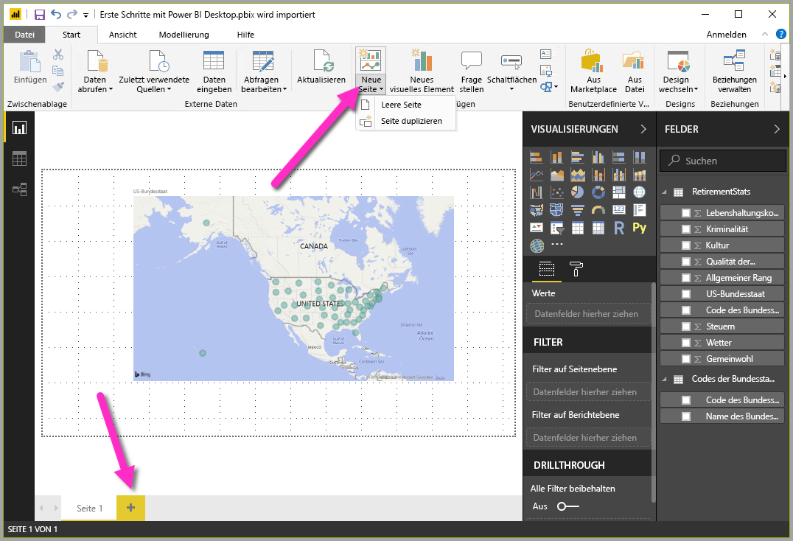

In der vorherigen Einheit haben wir zwei Datenquellen miteinander verbunden und diese Datenquellen nach unseren Vorstellungen strukturiert und kombiniert. Als Ergebnis verfügen wir nun über ein **Datenmodell**, das wir als Grundlage für die Erstellung von Berichten verwenden können. 

Das bedeutet nicht, dass wir für immer an diesem Datenmodell festhalten müssen. Änderungen können im Power Query-Editor vorgenommen werden, nachdem das Modell geladen wurde. Sie können auch ein Modell neu laden, um alle vorgenommenen Änderungen zu übernehmen. Aber vorerst reicht dieses Modell völlig aus. 

Um mit der Erstellung eines Berichts mit dem von uns erstellten Datenmodell zu beginnen, wechseln wir in Power BI Desktop zur Ansicht **Bericht**.

Die Ansicht **Bericht** in Power BI Desktop hat fünf Hauptbereiche:

1. Das Menüband, auf dem gängige Aufgaben im Zusammenhang mit Berichten und Visualisierungen angezeigt werden
2. Die Ansicht **Bericht** bzw. der Zeichenbereich, in der/dem Visualisierungen erstellt und angeordnet werden
3. Den Registerkartenbereich **Seiten** im unteren Bereich, in dem Sie eine Berichtsseite auswählen oder hinzufügen können
4. Den Bereich **Visualisierungen**, in dem Sie Visualisierungen ändern, Farben oder Achsen anpassen, Filter anwenden, Felder ziehen und vieles mehr können
5. Den Bereich **Felder**, in dem Abfrageelemente und Filter in die Ansicht **Bericht** oder den Bereich **Filter** des Bereichs **Visualisierungen** gezogen werden können
   

Die Bereiche **Visualisierungen** und **Felder** können durch Klicken auf den kleinen Pfeil am Rand ausgeblendet werden, wodurch in der Ansicht **Bericht** mehr Platz zur Erstellung überzeugender Visualisierungen zur Verfügung steht. Beim Ändern von Visualisierungen werden nach oben und unten zeigende Pfeile angezeigt, die das Ein- und Ausblenden des betreffenden Abschnitts ermöglichen.

## Erstellen von Visuals
Zum Erstellen einer Visualisierung ziehen Sie einfach ein Feld aus der Liste **Felder** auf die Ansicht **Bericht**. Ziehen Sie in diesem Fall das Feld *State* aus *RetirementStats*, und verfolgen Sie, was passiert.

Das sehen wir uns jetzt mal an. Power BI Desktop hat automatisch eine kartenbasierte Visualisierung erstellt, da die Software erkannt hat, dass das Feld *State* Daten zu geografischen Standorten enthält.

Beachten Sie, dass im Bereich **Visualisierungen** verschiedene Arten von Visualisierungen ausgewählt und im Bereich unterhalb der entsprechenden Symbole Felder auf verschiedenen Bereichen abgelegt werden können, um eine Legende zu platzieren oder die Visualisierung in anderer Weise zu ändern. 

Lassen Sie uns einige Visuals auf dieser ersten Seite erstellen, und sehen, was passiert. Ich kann den Typ eines Visuals ändern, indem ich es einfach auf dem Zeichenbereich auswähle und im Bereich **Visualisierungen** auf eine andere Kachel klicke. Wählen Sie anstelle von „Karte“ (Kachel mit Globussymbol) „Flächenkartogramm“ (die nächste Kachel, die wie Bundesstaaten in verschiedenen Farben aussieht) aus.

**Erstes Visual**: Ziehen Sie das Feld *Overall rank* (Allgemeine Rangfolge) aus dem Bereich **Felder** in den Abschnitt *Farbsättigung* im Bereich **Visualisierungen**. 

Um die in der Karte verwendeten Farben anzupassen, wählen Sie die (wie eine Farbrolle aussehende) Registerkarte **Format** im Bereich **Visualisierungen** aus. Erweitern Sie dann **Datenfarben**, um die Farben anzupassen.

Sie können die Größe des Visuals anpassen, indem Sie die Ecken oder Seiten eines ausgewählten Visuals ziehen. Lassen Sie uns dieses Visual nach links oben verschieben und das nächste Visual erstellen. Klicken Sie auf eine beliebige Stelle auf dem Zeichenbereich (nicht auf das Visual), um kein Visual auszuwählen, damit Sie bereit sind, Felder zu ziehen und das nächste Visual zu erstellen.

**Zweites Visual**: Ziehen Sie **State** aus **RetirementStats** in einen leeren Bereich des Zeichenbereichs.  Ziehen Sie dann das Feld **State**, danach das Feld **Health care quality** (Qualität des Gesundheitswesens) und das Feld **Well-being** (Wohlbefinden) auf das gleiche Visual. Wechseln wir nun zum Visual des Typs **Linien- und gruppiertes Säulendiagramm**, indem Sie im Bereich **Visualisierungen** auf die Kachel dieses Visuals klicken.

Wir haben es fast geschafft. Verschieben Sie auf der Registerkarte *Felder*das Feld **Well-being** zu *Zeilenwerte*. Die folgende Abbildung zeigt, was wir jetzt haben.

Sie können mit diesen Elementen so viel experimentieren, wie Sie möchten: Ändern Sie den Visualtyp, fügen Sie Felder hinzu, ändern Sie die Farben, oder ordnen Sie es im Zeichenbereich an. Alle diese Dinge machen Spaß, sind einfach rückgängig zu machen und ermöglichen eine schnelle Reaktion.

Wir machen mal einen Schnellvorlauf und sehen uns an, wie die Ansicht **Bericht** nach dem Hinzufügen einiger Visualisierungen und neuer Berichtsseiten aussieht. Keine Sorge, Sie können sie aus erster Hand sehen. In der Zusammenfassungseinheit finden Sie einen Link zum Herunterladen der endgültigen PBIX-Datei, sodass Sie sie in Ihre lokale Version von Power BI Desktop laden und nachvollziehen können, wie die Dinge zustande gekommen sind. 

Die erste Berichtsseite enthält eine Ansicht der Daten basierend auf der *allgemeinen Rangfolge*. Wenn wir eine der Visualisierungen auswählen, wird im Bereich **Felder und Filter** angezeigt, welche Felder ausgewählt wurden. Ersichtlich ist auch die Struktur der Visualisierung (die Felder, die auf **Gemeinsame Achse**, **Spaltenwerte** und **Zeilenwerte** angewendet wurden).

In diesem Bericht gibt es sechs **Seiten**, auf denen jeweils bestimmte Datenelemente visualisiert werden.

1. Die erste Seite (siehe oben) enthält alle Bundesstaaten auf der Basis *Allgemeine Rangfolge*.
2. Die zweite Seite konzentriert sich auf die zehn besten Bundesstaaten auf der Basis *Allgemeine Rangfolge*.
3. Auf der dritten Seite werden die 10 besten Bundesstaaten in Bezug auf Lebenshaltungskosten (und die entsprechenden Daten) visualisiert.
4. Auf der vierten Seite steht das Wetter im Mittelpunkt. Herausgefiltert wurden die 15 Bundesstaaten mit den meisten Sonnenstunden.
5. Auf der fünften Seite befindet sich ein Diagramm zum gesellschaftlichen Wohlbefinden, das für die 15 besten Bundesstaaten visualisiert ist.
6. Und zum Schluss wird eine Statistik zur Kriminalitätsrate mit den zehn sichersten (und auch den zehn unsichersten) Bundesstaaten visualisiert.

Hier sehen Sie, wie die Berichtsseite mit den Lebenshaltungskosten aussieht.

Es gibt viele interessante Berichte und Visualisierungen, die Sie erstellen können. Doch das Beste am Erstellen von Berichten ist, dass sie für andere freigegeben werden können. In die Einheit erfahren Sie, wie einfach das Freigeben von Power BI-Berichten ist.

## Hinzufügen von Berichtsseiten

Alle Berichte verfügen anfänglich über mindestens eine leere Seite. Seiten werden im Navigationsbereich links neben dem Zeichenbereich angezeigt. 

Sie können einer Seite alle Arten von Visualisierungen hinzufügen, aber Sie sollten es nicht übertreiben. Zu viele Visualisierungen auf einer Seite erschweren das Auffinden der gewünschten Informationen.

Um dem Bericht eine Seite hinzuzufügen, klicken Sie einfach auf dem Menüband auf **Neue Seite** oder neben der letzten Berichtsseite auf die Schaltfläche „+“.

Selbst mit nur ein paar wenigen Visuals haben Sie nun einen Bericht. Lassen Sie uns zur nächsten Einheit übergehen und erfahren, wie wir diese mit Erkenntnissen gefüllten Berichte für andere freigeben können.