Now that we have a Power BI Desktop report that’s reasonably complete, we can share it with others using the **Power BI** service. There are a few ways to share your work in Power BI Desktop. You can publish to the **Power BI** service, you can upload the .pbix file directly from the Power BI service, or you can save the .pbix file and send it like any other file.

First, let's look at publishing to the **Power BI** service directly from Power BI Desktop. On the **Home** ribbon, select **Publish**.

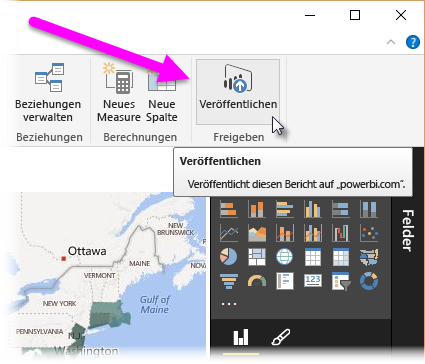

You may be prompted to sign in to Power BI.

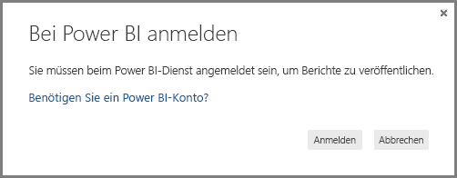

When you've signed in and the publish process is complete, you see the following dialog.

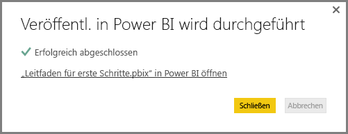

When you sign in to Power BI, you'll see Power BI Desktop file you just loaded in the **Dashboards**, **Reports**, and **Datasets** sections of the service.

Another way to share your work is to load it from within the **Power BI** service. The following link brings up the **Power BI** service in a browser:

`https://app.powerbi.com`

Select **Get Data** to start the process of loading your Power BI Desktop report.

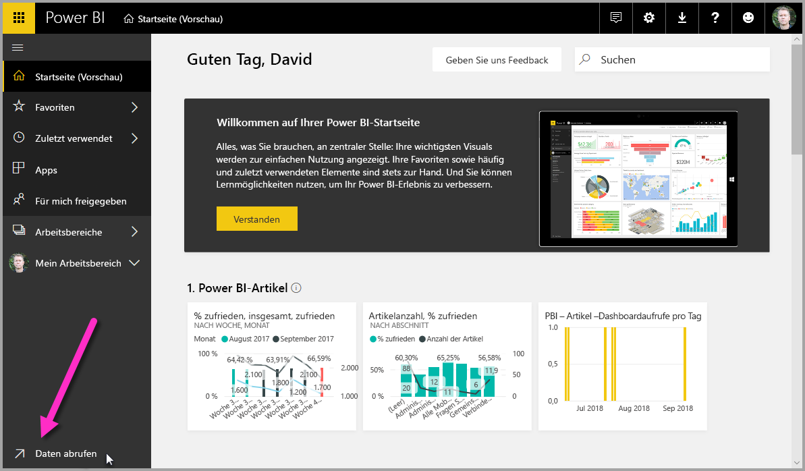

The **Get Data** page appears, from which you can select where to get your data from. In this case, we select **Get** from the **Files** box.

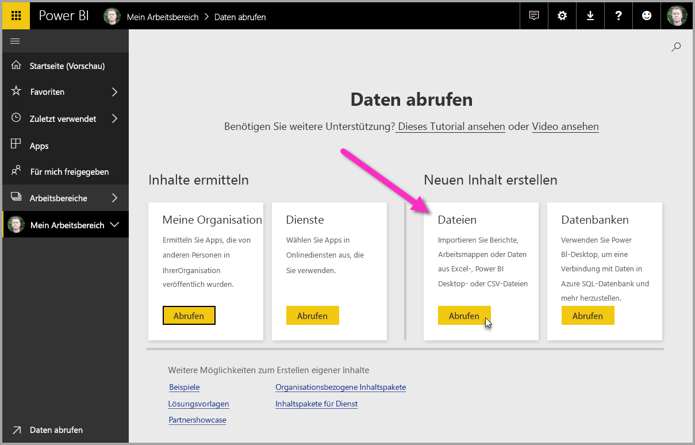

The **Files** view appears. In this case, we select **Local File**.

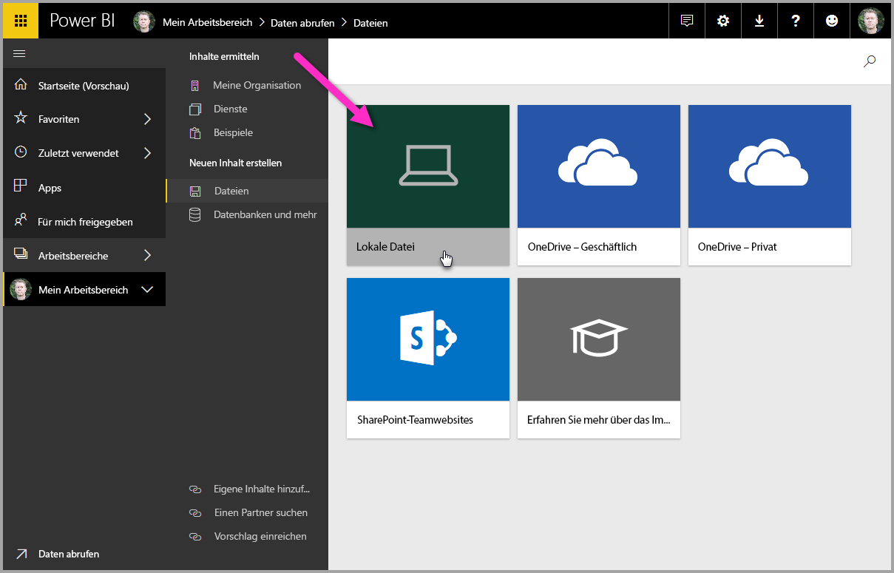

When you select the file, Power BI uploads the file.

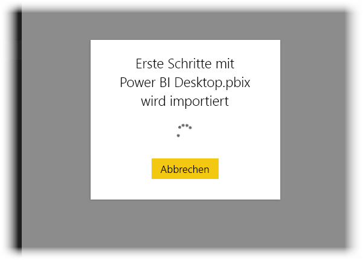

Once the file is uploaded, you can select the file from the **Reports** in the left pane of the Power BI service.

The **Power BI** service displays the first page of the report. Along the bottom of the page, you can select any tab to display that page of the report.

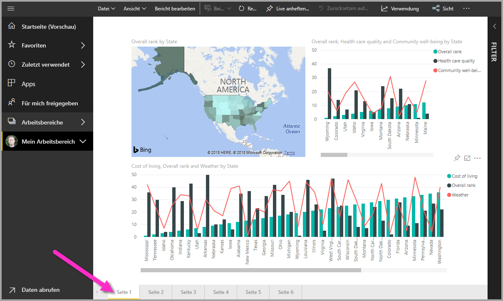

You can make changes to a report in the **Power BI** service by selecting **Edit Report** from the top of the report canvas.

To save your report, select **File > Save As** from the service. There are all sorts of interesting visuals you can create in the **Power BI** service from your report, which you can pin to a *dashboard*. To learn about dashboards in the **Power BI** service<strong>[, see Tips for designing a great dashboard](service-dashboards-design-tips.md)</strong>.

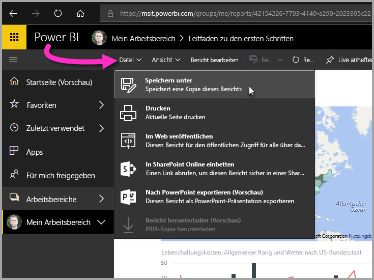

Once saved, select the **Share** icon on the main page.

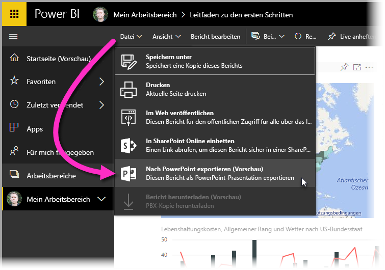

From here, you can send an email to colleagues with whom you’d like to share the dashboard.

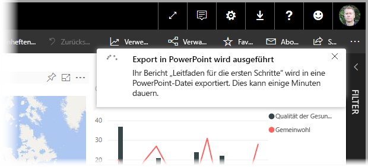

For more information about creating, sharing, and modifying dashboards, see [Share a dashboard](service-share-dashboards.md).

There are all sorts of compelling data-related mash-ups and visualizations you can do with Power BI Desktop, and with the Power BI service. Check out the next section for more information.