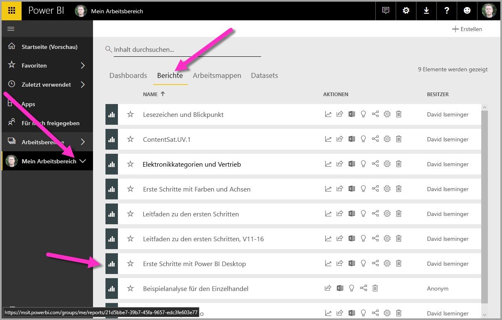

Jetzt, da wir einen Power BI Desktop-Bericht haben, der einigermaßen vollständig ist (oder zumindest ein Fortfahren ermöglicht), können wir ihn über den **Power BI**-Dienst für andere freigeben.Now that we have a Power BI Desktop report that’s reasonably complete (or at least ready to move ahead with), we can share it with others using the **Power BI** service. Es gibt in Power BI Desktop mehrere Möglichkeiten zum Freigeben des Berichts.There are a few ways to share your work in Power BI Desktop. Sie können ihn im **Power BI**-Dienst veröffentlichen, die PBIX-Datei direkt aus dem Power BI-Dienst hochladen oder die PBIX-Datei speichern und wie jede andere Datei senden.You can publish to the **Power BI** service, you can upload the .pbix file directly from the Power BI service, or you can save the .pbix file and send it like any other file. Sie können einen Bericht auch in eine PowerPoint-Datei exportieren und sogar eine PDF-Datei des Berichts erstellen.You can also export a report to a PowerPoint file, and even create a PDF file of your report.

## Veröffentlichen des Berichts im Power BI-DienstPublish to the Power BI service
Sehen wir uns zunächst die Veröffentlichung im **Power BI**-Dienst direkt aus Power BI Desktop an.First, let's look at publishing to the **Power BI** service directly from Power BI Desktop. Wählen Sie auf der Registerkarte **Start** im Menüband **Veröffentlichen** aus.On the **Home** ribbon, select **Publish**.

Sie werden möglicherweise aufgefordert, sich bei Power BI anzumelden.You may be prompted to sign in to Power BI.

Im nächsten eingeblendeten Fenster werden Sie nach einem Ziel für Ihren veröffentlichten Bericht gefragt.The next window that appears asks for a destination for your published report. Sie können einen Bericht in einem Arbeitsbereich veröffentlichen, auf den Ihre gesamte Organisation Zugriff hat (und so Ihren Bericht für alle in Ihrer Organisation freigeben), oder Sie können ihn für andere verfügbare Arbeitsbereiche freigeben.You can choose to publish a report to a workspace that's accessible from your entire organization (and thus share your report with everyone in your organzation), or you can share to other available workspaces. Die Arbeitsbereiche, die Sie sehen, basieren auf der Verfügbarkeit für Sie und Ihre Organisation.The workspaces you see will be based on which are available to you, and your organization.

Sie können den Bericht auch einfach in Ihrem eigenen Arbeitsbereich (genannt *Mein Arbeitsbereich*) freigeben und dann im Power BI-Dienst weitere Schritte damit unternehmen (einschließlich einer umfassenderen Freigabe).You can also simply share the report in your own workspace (called *My workspace*) and then do more with it in the Power BI service (including sharing it more broadly) from there. In diesem Fall entscheiden wir uns für *Mein Arbeitsbereich*.In our case, we'll select *My Workspace*.

Wenn Sie angemeldet sind und der Veröffentlichungsprozess abgeschlossen ist, sehen Sie das folgende Dialogfeld.When you've signed in and the publish process is complete, you see the following dialog.

Wenn Sie sich bei Power BI anmelden, sehen Sie die Power BI Desktop-Datei, die Sie gerade geladen haben, in den Abschnitten **Dashboards**, **Berichte** und **Datasets** des Diensts.When you sign in to Power BI, you'll see Power BI Desktop file you just loaded in the **Dashboards**, **Reports**, and **Datasets** sections of the service.

Eine weitere Möglichkeit zum Freigeben Ihres Berichts ist das Laden im **Power BI**-Dienst.Another way to share your work is to load it from within the **Power BI** service. Über den folgenden Link wird der **Power BI**-Dienst in einem Browser eingeblendet:The following link brings up the **Power BI** service in a browser:

`https://app.powerbi.com`

Wählen Sie **Daten abrufen** aus, um das Laden Ihres Power BI Desktop-Berichts zu starten.Select **Get Data** to start the process of loading your Power BI Desktop report.

Die Seite **Daten abrufen** wird angezeigt, auf der Sie auswählen können, wo Ihre Daten abgerufen werden sollen.The **Get Data** page appears, from which you can select where to get your data from. In diesem Fall wählen wir **Abrufen** im Feld **Dateien** aus.In this case, we select **Get** from the **Files** box.

Die Ansicht **Dateien** wird angezeigt.The **Files** view appears. In diesem Fall wählen wir **Lokale Datei**.In this case, we select **Local File**.

Wenn Sie die Datei auswählen, lädt Power BI die Datei hoch.When you select the file, Power BI uploads the file.

Sobald die Datei hochgeladen wurde, können Sie sie im linken Bereich des Power BI-Diensts in **Mein Arbeitsbereich** auswählen und dann im Zeichenbereich **Berichte** auswählen, um alle Ihre Berichte anzuzeigen.Once the file is uploaded, you can select the file from the **My Workspace** from the left pane in the Power BI service, and then select **Reports** from the canvas to display all your reports.

Wenn Sie den Bericht auswählen (durch Klicken auf dessen Namen), zeigt der **Power BI**-Dienst die erste Seite des Berichts an.When you select the report (by clicking on its name) the **Power BI** service displays the first page of the report. Unten auf der Seite können Sie eine beliebige Registerkarte zum Anzeigen dieser Seite des Berichts auswählen.Along the bottom of the page, you can select any tab to display that page of the report.

Sie können im **Power BI**-Dienst Änderungen an einem Bericht vornehmen, indem Sie oben im Berichtszeichenbereich auf **Bericht bearbeiten** klicken.You can make changes to a report in the **Power BI** service by selecting **Edit Report** from the top of the report canvas.

Wählen Sie zum Speichern Ihres Berichts im Dienst **Datei > Speichern unter** aus.To save your report, select **File > Save As** from the service. 

## Speichern als PowerPoint-DateiSave as PowerPoint file

Sie können Ihren Power BI Desktop-Bericht auch als PowerPoint-Präsentation exportieren, um ihn während einer PowerPoint-Präsentation mit anderen zu teilen.You can also export your Power BI Desktop report as a PowerPoint deck, and share your report with others during a PowerPoint presentation. 

Klicken Sie im Power BI-Dienst bei geladenem Bericht auf **Datei > Nach PowerPoint exportieren (Vorschau)**.From the Power BI service, with the report loaded, select **File > Export to PowerPoint (Preview)**.

Sobald Power BI den Exportvorgang abgeschlossen hat, erfahren Sie, wo die PowerPoint-Datei gespeichert wurde, die zur Freigabe für andere bereit ist.Once Power BI is done with the export process, it lets you know where the PowerPoint file was saved, and is ready to share with others.

Nachdem Sie erfahren haben, wie Berichte erstellt und freigegeben werden, können Sie mit Ihrer Vorstellungskraft Geschichten mit Daten erzählen und diese für Ihre gesamte Organisation freigeben.Now that you know how to create and share reports, you can use your imagination to tell stories with data and share them with your entire organization.

Lassen Sie uns zur nächsten Einheit übergehen, in der wir dieses Modul abschließen.Let's head to the next unit, where we wrap things up for this module.