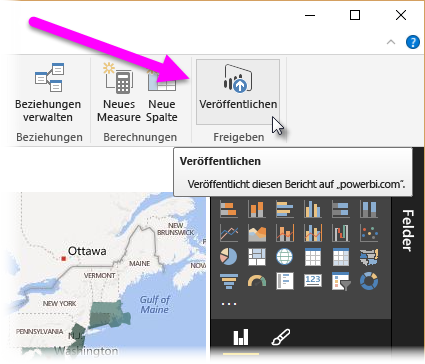

Herzlichen Glückwunsch!Congratulations! Sie haben gerade den Prozess der Erstellung eines Power BI-Berichts von Grund auf durchlaufen und gelernt, wie Sie Ihre Ergebnisse für andere freigeben können.You've just gone through the process of creating a Power BI report from scratch, and learned how to share your work with others. Lassen Sie uns zur Überprüfung einen Blick auf das werfen, was Sie gelernt haben.To review, let's take a look at what you learned.

In **Power BI Desktop** können Sie eine Verbindung mit den verschiedensten Datenquellen herstellen.In **Power BI Desktop** you can connect to all sorts of different data sources. Alles, was Sie in Power BI Desktop tun müssen, ist, auf dem Menüband **Daten abrufen** auszuwählen, woraufhin eine Vielzahl von Connectoroptionen angezeigt wird.All you have to do in Power BI Desktop is select **Get Data** from the ribbon, and a multitude of connector options appears. 

Sie haben auch gelernt, dass die Verbindung mit mehr als einer Datenquelle ganz einfach ist, da Sie über **Daten abrufen** einfach eine zweite Verbindung einrichten können. Sie können dazu auch im **Power Query-Editor** auf die Schaltfläche **Neue Quelle** klicken.You also learned that connecting to more than one data source is as easy as making a second **Get Data** connection, or from within **Power Query Editor**, using the **New Source** button. Der **Navigator** im **Power Query-Editor** bietet eine Vorschau auf die Daten.The **Navigator** in **Power Query Editor** provides a preview of the data.

Nachdem Sie Daten ausgewählt haben, können Sie sie nach Ihren Wünschen strukturieren, indem Sie Spalten, Zeilen oder Verbindungen zu einem einzigen **Datenmodell** zusammenführen, das Sie in Ihrem Bericht verwenden können.Once you selected data, you could shape it how you wanted by removing columns, rows, or merging connections into a single **data model** that you could use in your report.

Sie haben Visuals erstellt, indem Sie einfach Felder auf den Zeichenbereich des Berichts gezogen haben.You created visuals by just dragging fields onto the report canvas - it was that easy. Anschließend konnten Sie diese Visuals nach Ihren Wünschen ändern und experimentieren, bis Sie sie genauso aussahen, wie Sie es sich vorgestellt haben.Then you could modify those visuals however you wanted, experimenting until you got them looking just how you wanted.

Sobald alles erledigt war, konnten Sie Ihren Bericht für andere in Ihrem Unternehmen freigeben, indem Sie ihn im Power BI-Dienst veröffentlichten.And once it was all done, you were able to share your report with others in your organization by publishing your report to the Power BI service.

Gut gemacht!Great work! Wie Sie sich vielleicht erinnern, sind wir ein paar Visuals durchgegangen, mussten aber dann fortfahren, wobei wir versprachen, dass der fertige Bericht über einen Link in dieser Zusammenfassung verfügbar sein würde.As you might remember, we went through a few visuals but then had to move on, promising that the completed report would be available from a link in this summary. Dieses Versprechen können wir erfüllen.Well, here we are, and here it is. Um den fertigen Power BI Desktop-Bericht herunterzuladen, klicken Sie auf den folgenden Link:To download the completed Power BI Desktop report, use the following link:

* Fertig gestellter Power BI Desktop-Bericht – Erste Schritte mit Power BI DesktopCompleted Power BI Desktop report - Getting Started with Power BI Desktop

Gut gemacht!Great work! Über Power BI und Power BI Desktop gibt es noch mehr zu erfahren. Suchen Sie daher nach weiteren Modulen, mit denen Sie Ihr Wissen noch weiter ausbauen können.There's more to learn about Power BI, and Power BI Desktop, so look for more modules that take your learning even further. 
