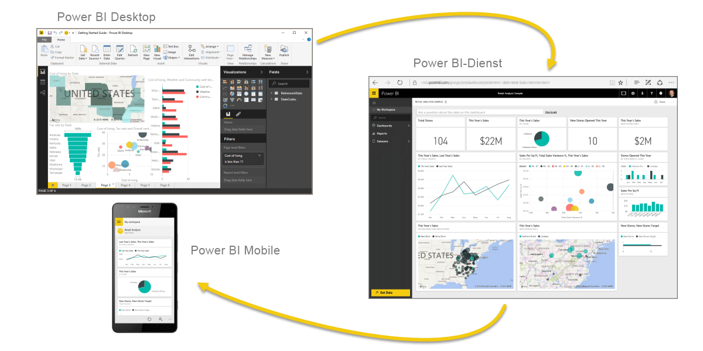

**Microsoft Power BI** ist eine Sammlung von Softwarediensten, Apps und Connectors, die zusammenarbeiten, um Ihre nicht verbundenen Datenquellen in stimmige, visuell ansprechende und interaktive Erkenntnisse zu verwandeln. Es spielt keine Rolle, ob es sich bei Ihren Daten um eine einfache Microsoft Excel-Arbeitsmappe oder eine Sammlung cloudbasierter und lokaler Hybrid-Data Warehouses handelt: Mit **Power BI** ist es einfach, eine Verbindung mit Ihren Datenquellen herzustellen, die wichtigen Aspekte zu visualisieren (bzw. zu ermitteln) und diese Informationen für beliebige Zielgruppen freizugeben.

**Power BI** kann einfach und schnell sein und dient zum raschen Gewinnen von Erkenntnissen aus einer Excel-Arbeitsmappe oder lokalen Datenbank. **Power BI** ist zugleich robust und unternehmenstauglich und nicht nur für umfassende Modellierungen und Echtzeitanalysen, sondern auch für die benutzerdefinierte Entwicklung geeignet. Sie können die Anwendung deshalb als Ihr persönliches Berichts- und Visualisierungstool nutzen, sie aber auch als Analyse- und Entscheidungsmodul im Hintergrund von Gruppenprojekten, Unternehmensbereichen oder gesamten Konzernen einsetzen.

Wenn Sie Power BI **noch nicht kennen**, ist dieses Modul ein guter Einstieg. Wenn Sie bereits über **Erfahrung** mit Power BI verfügen, verknüpft dieses Modul Zusammenhänge und schließt eventuelle Lücken.

## Die Komponenten von Power BI
Power BI besteht aus einer Microsoft Windows-Desktopanwendung mit dem Namen **Power BI Desktop**, einem SaaS-Onlinedienst (*Software-as-a-Service*) namens **Power BI-Dienst** und mobilen Power BI-**Apps**, die auf Windows-Smartphones und -Tablets sowie für Apple iOS- und Google Android-Geräte verfügbar sind.

Diese drei Elemente – **Desktop**, **Dienst** und **mobile Apps** – sind so konzipiert, dass geschäftliche Erkenntnisse so gewonnen, freigegeben und verwertet werden können, wie es für sie oder ihre Rolle am effektivsten ist.

## Power BI in Bezug auf Ihre Rolle
Es kann von Ihrer Rolle in einem Projekt oder Team abhängen, wie Sie Power BI verwenden. Inhaber anderer Rollen können Power BI für noch andere Zwecke nutzen, und dies ist absolut in Ordnung.

Beispielsweise können Sie Berichte und Dashboards im **Power BI-Dienst** anzeigen, was schon alles sein kann, was Sie mit Power BI anstellen. Doch Ihr Kollege, der viel mit Zahlen und Berichten hantiert, nutzt ggf. **Power BI Desktop** sehr aktiv (und veröffentlicht Power BI Desktop-Berichte im Power BI-Dienst, den Sie dann zu deren Anzeige verwenden können). Eine weitere Kollegin aus dem Vertrieb verwendet vielleicht hauptsächlich ihre Power BI-Smartphone-App, um ihren Status in Bezug auf ihre Verkaufsquote zu überwachen und Details zu neuen Leads anzuzeigen.

Unter Umständen nutzen Sie die einzelnen Elemente von **Power BI** auch zu unterschiedlichen Zeiten, je nach dem zu erreichenden Ziel oder Ihrer Rolle für ein Projekt oder eine Aktion.

Es kann sein, dass Sie den Bestands- und Fertigungsstatus in einem Echtzeitdashboard des Diensts anzeigen und **Power BI Desktop** einsetzen, um für Ihr eigenes Team Berichte zu Kundenbindungsstatistiken zu erstellen. Wie Sie Power BI nutzen, hängt davon ab, welches Feature oder welcher Dienst von Power BI für die jeweilige Situation am besten geeignet ist. Doch jede Komponente von Power BI steht Ihnen zur Verfügung, weshalb die Lösung so flexibel und überzeugend ist.

Später werden diese drei Elemente – **Desktop**, **Dienst** und **mobile Apps** – ausführlicher behandelt. In den nächsten Einheiten und Modulen erstellen wir außerdem Berichte in Power BI Desktop, geben sie im Dienst frei und beschäftigen uns auf unserem Mobilgerät mit ihren Details.

## Arbeitsablauf in Power BI
Ein typischer Arbeitsablauf in Power BI beginnt in **Power BI Desktop** mit dem Erstellen eines Berichts. Dieser Bericht wird dann für den Power BI-**Dienst** veröffentlicht und anschließend freigegeben, damit Benutzer von **Power BI Mobile**-Apps die Informationen nutzen können.

Der Ablauf ist nicht immer so. Das ist in Ordnung. Doch wir halten uns an diesen Ablauf, damit Sie die unterschiedlichen Komponenten von Power BI kennenlernen und erfahren, wie sie sich gegenseitig ergänzen.

Da Sie sich jetzt einen Überblick über dieses Modul verschaffen konnten und Informationen zu Power BI und den drei Hauptelementen erhalten haben, können wir uns ansehen, wie mit **Power BI** gearbeitet wird.

