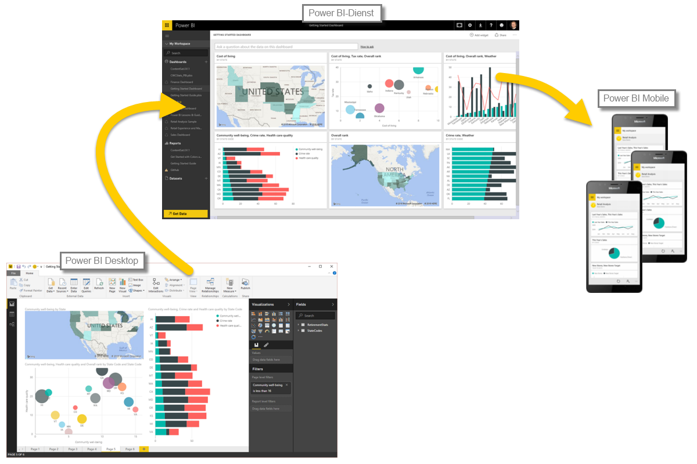

Nachdem Sie sich über die Grundlagen von Power BI informiert haben, können wir mit einigen praktischen Übungen und einer geführten Tour fortfahren.Now that you know the basics of Power BI, let’s jump into some hands-on experiences and a guided tour. 

Während Sie mehr über all die Dinge erfahren, die mit Power BI möglich sind, denken Sie daran, dass all diese Aktivitäten und die gesamte Analyse mit Power BI im Allgemeinen einem einheitlichen Ablauf folgen.As you learn about all the things that can be done with Power BI, keep in mind that all of these activities, and all the analysis done with Power BI generally follow a common flow. Der **allgemeine Ablauf** der Aktivitäten in Power BI lautet wie folgt:The **common flow** of activity in Power BI is the following:

* Einbinden von Daten in Power BI Desktop und Erstellen eines BerichtsBring data into Power BI Desktop, and create a report.
* Durchführen von Veröffentlichungen für den Power BI-Dienst, mit dem Sie neue Visualisierungen oder Dashboards erstellen könnenPublish to the Power BI service, where you can create new visualizations or build dashboards
* Freigeben von Dashboards für andere Benutzern, vor allem AußendienstmitarbeiterShare dashboards with others, especially people who are on the go
* Anzeigen und Interagieren mit freigegebenen Dashboards und Berichten in Power BI Mobile-AppsView and interact with shared dashboards and reports in Power BI Mobile apps

Wie bereits erwähnt, kann es sein, dass Sie Ihre gesamte Zeit nur mit dem **Power BI-Dienst** verbringen und Visuals und Berichte anzeigen, die andere erstellt haben. Das ist absolut in Ordnung.As mentioned earlier, you might spend all your time in the **Power BI service**, viewing visuals and reports that have been created by others – that’s just fine. Eine Kollegin in Ihrem Team nutzt unter Umständen nur **Power BI Desktop**, und auch das ist natürlich kein Problem.Someone else on your team might spend all of her time in **Power BI Desktop**, which is fine too. Aber damit Sie den gesamten Ablauf von Power BI und die Möglichkeiten der Anwendung kennenlernen, zeigen wir Ihnen alle Komponenten.In order to help you understand the full continuum of Power BI and what it can do, we’ll show you all of it… Sie können dann selbst entscheiden, wie Sie den größten Nutzen daraus ziehen.then you can decide how to use it to your best advantage.

Lassen Sie uns loslegen und die Lösung kennenlernen.So let’s jump in, and step through the experience. Als Erstes sollen Sie sich mit den grundlegenden Komponenten von Power BI vertraut machen. Dies ist eine gute Grundlage, um anschließend zu lernen, wie mit Power BI Daten in interessante Berichte und visuelle Elemente verwandelt werden können.The first order of business is to understand the basic building blocks of Power BI, which will provide a solid basis for learning how Power BI turns data into cool reports and visuals.

