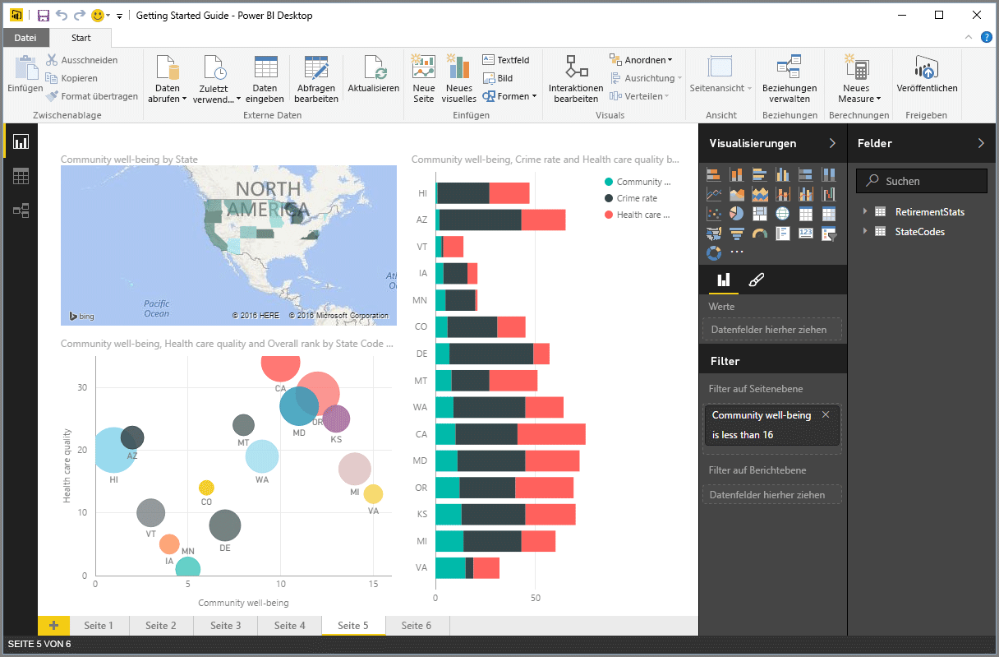

Alle Arbeiten, die Sie in Power BI ausführen, können in einige grundlegende **Komponenten** zerlegt werden. Wenn Sie sich mit diesen Komponenten vertraut gemacht haben, können Sie sie jeweils erweitern und mit dem Erstellen von ausgeklügelten und komplexen Berichten beginnen. Schließlich bestehen auch scheinbar komplexe Gebilde aus grundlegenden Komponenten. Gebäude werden beispielsweise aus Holz, Stahl, Beton und Glas gebaut. Autos bestehen aus Metall, Stoff und Gummi. Natürlich können auch Gebäude und Autos – je nach Anordnung dieser grundlegenden Komponenten – einfacher oder komplexer Art sein.

Wir werfen nun einen Blick auf diese grundlegenden Komponenten und beschreiben einige einfache Dinge, die damit erstellt werden können. Anschließend geht es darum, wie daraus auch komplexere Dinge erstellt werden können.

Die grundlegenden Komponenten in Power BI sind:

* Visualisierungen
* Datasets
* Berichte
* Dashboards
* Kacheln

## Visualisierungen
Eine **Visualisierung** (auch als **visuelles Element** bezeichnet) ist eine visuelle Darstellung von Daten, z.B. ein Diagramm, ein Graph, eine Karte mit Farbcodierung oder andere interessante Dinge, die Sie erstellen können, um Ihre Daten visuell darzustellen. Power BI enthält viele verschiedene Visualisierungstypen, und es werden ständig weitere hinzugefügt. In der folgenden Abbildung ist eine Sammlung mit unterschiedlichen Visualisierungen dargestellt, die im Power BI-Dienst erstellt wurden.

Visualisierungen können einfacher Art – z.B. eine einzelne Zahl mit einer signifikanten Bedeutung – oder visuell komplex sein, z.B. eine Karte mit Farbverläufen, mit der die Stimmung von Wählern in Bezug auf ein bestimmtes soziales Thema oder Problem angezeigt wird. Ziel eines visuellen Elements ist die Darstellung von Daten auf eine Weise, bei der Kontext und Erkenntnisse geliefert werden. Beides ist in einer unformatierten Tabelle mit Zahlen oder Text nur schwer zu erkennen.

## Datasets
Ein **Dataset** ist eine Sammlung mit Daten, die von Power BI zum Erstellen von Visualisierungen verwendet werden.

Sie können ein einfaches Dataset verwenden, das auf einer einzelnen Tabelle einer Excel-Arbeitsmappe basiert, beispielsweise wie in der folgenden Abbildung.

**Datasets** können auch eine Kombination aus vielen unterschiedlichen Quellen sein, die Sie filtern und kombinieren können, um eindeutige Sammlungsdaten (ein Dataset) für die Verwendung in Power BI bereitzustellen.

Beispielsweise können Sie ein Dataset aus drei unterschiedlichen Datenbankfeldern, einer Websitetabelle, einer Excel-Tabelle und Onlineergebnissen einer E-Mail-Marketingkampagne erstellen. Diese eindeutige Kombination wird weiterhin als einzelnes **Dataset** angesehen, obwohl die Daten aus vielen verschiedenen Quellen zusammengestellt wurden.

Indem Sie die Daten filtern, bevor Sie sie in Power BI einbinden, können Sie sich auf die für Sie wichtigen Daten konzentrieren. Sie können beispielsweise Ihre Kontaktdatenbank filtern, damit nur Kunden, die die E-Mails der Marketingkampagne erhalten haben, in das Dataset einbezogen werden. Anschließend können Sie basierend auf dieser Teilmenge von Kunden (gefilterte Sammlung), die in die Kampagne einbezogen wurden, visuelle Elemente erstellen. Durch das Filtern können Sie sich besser auf Ihre Daten und Arbeit konzentrieren.

Ein wichtiger und sehr hilfreicher Teil von Power BI sind die vielen vorhandenen **Connectors** für Daten. Es spielt keine Rolle, ob sich die gewünschten Daten in Excel oder einer SQL-Datenbank, in Azure oder Oracle oder in einem Dienst wie Facebook, Salesforce oder MailChimp befinden: Power BI verfügt über integrierte Connectors für Daten, mit denen Sie auf einfache Weise eine Verbindung mit diesen Daten herstellen, sie bei Bedarf filtern und in Ihr Dataset einbinden können.

Wenn Sie über ein Dataset verfügen, können Sie mit dem Erstellen von Visualisierungen beginnen, mit denen unterschiedliche Teile dieses Datasets auf unterschiedliche Arten angezeigt werden. Aus den angezeigten Daten können Sie dann Erkenntnisse gewinnen. An dieser Stelle kommen die Berichte ins Spiel.

## Berichte
In Power BI ist ein **Bericht** eine Sammlung mit Visualisierungen, die zusammen auf einer oder mehreren Seiten angezeigt werden. Wie bei anderen Berichten, die Sie ggf. für eine Verkaufspräsentation erstellen oder im Rahmen einer Schulaufgabe schreiben: In Power BI ist ein **Bericht** eine Sammlung mit Elementen, die miteinander in Beziehung stehen. In der folgenden Abbildung ist ein **Bericht** in Power BI Desktop dargestellt. In diesem Fall ist es die fünfte Seite eines sechsseitigen Berichts. Sie können Berichte auch im Power BI-Dienst erstellen.

Mit Berichten können Sie viele Visualisierungen erstellen – ggf. auch auf mehreren Seiten – und diese so anordnen, wie es für Ihre Zwecke am besten ist.

Es kann beispielsweise sein, dass Sie über einen Bericht zum Quartalsumsatz oder zum Produktwachstum in einem bestimmten Segment verfügen oder dass Sie einen Bericht zu den Migrationsmustern von Eisbären erstellen. Unabhängig davon, in welchem Themenbereich Sie sich bewegen, können Sie Ihre Visualisierungen zusammenstellen und auf einer oder mehreren Seiten anordnen.

## Dashboards
Wenn Sie eine Seite eines Berichts oder eine Sammlung mit Visualisierungen teilen möchten, erstellen Sie ein **Dashboard**. Ein Power BI-**Dashboard** ähnelt dem Armaturenbrett eines Autos und umfasst eine Sammlung visueller Elemente auf einer Seite, die Sie für andere Personen freigeben können. Häufig handelt es sich um eine Gruppe mit visuellen Elementen, die Ihnen einen schnellen Überblick über die Daten bzw. Ihre gewünschte „Story“ verschaffen.

Ein Dashboard muss auf eine einzelne Seite passen, die häufig als „Canvas“ bezeichnet wird (leere Hintergrundfläche in Power BI Desktop oder im Dienst, auf der Sie die Visualisierungen anordnen). Sie können sich dies wie die Zeichenfläche vorstellen, die von einem Künstler bzw. Maler verwendet wird. Eine Arbeitsfläche, auf der Sie interessante und ansprechende visuelle Elemente erstellen, kombinieren und überarbeiten.
Sie können Dashboards für andere Benutzer oder Gruppen freigeben, die dann mit Ihrem Dashboard interagieren können, wenn sie den Power BI-Dienst oder ihr mobiles Gerät verwenden.

## Kacheln
In Power BI ist eine **Kachel** eine einzelne Visualisierung in einem Bericht oder einem Dashboard. Es ist ein rechteckiges Feld mit jeweils einer Visualisierung. In der folgenden Abbildung ist eine Kachel dargestellt (heller Kasten), die von anderen Kacheln umgeben ist.

Wenn Sie in Power BI einen Bericht oder ein Dashboard *erstellen*, können Sie die Kacheln so verschieben oder anordnen, wie dies für die Darstellung Ihrer Informationen am besten geeignet ist. Sie können sie wie gewünscht vergrößern, die Höhe oder Breite ändern und sie in der Nähe von anderen Kacheln anordnen.

Beim *Anzeigen* oder *Nutzen* eines Dashboards oder Berichts – wenn Sie also nicht der Ersteller oder Besitzer sind, aber die Freigabe für Sie erteilt wurde – können Sie damit interagieren, aber nicht die Größe der Kacheln oder ihre Anordnung ändern.

## Zusammenfassung
Dies sind die Grundlagen von Power BI und der einzelnen Komponenten. Wir fassen diese noch einmal kurz zusammen.

Power BI ist eine Sammlung mit Diensten, Apps und Connectors, mit der Sie unabhängig vom Speicherort eine Verbindung mit Ihren Daten herstellen und diese bei Bedarf filtern und dann in Power BI einbinden können, um ansprechende Visualisierungen zu erstellen und dann für andere Benutzer freizugeben.  

Nachdem Sie sich nun mit den grundlegenden Komponenten von Power BI vertraut gemacht haben, wird deutlich, dass Sie Datasets erstellen können, die *für Sie* sinnvoll sind. Außerdem können Sie visuell ansprechende Berichte erstellen, um Ihre Informationen zu vermitteln. Mit Power BI vermittelte Informationen müssen nicht unbedingt komplex oder kompliziert sein, um für Benutzer interessant zu sein.

Für einige Benutzer kann die Verwendung einer einzelnen Excel-Tabelle in einem Dataset und die anschließende Freigabe eines Dashboards für das Team eine unglaublich wertvolle Nutzung von Power BI bedeuten.

Für andere Benutzer besteht der gewünschte Nutzen von Power BI beispielsweise in der folgenden Vorgehensweise: Verwendung von Azure SQL Data Warehouse-Echtzeittabellen, die mit anderen Datenbanken und einer Echtzeitquelle kombiniert und dann in Echtzeit gefiltert werden, um ein Dataset zu erstellen, mit dem der Fertigungsstatus lückenlos überwacht wird.

Der Prozess ist hierbei jeweils gleich: Erstellen von Datasets, Erstellen von ansprechenden visuellen Elementen und Freigeben für andere Benutzer. Und auch das Ergebnis ist praktisch identisch: Bändigen Ihrer ständig zunehmenden Datenmengen und Produzieren von verwertbaren Erkenntnissen.

Unabhängig davon, ob für Ihre Datenerkenntnisse einfache oder komplexe Datasets erforderlich sind, können Sie schnell in Power BI einsteigen und die Nutzung gemäß Ihren jeweiligen Datenanforderungen dann steigern. Und weil Power BI ein Microsoft-Produkt ist, können Sie sicher sein, dass es stabil, erweiterbar, Office-kompatibel und unternehmenstauglich ist.

Als Nächstes wird die Funktionsweise beschrieben. Hierzu sehen wir uns kurz den Power BI-Dienst an.

