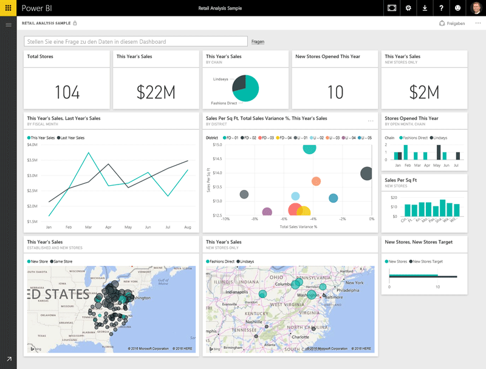

Alle Arbeiten, die Sie in Microsoft Power BI ausführen, können in einige grundlegende **Komponenten** zerlegt werden.Everything you do in Microsoft Power BI can be broken down into a few basic **building blocks**. Wenn Sie sich mit diesen Komponenten vertraut gemacht haben, können Sie sie jeweils erweitern und mit dem Erstellen ausgeklügelter und komplexer Berichte beginnen.After you understand these building blocks, you can expand on each of them and begin creating elaborate and complex reports. Schließlich basieren auch scheinbar komplexe Dinge auf Grundbausteinen.After all, even seemingly complex things are built from basic building blocks. Gebäude werden z.B. aus Holz, Stahl, Beton und Glas erstellt, und Autos aus Metall, Stoff und Kunststoff.For example, buildings are created with wood, steel, concrete and glass, and cars are made from metal, fabric, and rubber. Natürlich können auch Gebäude und Autos – je nach Anordnung dieser grundlegenden Komponenten – einfacher oder komplexer Art sein.Of course, buildings and cars can also be basic or elaborate, depending on how those basic building blocks are arranged.

Wir werfen nun einen Blick auf diese grundlegenden Komponenten und beschreiben einige einfache Dinge, die damit erstellt werden können. Anschließend geht es darum, wie daraus auch komplexere Dinge erstellt werden können.Let's take a look at these basic building blocks, discuss some simple things that can be built with them, and then get a glimpse into how complex things can also be created.

Die grundlegenden Komponenten in Power BI sind:Here are the basic building blocks in Power BI:

* VisualisierungenVisualizations
* DatasetsDatasets
* BerichteReports
* DashboardsDashboards
* KachelnTiles

## VisualisierungenVisualizations
Eine **Visualisierung** (auch als **visuelles Element** bezeichnet) ist eine visuelle Darstellung von Daten, z.B. ein Diagramm, eine Karte mit Farbcodierung oder andere interessante Dinge, die Sie erstellen können, um Ihre Daten visuell darzustellen.A **visualization** (sometimes also referred to as a **visual**) is a visual representation of data, like a chart, a color-coded map, or other interesting things you can create to represent your data visually. Power BI enthält viele verschiedene Visualisierungstypen, und es werden ständig weitere hinzugefügt.Power BI has all sorts of visualization types, and more are coming all the time. In der folgenden Abbildung ist eine Sammlung mit unterschiedlichen Visualisierungen dargestellt, die im Power BI-Dienst erstellt wurden.The following image shows a collection of different visualizations that were created in the Power BI service.

Visualisierungen können einfacher Art sein – z.B. eine einzelne Zahl mit einer signifikanten Bedeutung – oder visuell komplex sein, z.B. eine Karte mit Farbverläufen, mit der die Stimmung von Wählern in Bezug auf ein bestimmtes soziales Thema oder Problem angezeigt wird.Visualizations can be simple, like a single number that represents something significant, or they can be visually complex, like a gradient-colored map that shows voter sentiment about a certain social issue or concern. Ziel eines visuellen Elements ist die Darstellung von Daten auf eine Weise, bei der Kontext und Einblicke geliefert werden. Beides ist in einer unformatierten Tabelle mit Zahlen oder Text wahrscheinlich nur schwer zu erkennen.The goal of a visual is to present data in a way that provides context and insights, both of which would probably be difficult to discern from a raw table of numbers or text.

## DatasetsDatasets
Ein **Dataset** ist eine Sammlung mit Daten, die von Power BI zum Erstellen von Visualisierungen verwendet werden.A **dataset** is a collection of data that Power BI uses to create its visualizations.

Sie können ein einfaches Dataset verwenden, das auf einer einzelnen Tabelle einer Microsoft Excel-Arbeitsmappe basiert, beispielsweise wie in der folgenden Abbildung.You can have a simple dataset that's based on a single table from a Microsoft Excel workbook, similar to what's shown in the following image.

**Datasets** können auch eine Kombination aus vielen unterschiedlichen Quellen sein, die Sie filtern und kombinieren können, um eindeutige Sammlungsdaten (ein Dataset) für die Verwendung in Power BI bereitzustellen.**Datasets** can also be a combination of many different sources, which you can filter and combine to provide a unique collection of data (a dataset) for use in Power BI.

Beispielsweise können Sie ein Dataset aus drei Datenbankfeldern, einer Websitetabelle, einer Excel-Tabelle und Onlineergebnissen einer E-Mail-Marketingkampagne erstellen.For example, you can create a dataset from three database fields, one website table, an Excel table, and online results of an email marketing campaign. Diese eindeutige Kombination wird weiterhin als einzelnes **Dataset** angesehen, obwohl die Daten aus vielen verschiedenen Quellen zusammengestellt wurden.That unique combination is still considered a single **dataset**, even though it was pulled together from many different sources.

Indem Sie die Daten filtern, bevor Sie sie in Power BI einbinden, können Sie sich auf die für Sie wichtigen Daten konzentrieren.Filtering data before bringing it into Power BI lets you focus on the data that matters to you. Sie können beispielsweise Ihre Kontaktdatenbank filtern, damit nur Kunden, die die E-Mails der Marketingkampagne erhalten haben, in das Dataset einbezogen werden.For example, you can filter your contact database so that only customers who received emails from the marketing campaign are included in the dataset. Anschließend können Sie basierend auf dieser Teilmenge von Kunden (gefilterte Sammlung), die in die Kampagne einbezogen wurden, visuelle Elemente erstellen.You can then create visuals based on that subset (the filtered collection) of customers who were included in the campaign. Durch das Filtern können Sie sich besser auf Ihre Daten und Arbeit konzentrieren.Filtering helps you focus your data—and your efforts.

Ein wichtiger und sehr hilfreicher Teil von Power BI sind die vielen vorhandenen **Connectors** für Daten.An important and enabling part of Power BI is the multitude of data **connectors** that are included. Es spielt keine Rolle, ob sich die gewünschten Daten in Excel oder einer Microsoft SQL Server-Datenbank, in Azure oder Oracle oder in einem Dienst wie Facebook, Salesforce oder MailChimp befinden: Power BI verfügt über integrierte Connectors für Daten, mit denen Sie auf einfache Weise eine Verbindung mit diesen Daten herstellen, sie bei Bedarf filtern und in Ihr Dataset einbinden können.Whether the data you want is in Excel or a Microsoft SQL Server database, in Azure or Oracle, or in a service like Facebook, Salesforce, or MailChimp, Power BI has built-in data connectors that let you easily connect to that data, filter it if necessary, and bring it into your dataset.

Wenn Sie über ein Dataset verfügen, können Sie mit dem Erstellen von Visualisierungen beginnen, die unterschiedliche Teile dieses Datasets auf unterschiedliche Weise anzeigen. Aus den angezeigten Daten können Sie dann Erkenntnisse gewinnen.After you have a dataset, you can begin creating visualizations that show different portions of it in different ways, and gain insights based on what you see. An dieser Stelle kommen die Berichte ins Spiel.That's where reports come in.

## BerichteReports
In Power BI ist ein **Bericht** eine Sammlung mit Visualisierungen, die zusammen auf einer oder mehreren Seiten angezeigt werden.In Power BI, a **report** is a collection of visualizations that appear together on one or more pages. Wie bei anderen Berichten, die Sie ggf. für eine Verkaufspräsentation erstellen oder im Rahmen einer Schulaufgabe schreiben: In Power BI ist ein Bericht eine Sammlung mit Elementen, die miteinander in Beziehung stehen.Just like any other report you might create for a sales presentation or write for a school assignment, a report in Power BI is a collection of items that are related to each another. In der folgenden Abbildung ist ein **Bericht** in Power BI Desktop dargestellt. In diesem Fall ist es die fünfte Seite eines sechsseitigen Berichts.The following image shows a **report** in Power BI Desktop—in this case, it's the fifth page in a six-page report. Sie können Berichte auch im Power BI-Dienst erstellen.You can also create reports in the Power BI service.

Mit Berichten können Sie viele Visualisierungen erstellen – ggf. auch auf mehreren Seiten – und diese Visualisierungen so anordnen, wie es für Ihre Zwecke am besten ist.Reports let you create many visualizations, on multiple pages if necessary, and let you arrange those visualization in whatever way best tells your story.

Es kann beispielsweise sein, dass Sie über einen Bericht zum Quartalsumsatz, zum Produktwachstum in einem bestimmten Segment oder zu den Migrationsmustern von Eisbären verfügen.You might have a report about quarterly sales, product growth in a particular segment, or migration patterns of polar bears. Unabhängig davon, in welchem Themenbereich Sie sich bewegen, können Sie Ihre Visualisierungen zusammenstellen und auf einer Seite (oder mehreren) anordnen.Whatever your subject, reports let you gather and organize your visualizations onto one page (or more).

## DashboardsDashboards
Wenn Sie eine Seite eines Berichts oder eine Sammlung mit Visualisierungen teilen möchten, erstellen Sie ein **Dashboard**.When you're ready to share a single page from a report, or a collection of visualizations, you create a **dashboard**. Ein Power BI-**Dashboard** ähnelt dem Armaturenbrett eines Autos und umfasst eine Sammlung visueller Elemente auf einer Seite, die Sie für andere Personen freigeben können.Much like the dashboard in a car, a Power BI **dashboard** is a collection of visuals from a single page that you can share with others. Häufig handelt es sich um eine ausgewählte Gruppe mit visuellen Elementen, die Ihnen einen schnellen Überblick über die Daten bzw. Ihre gewünschte „Story“ verschaffen.Often, it's a selected group of visuals that provide quick insight into the data or story you're trying to present.

Ein Dashboard muss auf eine einzelne Seite passen, die häufig als „Canvas“ bezeichnet wird (leere Hintergrundfläche in Power BI Desktop oder im Dienst, auf der Sie die Visualisierungen anordnen).A dashboard must fit on a single page, often called a canvas (the canvas is the blank backdrop in Power BI Desktop or the service, where you put visualizations). Sie können sich dies wie die Leinwand eines Maler vorstellen – eine Arbeitsfläche, auf der Sie interessante und ansprechende visuelle Elemente erstellen, kombinieren und überarbeiten.Think of it like the canvas that an artist or painter uses—a workspace where you create, combine, and rework interesting and compelling visuals.
Sie können Dashboards für andere Benutzer oder Gruppen freigeben, die dann mit Ihren Dashboards interagieren können, wenn sie den Power BI-Dienst oder ihr mobiles Gerät verwenden.You can share dashboards with other users or groups, who can then interact with your dashboards when they're in the Power BI service or on their mobile device.

## KachelnTiles
In Power BI ist eine **Kachel** eine einzelne Visualisierung in einem Bericht oder einem Dashboard.In Power BI, a **tile** is a single visualization on a report or a dashboard. Sie ist ein rechteckiges Feld mit jeweils einer Visualisierung.It's the rectangular box that holds an individual visual. In der folgenden Abbildung ist eine Kachel dargestellt (heller Kasten), die von anderen Kacheln umgeben ist.In the following image, you see one tile (highlighted by a bright box), which is also surrounded by other tiles.

Wenn Sie in Power BI einen Bericht oder ein Dashboard *erstellen*, können Sie die Kacheln so verschieben oder anordnen, wie dies für die Darstellung Ihrer Informationen am besten geeignet ist.When you're *creating* a report or a dashboard in Power BI, you can move or arrange tiles to reflect the way you want to present your information. Sie können sie wie gewünscht vergrößern, die Höhe oder Breite ändern und sie in der Nähe von anderen Kacheln anordnen.You can make them bigger, change their height or width, and snuggle them up to other tiles however you want.

Beim *Anzeigen* oder *Nutzen* eines Dashboards oder Berichts – wenn Sie also nicht der Ersteller oder Besitzer sind, aber das Dashboard oder der Bericht für Sie freigegeben wurde – können Sie damit interagieren, aber nicht die Größe der Kacheln oder ihre Anordnung ändern.When you're *viewing*, or *consuming*, a dashboard or report—which means you're not the creator or owner, but the report or dashboard has been shared with you—you can interact with it, but you can't change the size of the tiles or their arrangement.

## ZusammenfassungAll together now
Dies sind die Grundlagen von Power BI und der einzelnen Komponenten.Those are the basics of Power BI and its building blocks. Wir fassen diese noch einmal kurz zusammen.Let's take a moment to review.

Power BI ist eine Sammlung mit Diensten, Apps und Connectors, mit der Sie unabhängig vom Speicherort eine Verbindung mit Ihren Daten herstellen und diese bei Bedarf filtern und dann in Power BI einbinden können, um ansprechende Visualisierungen zu erstellen und dann für andere Benutzer freizugeben.Power BI is a collection of services, apps, and connectors that lets you connect to your data, wherever it happens to reside, filter it if necessary, and then bring it into Power BI, where you can create compelling visualizations that you can share with others.

Nachdem Sie sich nun mit den grundlegenden Komponenten von Power BI vertraut gemacht haben, sollte deutlich sein, dass Sie Datasets erstellen können, die *für Sie* sinnvoll sind. Außerdem können Sie visuell ansprechende Berichte erstellen, um Ihre Informationen zu vermitteln.Now that you've learned about the handful of basic building blocks of Power BI, it should be clear that you can create datasets that make sense *to you* and create visually compelling reports that tell your story. Mit Power BI vermittelte Informationen müssen nicht unbedingt komplex oder kompliziert sein, um für Benutzer interessant zu sein.Stories told with Power BI don't have to be complex, or complicated, to be compelling.

Für einige Benutzer kann die Verwendung einer einzelnen Excel-Tabelle in einem Dataset und die anschließende Freigabe eines Dashboards für das Team eine unglaublich wertvolle Nutzung von Power BI bedeuten.For some people, using a single Excel table in a dataset and then sharing a dashboard with their team will be an incredibly valuable way to use Power BI.

Für andere Benutzer besteht der Wert von Power BI in der Verwendung von Azure SQL Data Warehouse-Echtzeittabellen, die mit anderen Datenbanken und einer Echtzeitquelle kombiniert und dann in Echtzeit gefiltert werden, um ein Dataset zu erstellen, mit dem der Fertigungsstatus lückenlos überwacht wird.For others, the value of Power BI will come from being able to use real-time Azure SQL Data Warehouse tables that combine with other databases and real-time sources, which are then filtered in real time to build a dataset that monitors moment-by-moment manufacturing progress.

Der Prozess ist hierbei für beide Gruppen jeweils gleich: Erstellen von Datasets, Erstellen von ansprechenden visuellen Elementen und Freigeben für andere Benutzer.For both groups, the process is the same: create datasets, build compelling visuals, and share them with others. Und auch das Ergebnis ist praktisch identisch: Bändigen Ihrer ständig zunehmenden Datenmengen und Produzieren von verwertbaren Einblicken.And the result is also the same for both groups: harness your ever-expanding world of data, and turn it into actionable insights.

Unabhängig davon, ob für Ihre Dateneinblicke einfache oder komplexe Datasets erforderlich sind, können Sie schnell in Power BI einsteigen und die Nutzung dann gemäß Ihrer jeweiligen Datenanforderungen steigern.Whether your data insights require straightforward or complex datasets, Power BI helps you get started quickly and can expand with your needs to be as complex as your world of data requires. Weil Power BI ein Microsoft-Produkt ist, können Sie auch sicher sein, dass es stabil, erweiterbar, Microsoft Office-kompatibel und unternehmenstauglich ist.And because Power BI is a Microsoft product, you can count on it being robust, extensible, Microsoft Office–friendly, and enterprise-ready.

Als Nächstes wird die Funktionsweise beschrieben.Now let's see how this works. Hierzu sehen wir uns kurz den Power BI-Dienst an.We'll start by taking a quick look at the Power BI service.

