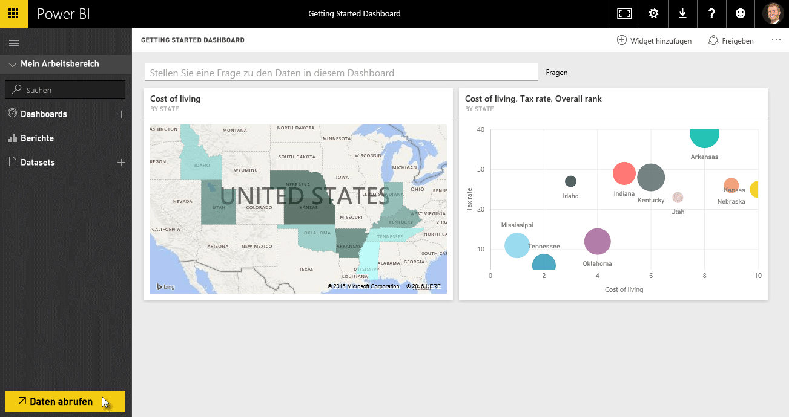
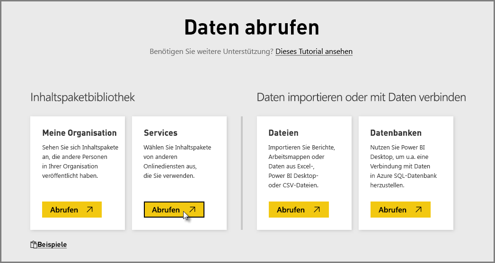
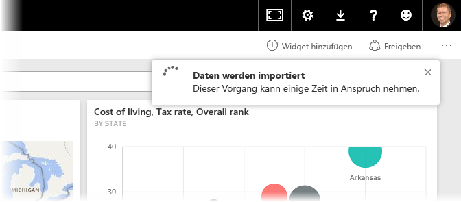
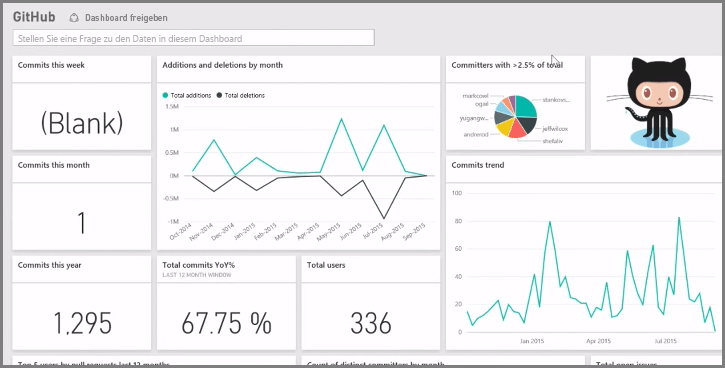
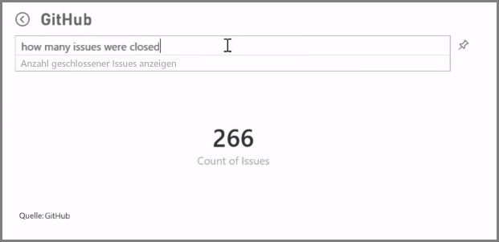
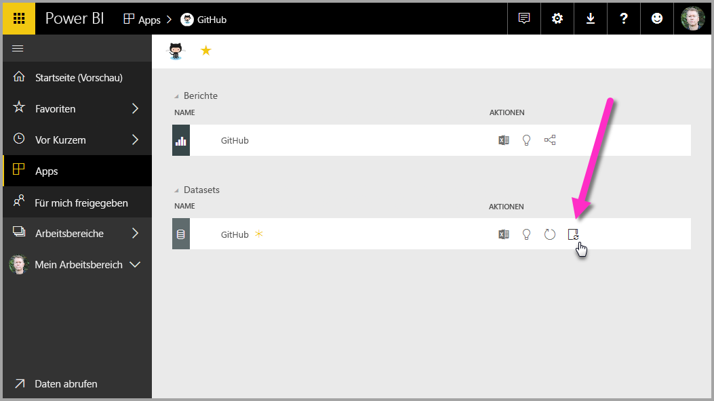
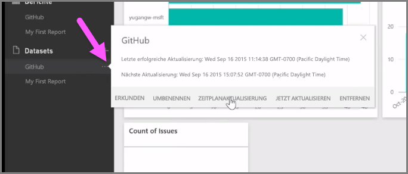

Wie wir gesehen haben, ist der allgemeine Arbeitsablauf in Power BI das Erstellen eines Berichts in Power BI Desktop, das Veröffentlichen des Berichts über den Power BI-Dienst und das anschließende Freigeben für andere Benutzer, damit diese ihn im Dienst oder in einer mobilen App anzeigen können.

Einige Benutzer beginnen Ihre Arbeit aber im Power BI-Dienst. Daher werfen wir einen kurzen Blick auf den Dienst, um eine einfache und beliebte Vorgehensweise kennenzulernen, mit der in Power BI schnell visuelle Elemente erstellt werden können: *Apps*.

Eine **App** ist eine Sammlung mit vorkonfigurierten, fertigen visuellen Elementen und Berichten, die auf bestimmten Datenquellen basieren, z.B. Salesforce. Die Verwendung einer App ist mit dem Zubereiten eines Fertiggerichts in der Mikrowelle oder dem Bestellen eines Fastfood-Menüs vergleichbar: Nach wenigen Klicks und Kommentaren erhalten Sie in kurzer Zeit eine Zusammenstellung von Speisen, die gut zusammenpassen und in einer sauberen und bequemen Verpackung geliefert werden.

Wir sehen uns daher kurz die Apps, den Dienst und die Funktionsweise an. In den nächsten Abschnitten werden Apps (und der Dienst) ausführlicher behandelt. Sie können sich dies wie ein Appetithäppchen vorstellen.

## Erstellen von Standarddashboards mit Clouddiensten
Mit Power BI ist es einfach, eine Verbindung mit Daten herzustellen. Im Power BI-Dienst können Sie auf der Startseite unten links einfach die Schaltfläche **Daten abrufen** wählen.

Auf dem *Canvas* (mittlerer Bereich des Power BI-Diensts) werden die verfügbaren Datenquellen im Power BI-Dienst angezeigt. Zusätzlich zu allgemeinen Datenquellen wie Excel-Dateien, Datenbanken oder Azure-Daten kann mit Power BI genauso leicht auch eine Verbindung mit **Softwarediensten** (auch als SaaS-Anbieter oder Clouddienste bezeichnet), z.B. Salesforce, Facebook oder Google Analytics, und vielen anderen SaaS-Diensten hergestellt werden.

Für diese Softwaredienste stellt der **Power BI-Dienst** eine Sammlung mit fertigen visuellen Elementen bereit, die in Dashboards und Berichten vorab angeordnet sind (als **Apps** bezeichnet). Mithilfe von Apps können Sie in Power BI mit Daten aus dem gewählten Dienst schnell starten. Bei Verwendung der Salesforce-App stellt Power BI beispielsweise eine Verbindung mit Ihrem Salesforce-Konto her (nach Angabe Ihrer Anmeldeinformationen) und füllt dann eine vordefinierte Sammlung mit visuellen Elementen und Dashboards in Power BI mit Daten.

Power BI verfügt über Apps für alle Arten von Diensten. In der folgenden Abbildung ist der erste Bildschirm mit Diensten in alphabetischer Reihenfolge dargestellt, der angezeigt wird, wenn Sie im Feld **Dienste** die Option **Abrufen** wählen (in der vorherigen Abbildung gezeigt). Wie Sie in der folgenden Abbildung sehen, können Sie unter vielen Diensten wählen.

Für unsere Zwecke wählen wir **GitHub**. GitHub ist eine Anwendung für die Online-Quellcodeverwaltung. Nach dem Eingeben der Informationen und Anmeldeinformationen für die GitHub-App wird mit dem Import der Daten begonnen.

Nach dem Laden der Daten wird das vordefinierte GitHub-App-Dashboard angezeigt.

Zusätzlich zum **Dashboard** ist auch der **Bericht** verfügbar, der für die Erstellung des Dashboards generiert wurde (als Teil der GitHub-App). Dies gilt auch für das **Dataset** (Sammlung mit Daten aus GitHub), das während des Datenimports erstellt und zum Erstellen des GitHub-Berichts verwendet wurde.

Im Dashboard können Sie auf eines der visuellen Elemente klicken, um automatisch zur Seite **Bericht** zu gelangen, auf der das visuelle Element erstellt wurde. Wenn Sie auf das visuelle Element mit den obersten fünf Benutzern nach Pull Requests (**Top 5 users by pull requests**) klicken, wird in Power BI im Bericht die Seite **Pull Requests** geöffnet (Seite des Berichts, auf der das visuelle Element erstellt wurde).

## Stellen von Fragen zu Ihren Daten
Sie können auch Fragen zu Ihren Daten stellen. Der Power BI-Dienst erstellt dann basierend auf Ihrer Frage in Echtzeit visuelle Elemente. In der folgenden Abbildung ist dargestellt, dass Power BI ein visuelles Element mit einer Zahl erstellt, mit dem die Anzahl von geschlossenen Problemen angezeigt wird. Dieser Wert basiert darauf, was in der Leiste für **Abfragen in natürlicher Sprache** eingegeben wird.

Wenn Ihnen ein visuelles Element gefällt, können Sie das Symbol **Stift** rechts von der Leiste für Abfragen in natürlicher Sprache auswählen, um es im Dashboard anzuheften. In diesem Fall wird das visuelle Element im GitHub-Dashboard angeheftet, da dies das derzeit ausgewählte Dashboard ist.

## Aktualisieren von Daten im Power BI-Dienst
Sie können das Dataset für eine App oder andere Daten, die Sie in Power BI nutzen, auch **aktualisieren**. Wählen Sie die Schaltfläche mit den Auslassungspunkten neben einem Dataset, um die Einstellungen zu aktualisieren. Ein Menü wird angezeigt.

Wählen Sie unten im Menü die Option **Aktualisierung planen**. Das Dialogfeld „Einstellungen“ wird auf der Canvas angezeigt, damit Sie die gewünschten Aktualisierungseinstellungen vornehmen können.

Dies soll als kurze Übersicht über den Power BI-Dienst reichen. Es gibt in Bezug auf den Dienst noch viele weitere Möglichkeiten, die später im Kurs beschrieben werden. Beachten Sie auch, dass Sie Verbindungen mit vielen unterschiedlichen Arten von Daten herstellen und viele verschiedene Apps nutzen können. Außerdem werden ständig weitere Apps hinzugefügt.

Wir fahren jetzt mit dem nächsten Thema fort, in dem dieser Abschnitt zu den **ersten Schritten** zusammengefasst wird und in dem Sie einen Ausblick auf die weitere Vorgehensweise erhalten.

