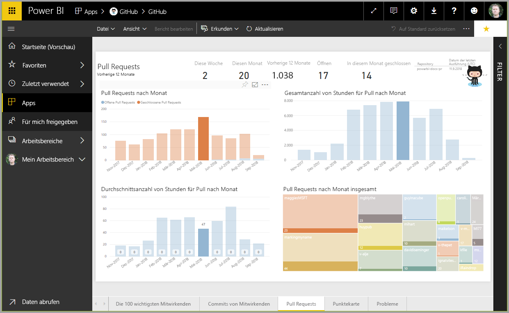

Wie wir in der vorherigen Einheit gesehen haben, ist der allgemeine Arbeitsablauf in Microsoft Power BI das Erstellen eines Berichts in Power BI Desktop, das Veröffentlichen des Berichts über den Power BI-Dienst und dessen anschließende Freigabe für andere Benutzer, damit diese ihn im Dienst oder einer mobilen App anzeigen können.

Da einige Benutzer Ihre Arbeit aber im Power BI-Dienst beginnen, werfen wir zunächst einen kurzen Blick auf diesen Dienst, um eine einfache und beliebte Vorgehensweise kennenzulernen, mit der in Power BI Visuals schnell erstellt werden können: *Apps*.

Eine **App** ist eine Sammlung vorkonfigurierter, einsatzbereiter Visuals und Berichte, die für eine gesamte Organisation freigegeben werden. Die Verwendung einer App ist mit dem Zubereiten eines Fertiggerichts in der Mikrowelle oder dem Bestellen eines Fastfood-Menüs vergleichbar: Nach wenigen Tastendrücken bzw. Eingaben erhalten Sie in kurzer Zeit eine Zusammenstellung von Speisen, die gut zusammenpassen und in einer sauberen und bequemen Verpackung geliefert werden.

Wir sehen uns daher kurz die Apps, den Dienst und die Funktionsweise an. In den nächsten Modulen werden Apps (und der Dienst) ausführlicher behandelt. Sie können sie sich bis dahin als Appetithäppchen vorstellen.

## Erstellen von Standarddashboards mit Clouddiensten
Mit Power BI ist es einfach, eine Verbindung mit Daten herzustellen. Im Power BI-Dienst können Sie auf der Startseite links unten einfach auf die Schaltfläche **Daten abrufen** klicken.

Auf dem *Zeichenbereich* (dem mittleren Bereich des Power BI-Diensts) werden die verfügbaren Datenquellen im Power BI-Dienst angezeigt. Zusätzlich zu gängigen Datenquellen wie Microsoft Excel-Dateien, Datenbanken oder Microsoft Azure-Daten kann mit Power BI genauso leicht auch eine Verbindung mit einer Sammlung von **Softwarediensten** (auch als SaaS-Anbieter oder Clouddienste bezeichnet), z.B. Salesforce, Facebook oder Google Analytics und vielen anderen hergestellt werden.

Für diese Softwaredienste stellt der **Power BI-Dienst** eine Sammlung einsatzbereiter Visuals bereit, die in Dashboards und Berichten für Ihre Organisation vorab angeordnet sind. Diese Sammlung von Visuals wird als **App** bezeichnet. Mit Apps können Sie schnell mit Daten und Dashboards arbeiten, die Ihre Organisation für Sie erstellt hat. Bei Verwendung der GitHub-App stellt Power BI beispielsweise (nach Angabe Ihrer Anmeldeinformationen) eine Verbindung mit Ihrem GitHub-Konto her und füllt dann eine vordefinierte Sammlung mit Visuals und Dashboards in Power BI mit Daten.

Es gibt Apps für alle möglichen Onlinedienste. Die folgende Abbildung zeigt eine Seite mit Apps in alphabetischer Reihenfolge, die für verschiedene Onlinedienste verfügbar sind. Diese Seite wird angezeigt, wenn Sie im Feld **Dienste** (siehe die vorherige Abbildung) auf die Schaltfläche **Abrufen** klicken. Wie Sie in der folgenden Abbildung sehen, können Sie unter vielen Apps wählen.

Für unsere Zwecke wählen wir **GitHub**. GitHub ist eine Anwendung für die Online-Quellcodeverwaltung. Wenn Sie in der GitHub-App auf die Schaltfläche **Jetzt anfordern** klicken, wird das Dialogfeld **Mit GitHub verbinden** angezeigt. 

Nach Eingeben der Informationen und Anmeldeinformationen für die GitHub-App beginnt die Installation der App.

Nach dem Laden der Daten wird das vordefinierte Dashboard der GitHub-App angezeigt.

Zusätzlich zum **Dashboard** der App ist auch der **Bericht** verfügbar, der (als Teil der GitHub-App) die Erstellung des Dashboards generiert wurde. Dies gilt auch für das **Dataset** (Sammlung mit aus GitHub per Pull abgerufenen Daten), das während des Datenimports erstellt und zum Erstellen des GitHub-Berichts verwendet wurde.

Auf dem Dashboard können Sie Visuals auswählen und mit ihnen interagieren. Während Sie dies tun, reagieren alle anderen Visuals auf der Seite entsprechend. Wenn z.B. im Visual **Pull Requests (by month)** beispielsweise auf den Balken **May 2018** geklickt wird, passen sich die anderen Visuals auf der Seite an diese Auswahl an.

## Aktualisieren von Daten im Power BI-Dienst
Sie können das Dataset für eine App oder andere Daten, die Sie in Power BI nutzen, auch **aktualisieren**. Um Aktualisierungseinstellungen festzulegen, klicken Sie auf das Symbol für die Zeitplanaktualisierung des zu aktualisierenden Datensatzes, und verwenden Sie dann das eingeblendete Menü. Sie können auch auf das Aktualisierungssymbol (den Kreis mit einem Pfeil) neben dem Symbol für die Zeitplanaktualisierung klicken, um den Datensatz sofort zu aktualisieren.

Die Registerkarte **Datasets** wird auf der eingeblendeten Seite **Einstellungen** ausgewählt. Klicken Sie im rechten Bereich auf den Pfeil neben **Geplante Aktualisierung**, um diesen Abschnitt zu erweitern. Das Dialogfeld **Einstellungen** wird auf dem Zeichenbereich angezeigt, damit Sie die gewünschten Aktualisierungseinstellungen vornehmen können.

Dies soll als kurze Übersicht über den Power BI-Dienst reichen. Der Dienst bietet noch viele weitere Möglichkeiten, die später in diesem und weiteren Modulen beschrieben werden. Beachten Sie auch, dass Sie Verbindungen mit vielen unterschiedlichen Datentypen herstellen und viele verschiedene Apps nutzen können. Außerdem werden ständig weitere Apps hinzugefügt.

