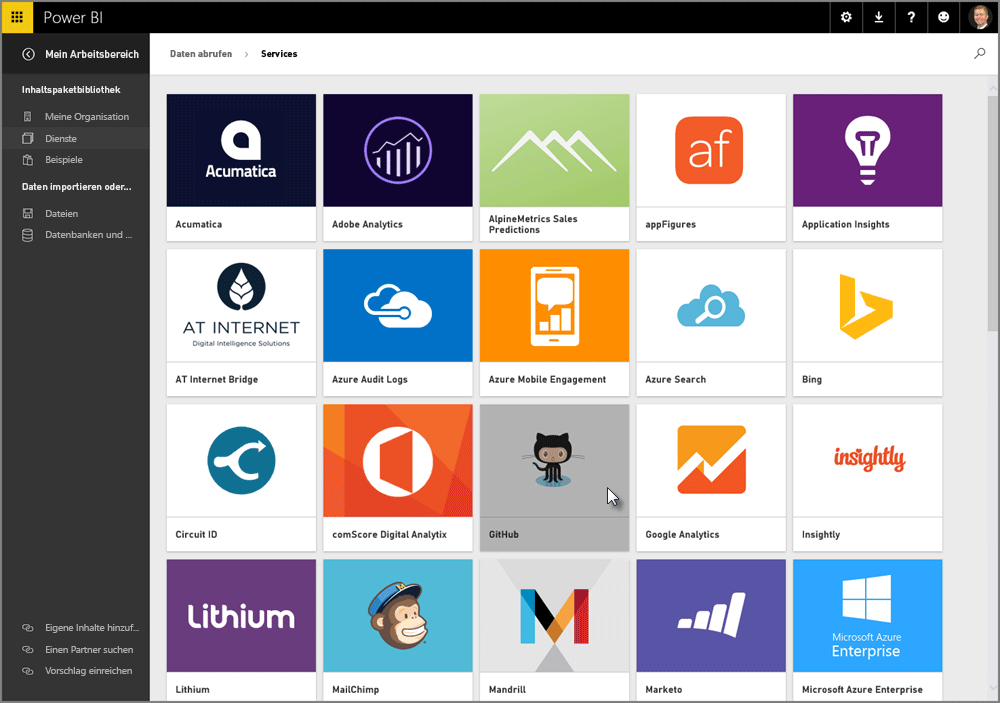

Wie wir gesehen haben, ist der allgemeine Arbeitsablauf in Power BI das Erstellen eines Berichts in Power BI Desktop, das Veröffentlichen des Berichts über den Power BI-Dienst und das anschließende Freigeben für andere Benutzer, damit diese ihn im Dienst oder in einer mobilen App anzeigen können.As we learned, the common flow of work in Power BI is to create a report in Power BI Desktop, publish it to the Power BI service, then share it with others so they can view it in the service or on a mobile app.

Einige Benutzer beginnen Ihre Arbeit aber im Power BI-Dienst. Daher werfen wir einen kurzen Blick auf den Dienst, um eine einfache und beliebte Vorgehensweise kennenzulernen, mit der in Power BI schnell visuelle Elemente erstellt werden können: *Apps*.Some people begin in the Power BI service, though, so let's take a quick look at the service, and learn about an easy and popular way to quickly create visuals in Power BI: *apps*.

Eine **App** ist eine Sammlung mit vorkonfigurierten, fertigen visuellen Elementen und Berichten, die auf bestimmten Datenquellen basieren, z.B. Salesforce.An **app** is a collection of pre-configured, ready-made visuals and reports based on specific data sources, such as Salesforce. Die Verwendung einer App ist mit dem Zubereiten eines Fertiggerichts in der Mikrowelle oder dem Bestellen eines Fastfood-Menüs vergleichbar: Nach wenigen Klicks und Kommentaren erhalten Sie in kurzer Zeit eine Zusammenstellung von Speisen, die gut zusammenpassen und in einer sauberen und bequemen Verpackung geliefert werden.Using an app is like microwaving a TV dinner or ordering a fast-food value meal: with just a few clicks and comments, you're quickly served up a collection of entrees designed to go well together, all presented in a tidy, ready-to-consume package.

Wir sehen uns daher kurz die Apps, den Dienst und die Funktionsweise an.So let's take a quick look at apps, the service, and how it works. In den nächsten Abschnitten werden Apps (und der Dienst) ausführlicher behandelt. Sie können sich dies wie ein Appetithäppchen vorstellen.We go into more detail about apps (and the service) in upcoming sections; think of this as a bit of taste-testing to whet your appetite.

## Erstellen von Standarddashboards mit ClouddienstenCreate out-of-the-box dashboards with cloud services
Mit Power BI ist es einfach, eine Verbindung mit Daten herzustellen.With Power BI, connecting to data is easy. Im Power BI-Dienst können Sie auf der Startseite unten links einfach die Schaltfläche **Daten abrufen** wählen.From the Power BI service, you can simply select the **Get Data** button in the bottom left corner of the home screen.

Auf dem *Canvas* (mittlerer Bereich des Power BI-Diensts) werden die verfügbaren Datenquellen im Power BI-Dienst angezeigt.The *canvas* (the area in the center of the Power BI service) shows you the available sources of data in the Power BI service. Zusätzlich zu allgemeinen Datenquellen wie Excel-Dateien, Datenbanken oder Azure-Daten kann mit Power BI genauso leicht auch eine Verbindung mit **Softwarediensten** (auch als SaaS-Anbieter oder Clouddienste bezeichnet), z.B. Salesforce, Facebook oder Google Analytics, und vielen anderen SaaS-Diensten hergestellt werden.In addition to common data sources such as Excel files, databases, or Azure data, Power BI can connect to **software services** (also called SaaS providers, or cloud services) such as Salesforce, Facebook, Google Analytics, and a whole assortment of other SaaS services just as easily.

Für diese Softwaredienste stellt der **Power BI-Dienst** eine Sammlung mit fertigen visuellen Elementen bereit, die in Dashboards und Berichten vorab angeordnet sind (als **Apps** bezeichnet).For these software services, the **Power BI service** provides a collection of ready-made visuals, pre-arranged in dashboards and reports called **apps**. Mithilfe von Apps können Sie in Power BI mit Daten aus dem gewählten Dienst schnell starten.Apps get you up and running in Power BI quickly with data from the service that you select. Bei Verwendung der Salesforce-App stellt Power BI beispielsweise eine Verbindung mit Ihrem Salesforce-Konto her (nach Angabe Ihrer Anmeldeinformationen) und füllt dann eine vordefinierte Sammlung mit visuellen Elementen und Dashboards in Power BI mit Daten.For example, when you use the Salesforce app, Power BI connects to your Salesforce account (once you provide your credentials) and then populates a pre-defined collection of visuals and dashboards in Power BI.

Power BI verfügt über Apps für alle Arten von Diensten.Power BI provides apps for all sorts of services. In der folgenden Abbildung ist der erste Bildschirm mit Diensten in alphabetischer Reihenfolge dargestellt, der angezeigt wird, wenn Sie im Feld **Dienste** die Option **Abrufen** wählen (in der vorherigen Abbildung gezeigt).The following image shows the first screen of services, in alphabetical order, that is displayed when you select **Get** from the **Services** box (shown in the previous image). Wie Sie in der folgenden Abbildung sehen, können Sie unter vielen Diensten wählen.As you can see from the image below, there are many to choose from.

Für unsere Zwecke wählen wir **GitHub**.For our purposes, we’ll choose **GitHub**. GitHub ist eine Anwendung für die Online-Quellcodeverwaltung.GitHub is an application for online source control. Nach dem Eingeben der Informationen und Anmeldeinformationen für die GitHub-App wird mit dem Import der Daten begonnen.Once I enter the information and credentials for the GitHub app, it begins importing my data.

Nach dem Laden der Daten wird das vordefinierte GitHub-App-Dashboard angezeigt.Once the data is loaded, the pre-defined GitHub app dashboard appears.

Zusätzlich zum **Dashboard** ist auch der **Bericht** verfügbar, der für die Erstellung des Dashboards generiert wurde (als Teil der GitHub-App). Dies gilt auch für das **Dataset** (Sammlung mit Daten aus GitHub), das während des Datenimports erstellt und zum Erstellen des GitHub-Berichts verwendet wurde.In addition to the **Dashboard**, the **Report** that was generated (as part of the GitHub app) to create the dashboard is available too, as is the **Dataset** (the collection of data pulled from GitHub) that was created during the data import, and used to create the GitHub Report.

Im Dashboard können Sie auf eines der visuellen Elemente klicken, um automatisch zur Seite **Bericht** zu gelangen, auf der das visuelle Element erstellt wurde.On the Dashboard, you can click on any of the visuals, and automatically be taken to the **Report** page from which that visual was created. Wenn Sie auf das visuelle Element mit den obersten fünf Benutzern nach Pull Requests (**Top 5 users by pull requests**) klicken, wird in Power BI im Bericht die Seite **Pull Requests** geöffnet (Seite des Berichts, auf der das visuelle Element erstellt wurde).So when the **Top 5 users by pull requests** visual is clicked, Power BI opens the **Pull Requests** page in the Report (the Report page from which that visual was created).

## Stellen von Fragen zu Ihren DatenAsking questions of your data
Sie können auch Fragen zu Ihren Daten stellen. Der Power BI-Dienst erstellt dann basierend auf Ihrer Frage in Echtzeit visuelle Elemente.You can also ask questions of your data, and the Power BI service will create visuals based on your question, in real time. In der folgenden Abbildung ist dargestellt, dass Power BI ein visuelles Element mit einer Zahl erstellt, mit dem die Anzahl von geschlossenen Problemen angezeigt wird. Dieser Wert basiert darauf, was in der Leiste für **Abfragen in natürlicher Sprache** eingegeben wird.In the following image, you can see Power BI creates a number visual showing the Count of Issues closed, based on what is typed in the **Natural Language Query** bar.

Wenn Ihnen ein visuelles Element gefällt, können Sie das Symbol **Stift** rechts von der Leiste für Abfragen in natürlicher Sprache auswählen, um es im Dashboard anzuheften.When you have a visual that you like, you can select the **Pin** icon, to the right of the Natural Language Query bar, to pin that visual to the dashboard. In diesem Fall wird das visuelle Element im GitHub-Dashboard angeheftet, da dies das derzeit ausgewählte Dashboard ist.In this case, the visual is pinned to the GitHub dashboard, since that’s the dashboard currently selected.

## Aktualisieren von Daten im Power BI-DienstRefreshing data in the Power BI service
Sie können das Dataset für eine App oder andere Daten, die Sie in Power BI nutzen, auch **aktualisieren**.You can also choose to **refresh** the dataset for an app, or other data you use in Power BI. Wählen Sie die Schaltfläche mit den Auslassungspunkten neben einem Dataset, um die Einstellungen zu aktualisieren. Ein Menü wird angezeigt.To set refresh settings, select the ellipses (the three dots) next to a data set, and a menu appears.

Wählen Sie unten im Menü die Option **Aktualisierung planen**.Select the **Schedule Refresh** option from the bottom of that menu. Das Dialogfeld „Einstellungen“ wird auf der Canvas angezeigt, damit Sie die gewünschten Aktualisierungseinstellungen vornehmen können.The Settings dialog appears on the canvas, letting you set the refresh settings that meet your needs.

Dies soll als kurze Übersicht über den Power BI-Dienst reichen.That's enough for our quick look at the Power BI service. Es gibt in Bezug auf den Dienst noch viele weitere Möglichkeiten, die später im Kurs beschrieben werden.There are many more things you can do with the service, which we'll cover later in this course. Beachten Sie auch, dass Sie Verbindungen mit vielen unterschiedlichen Arten von Daten herstellen und viele verschiedene Apps nutzen können. Außerdem werden ständig weitere Apps hinzugefügt.Remember, too, that there are many different types of data you can connect to, and all sorts of apps, with more of each coming all the time.

Wir fahren jetzt mit dem nächsten Thema fort, in dem dieser Abschnitt zu den **ersten Schritten** zusammengefasst wird und in dem Sie einen Ausblick auf die weitere Vorgehensweise erhalten.Okay, let's move to the next topic, where we summarize this **Getting Started** section, and get you ready for what's next.

