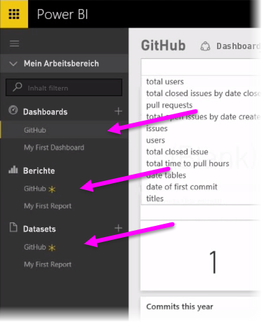

Wie wir in der vorherigen Einheit gesehen haben, ist der allgemeine Arbeitsablauf in Power BI das Erstellen eines Berichts in Power BI Desktop, das Veröffentlichen des Berichts über den Power BI-Dienst und dessen anschließende Freigabe für andere Benutzer, damit diese ihn im Dienst oder in einer mobilen App anzeigen können.As we learned in the previous unit, the common flow of work in Power BI is to create a report in Power BI Desktop, publish it to the Power BI service, then share it with others so they can view it in the service or on a mobile app.

Einige Benutzer beginnen Ihre Arbeit aber im Power BI-Dienst. Daher werfen wir einen kurzen Blick auf den Dienst, um eine einfache und beliebte Vorgehensweise kennenzulernen, mit der in Power BI schnell visuelle Elemente erstellt werden können: *Apps*.Some people begin in the Power BI service, though, so let's take a quick look at the service, and learn about an easy and popular way to quickly create visuals in Power BI: *apps*.

Eine **App** ist eine Sammlung mit vorkonfigurierten, fertigen visuellen Elementen und Berichten, die für eine gesamte Organisation freigegeben werden.An **app** is a collection of pre-configured, ready-made visuals and reports that are shared with an entire organization. Die Verwendung einer App ist mit dem Zubereiten eines Fertiggerichts in der Mikrowelle oder dem Bestellen eines Fastfood-Menüs vergleichbar: Nach wenigen Klicks und Eingaben erhalten Sie in kurzer Zeit eine Zusammenstellung von Speisen, die gut zusammenpassen und in einer sauberen und bequemen Verpackung geliefert werden.Using an app is like microwaving a TV dinner or ordering a fast-food value meal: with just a few clicks and comments, you're quickly served up a collection of entrees designed to go together, all presented in a tidy, ready-to-consume package.

Wir sehen uns daher kurz die Apps, den Dienst und die Funktionsweise an.So let's take a quick look at apps, the service, and how it works. In den nächsten Modulen werden Apps (und der Dienst) ausführlicher behandelt. Sie können sich dieses als Appetithäppchen vorstellen.We go into more detail about apps (and the service) in upcoming modules; think of this as a bit of taste-testing to whet your appetite.

## Erstellen von Standarddashboards mit ClouddienstenCreate out-of-the-box dashboards with cloud services
Mit Power BI ist es einfach, eine Verbindung mit Daten herzustellen.With Power BI, connecting to data is easy. Im Power BI-Dienst können Sie auf der Startseite unten links einfach die Schaltfläche **Daten abrufen** wählen.From the Power BI service, you can simply select the **Get Data** button in the bottom left corner of the home screen.

Auf dem *Canvas* (mittlerer Bereich des Power BI-Diensts) werden die verfügbaren Datenquellen im Power BI-Dienst angezeigt.The *canvas* (the area in the center of the Power BI service) shows you the available sources of data in the Power BI service. Zusätzlich zu allgemeinen Datenquellen wie Excel-Dateien, Datenbanken oder Azure-Daten kann mit Power BI genauso leicht auch eine Verbindung mit **Softwarediensten** (auch als SaaS-Anbieter oder Clouddienste bezeichnet), z.B. Salesforce, Facebook oder Google Analytics, und vielen anderen SaaS-Diensten hergestellt werden.In addition to common data sources such as Excel files, databases, or Azure data, Power BI can connect to **software services** (also called SaaS providers, or cloud services) such as Salesforce, Facebook, Google Analytics, and a whole assortment of other SaaS services just as easily.

Für diese Softwaredienste stellt der **Power BI-Dienst** eine Sammlung mit einsatzbereiten visuellen Elementen bereit, die in Dashboards und Berichten für Ihre Organisation vorab angeordnet sind (und als **Apps** bezeichnet werden).For these software services, the **Power BI service** provides a collection of ready-made visuals, pre-arranged in dashboards and reports for your organization called **apps**. Mit Apps können Sie in Power BI schnell mit Daten und Dashboards arbeiten, die Ihre Organisation für Sie erstellt hat.Apps get you up and running in Power BI quickly with data and dashboards that your organization has created for you. Bei Verwendung der GitHub-App stellt Power BI beispielsweise eine Verbindung mit Ihrem GitHub-Konto her (nach Angabe Ihrer Anmeldeinformationen) und füllt dann eine vordefinierte Sammlung mit visuellen Elementen und Dashboards in Power BI mit Daten.For example, when you use the GitHub app, Power BI connects to your GitHub account (once you provide your credentials) and then populates a pre-defined collection of visuals and dashboards in Power BI.

Es gibt Apps für alle möglichen Onlinedienste.There are apps for all sorts of different online services. Die folgende Abbildung zeigt einen Bildschirm mit Diensten, die bei verschiedenen Onlinediensten verfügbar sind, in alphabetischer Reihenfolge. Dieser wird angezeigt, wenn Sie im Feld **Dienste** die Option **Abrufen** wählen (siehe die vorherige Abbildung).The following image shows a screen of apps available from various online services, in alphabetical order, that is displayed when you select **Get** from the **Services** box (shown in the previous image). Wie Sie in der folgenden Abbildung sehen, können Sie unter vielen Diensten wählen.As you can see from the image below, there are many to choose from.

Für unsere Zwecke wählen wir **GitHub**.For our purposes, we’ll choose **GitHub**. GitHub ist eine Anwendung für die Online-Quellcodeverwaltung.GitHub is an application for online source control. Wenn ich jetzt in der GitHub-App auf **Jetzt anfordern** klicke, wird das Fenster **Mit GitHub verbinden** angezeigt.When I select the **Get it now** button from the GitHub app the **Connect to GitHub** window appears. 

Nach Eingeben der Informationen und Anmeldeinformationen für die GitHub-App wird mit der Installation der App begonnen.Once I enter the information and credentials for the GitHub app, it begins to install the app.

Nach dem Laden der Daten wird das vordefinierte GitHub-App-Dashboard angezeigt.Once the data is loaded, the pre-defined GitHub app dashboard appears.

Zusätzlich zum **Dashboard** der App ist auch der **Bericht** verfügbar, der für die Erstellung des Dashboards generiert wurde (als Teil der GitHub-App). Dies gilt auch für das **Dataset** (Sammlung mit Daten aus GitHub), das während des Datenimports erstellt und zum Erstellen des GitHub-Berichts verwendet wurde.In addition to the app **Dashboard**, the **Report** that was generated (as part of the GitHub app) to create the dashboard is available too, as is the **Dataset** (the collection of data pulled from GitHub) that was created during the data import, and used to create the GitHub Report.

Auf dem Dashboard können Sie auf eines der Visuals klicken und mit ihnen interagieren, woraufhin alle anderen Visuals auf der Seite reagieren.On the Dashboard, you can click on any of the visuals and interact with them, and all the other visuals on the page will respond. Wenn im Visual **Pull Requests (by month)** beispielsweise auf den Balken **May 2018** geklickt wird, passen sich die anderen Visuals auf der Seite an diese Auswahl an.So when the **May 2018** bar is clicked in the **Pull Requests (by month)** visual, the other visuals on the page adjust to reflect that selection.

## Aktualisieren von Daten im Power BI-DienstRefreshing data in the Power BI service
Sie können das Dataset für eine App oder andere Daten, die Sie in Power BI nutzen, auch **aktualisieren**.You can also choose to **refresh** the dataset for an app, or other data you use in Power BI. Um Aktualisierungseinstellungen festzulegen, klicken Sie auf das Symbol für die Zeitplanaktualisierung für das Dataset, das Sie aktualisieren möchten. Ein Menü wird eingeblendet.To set refresh settings, select the schedule refresh icon for the dataset you want to refresh, and a menu appears. Sie können auch auf das Aktualisierungssymbol daneben (den Kreis mit einem Pfeil) klicken, um es sofort zu aktualisieren.You can also select the refresh icon beside it (the circle with an arrow) to refresh it now.

Die Registerkarte **Datasets** wird im eingeblendeten Einstellungsfenster ausgewählt.The **Datasets** tab is selected from the settings window that appears. Klicken Sie auf den Pfeil **Zeitplanaktualisierung**, um diesen Abschnitt im rechten Fensterbereich zu erweitern.Select the **Schedule Refresh** arrow to expand that section in the right pane. Das Dialogfeld „Einstellungen“ wird auf der Canvas angezeigt, damit Sie die gewünschten Aktualisierungseinstellungen vornehmen können.The Settings dialog appears on the canvas, letting you set the refresh settings that meet your needs.

Dies soll als kurze Übersicht über den Power BI-Dienst reichen.That's enough for our quick look at the Power BI service. Es gibt in Bezug auf den Dienst noch viele weitere Möglichkeiten, die später in diesem und weiteren Modulen beschrieben werden.There are many more things you can do with the service, which we'll cover later in this module, and in upcoming modules. Beachten Sie auch, dass Sie Verbindungen mit vielen unterschiedlichen Arten von Daten herstellen und viele verschiedene Apps nutzen können. Außerdem werden ständig weitere Apps hinzugefügt.Remember, too, that there are many different types of data you can connect to, and all sorts of apps, with more of each coming all the time.

