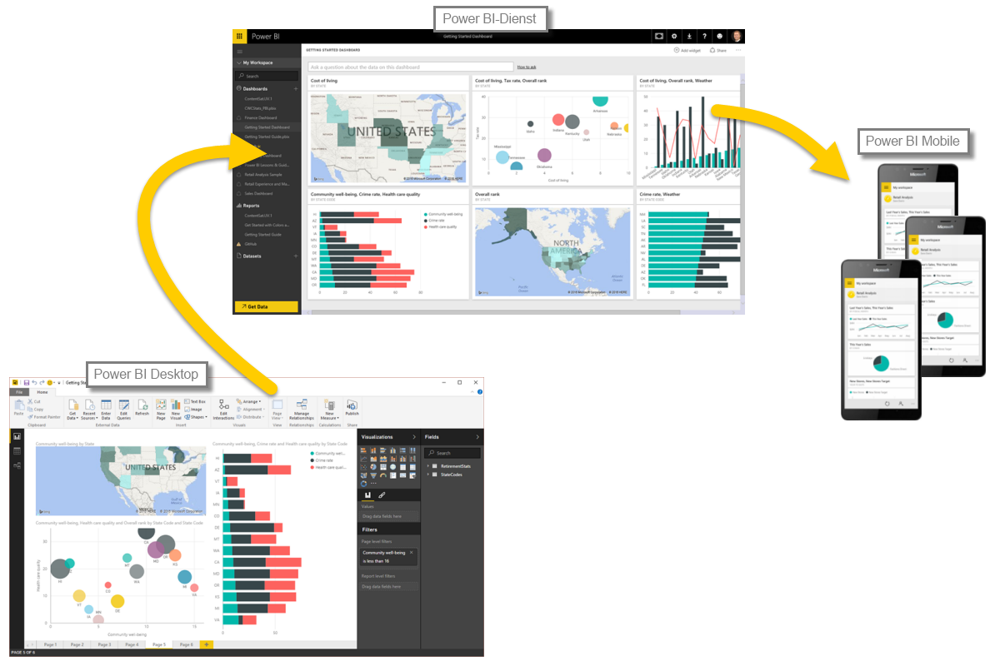

Lassen Sie uns kurz wiederholen, was wir in diesem ersten Modul behandelt haben.Let’s do a quick review of what we covered in this first module.

**Power BI** ist eine Sammlung mit Softwarediensten, Apps und Connectors, die zusammen genutzt werden, um für Ihre Daten interaktive Erkenntnisse zu gewinnen.**Power BI** is a collection of software services, apps, and connectors that work together to turn your data into interactive insights. Sie können Daten aus einzelnen einfachen Quellen verwenden, z.B. einer Excel-Arbeitsmappe, oder Daten per Pullvorgang aus mehreren Datenbanken und Cloudquellen übertragen, um komplexe Datasets und Berichte zu erstellen.You can use data from single basic sources, such as an Excel workbook, or pull data in from multiple databases and cloud sources to create complex datasets and reports. Power BI kann – je nach Ihren globalen Geschäftsanforderungen – so einfach oder so komplex sein, wie Sie möchten.Power BI can be as straightforward as you want, or as enterprise-ready as your complex global business requires.

Power BI besteht aus drei Hauptelementen: **Power BI Desktop**, **Power BI-Dienst** und **Power BI Mobile**. Diese Elemente arbeiten zusammen, damit Sie Ihre Daten wie gewünscht erstellen, freigeben und nutzen und damit interagieren können.Power BI consists of three main elements – the **Power BI Desktop**, the **Power BI service**, and **Power BI Mobile** – which all work collectively to let you create, interact with, share, and consume your data how you want it.

Es wurden auch die grundlegenden Komponenten von Power BI beschrieben:We discussed the basic building blocks in Power BI too, which are:

* **Visualisierungen**: Visuelle Darstellung von Daten, auch als „visuelle Elemente“ bezeichnet**Visualizations** – a visual representation of data, sometimes just called visuals
* **Datasets**: Sammlungen mit Daten, die von Power BI zum Erstellen von Visualisierungen verwendet werden**Datasets** – a collection of data that Power BI uses to create visualizations
* **Berichte**: Sammlungen mit visuellen Elementen aus einem Dataset über eine oder mehrere Seiten**Reports** – a collection of visuals from a dataset, spanning one or more pages
* **Dashboards**: Einzelne Seite mit Sammlungen visueller Elemente, aus einem Bericht erstellt**Dashboards** – a single page collection of visuals, built from a report
* **Kacheln**: Einzelne Visualisierung in einem Bericht oder Dashboard**Tiles** – a single visualization found in a report or dashboard

Im **Power BI-Dienst** haben wir mit wenigen Klicks eine **App** installiert.In the **Power BI service**, we installed an **app** with just a few clicks. Die **App** (eine fertige Sammlung mit visuellen Elementen und Berichten) ermöglicht uns das mühelose Herstellen einer Verbindung mit einem **Softwaredienst**, um die App mit Daten zu füllen und diese zum Leben zu erwecken.That **app** – a ready-made collection of visuals and reports – let us easily connect to a **software service** to populate the app and bring that data to life.

Zuletzt haben wir einen **Aktualisierungszeitplan** für unsere Daten eingerichtet, damit wir sichergehen können, dass diese Daten aktuell sind, wenn wir zum Power BI-Dienst zurückkehren.Lastly, we set up a **refresh schedule** for our data, so we know when we go back to the Power BI service that data will be fresh.

## Nächste SchritteNext steps
**Glückwunsch!****Congratulations!** Sie haben das erste Modul des **Lernpfads** für Power BI abgeschlossen.You've completed the first module of the **Learning Path** for Power BI. Fahren Sie mit Ihrem gewonnenen Wissen mit dem nächsten Abschnitt fort, der die Schritte zur Erstellung Ihres ersten Berichts aufzeigt.You now have a firm foundation of knowledge to move on to the next section, which walks through the steps to create your first report. 

Es wurde schon erwähnt, aber hier soll noch einmal darauf hingewiesen werden: In diesem Lernpfad bauen Sie Wissen auf, indem Sie den gängigen Arbeitsablauf in Power BI befolgen:We mentioned this before, but it's worth restating: this Learning Path builds your knowledge by following the common flow of work in Power BI:

* Einbinden von Daten in **Power BI Desktop** und Erstellen eines BerichtsBring data into **Power BI Desktop**, and create a report.
* Durchführen von **Veröffentlichungen** für den Power BI-Dienst, mit dem Sie neue Visualisierungen oder Dashboards erstellen**Publish** to the Power BI service, where you create new visualizations or build dashboards
* **Freigeben** Ihrer Dashboards für andere Benutzer, vor allem für Personen im Außendienst**Share** your dashboards with others, especially people who are on the go
* Anzeigen und Interagieren mit freigegebenen Dashboards und Berichten in **Power BI Mobile**-AppsView and interact with shared dashboards and reports in **Power BI Mobile** apps

Unter Umständen führen Sie diese Arbeiten nicht alle selbst aus. Einige Benutzer zeigen vielleicht nur die Dashboards im Dienst an, die von anderen Benutzern erstellt wurden.You might not do all that work yourself - some people will only view dashboards in the service that were created by someone else. Das ist in Ordnung, und schon bald wird es ein Modul geben, das Ihnen zeigt, wie Sie einfach durch den **Power BI-Dienst** navigieren und ihn nutzen können, um Berichte und Anwendungen problemlos anzuzeigen und mit ihnen zu interagieren.That's fine, and we'll soon have a module dedicated to dedicated to showing you how to easily navigate and use the **Power BI service**, so you can easily view and interact with reports and apps.

Bei der Befolgung des Arbeitsablaufs in Power BI zeigt Ihnen das nächste Modul jedoch, wie Sie einen Bericht erstellen und im Power BI-Dienst veröffentlichen können.In following the flow of work in Power BI, however, the next module shows you how to create a report and publish that report to the Power BI service. Im nächsten Modul erfahren Sie, wie diese Berichte und Dashboards erstellt werden und mit den Daten verbunden sind.... und Sie können sich sogar entscheiden, ob Sie einen eigenen erstellen möchten.In the next module, you'll learn how those reports and dashboards are created, and how they connected to the data... and you might even decide to create one of your own.

Wir sehen uns im nächsten Modul!See you in the next module!

