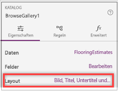

In einer vorherigen Einheit haben Sie die Flooring Estimates-App erstellt und sich mit ihrem Standarddesign vertraut gemacht.In a previous unit, you generated the Flooring Estimates app and started to explore its default design. Von PowerApps generierte Standard-Apps sind nützlich. Häufig müssen Sie diese jedoch an Ihre eigenen Anforderungen anpassen.Apps that Microsoft PowerApps generates are useful out of the box, but you'll often want to customize a generated app to suit your needs.

In dieser Einheit erläutern wir einige einfache Änderungen, die für die einzelnen App-Bildschirme vorgenommen werden können.In this unit, we'll walk you through some basic changes for each screen in the app. Es gibt zwar noch deutlich mehr Möglichkeiten zum Anpassen der App, doch für die ersten Schritte empfiehlt es sich, Anpassungen an einer generierten App vorzunehmen.You can do a lot more to customize an app, but the best way to start learning is to take any generated app and make common customizations.

## Bildschirm zum DurchsuchenBrowse screen
Wir beginnen mit dem Bildschirm zum Durchsuchen.We'll start on the browse screen. In der App ist jedem Produkt bereits ein Bild und ein Text zugeordnet, doch das Layout könnte ansprechender gestaltet werden.The app already shows an image and some text for each product, but the layout could be better. Daran möchten wir jetzt arbeiten.Let's work on that.

1. Klicken Sie im linken Bereich **Screens** (Bildschirme) auf **BrowseGallery1**.In the **Screens** pane on the left, select **BrowseGallery1**.

    Der Katalog wird daraufhin durch einen Rahmen hervorgehoben.The selection box around the gallery confirms your choice.

    

1. Öffnen Sie im rechten Bereich den Bereich **Data** (Daten), indem Sie auf den Link neben **Layout** klicken.In the right pane, open the **Data** pane by selecting the link next to **Layout**.

    

1. Wählen Sie ein anderes Layout aus, durch das z.B. das Bild, der Titel und der Untertitel werden, jedoch nicht der Text.Select a different layout, such as the one that shows the image, the title, and the subtitle but not the body.

    

1. Wählen Sie im oberen Katalogbereich die Elementkategorie aus.Select the category of the item at the top of the gallery.

    

1. Ändern Sie in der Formularleiste **ThisItem.Category** in **ThisItem.Name**.Change **ThisItem.Category** to **ThisItem.Name** in the formula bar.

1. Wiederholen Sie die vorherigen beiden Schritte, und passen Sie dabei das andere **Beschriftungssteuerelement** so an, dass für alle Elemente Preise angezeigt werden.Repeat the previous two steps, but change the other **Label** control to show the price of each item.

    

Wie Sie sehen, können das Layout des Katalogs und die jeweiligen Datenkategorien ganz einfach angepasst werden.It's that easy to change the layout of a gallery and the types of data that it shows. Vielleicht haben Sie sogar Spaß dabei.And you might find that it's fun too!

## DetailbildschirmDetails screen

Wir möchten die Reihenfolge der Felder auf dem Detailbildschirm ändern.On the details screen, we want to change the order of the fields. Die Steuerelemente auf diesem Bildschirm unterscheiden sich von den Steuerelementen auf dem Bildschirm zum Durchsuchen. Daher gibt es auch leichte Abweichungen im Änderungsprozess.The controls on this screen differ from the controls on the browse screen, so the process for changing them is also a little different.

1. Klicken Sie im linken Bereich **Screens** (Bildschirme) auf **DetailScreen1** > **DetailForm1**.On the **Screens** pane on the left, select **DetailScreen1** > **DetailForm1**.

1. Wählen Sie im rechten Bereich den Text aus, mit dem die Anzahl der ausgewählten Felder angezeigt wird.In the right pane, select the text that shows the number of selected fields.

    

1. Ziehen Sie das Feld **Name** in den oberen Bereich der Felderliste, und ziehen Sie das Feld **Image** (Bild) nach unten.Drag the **Name** field to the top of the list of fields, and drag the **Image** field to the bottom.

    

## Bildschirm zum Bearbeiten/ErstellenEdit/create screen

Abschließend soll nun auf dem Bildschirm, auf dem Benutzer Einträge erstellen und bearbeiten, die Eingabe von Informationen im Textfeld erleichtert werden.Finally, on the screen where your user edits and creates entries, we want to make it easier to enter information in a text box.

1. Klicken Sie im linken Bereich **Screens** (Bildschirme) auf **EditScreen1** > **EditForm1**.On the **Screens** pane on the left, select **EditScreen1** > **EditForm1**.

1. Wählen Sie im rechten Bereich den Text aus, mit dem die Anzahl der ausgewählten Felder angezeigt wird.In the right pane, select the text that shows the number of selected fields.

1. Klicken Sie zuerst auf den Dropdownpfeil der Liste **Overview** (Übersicht) und anschließend auf **Mehrzeiligen Text bearbeiten**.Select the drop-down arrow for the **Overview** list, and then select **Edit multi-line text**.

    Mit dem Bearbeitungssteuerelement für mehrzeiligen Text wird die Eingabe längerer Texte vereinfacht.A multi-line edit control will make it easier to add more than a few words in this field.

    

Nun wissen Sie, wie die Darstellung und Benutzerfreundlichkeit einer erstellten App mit einigen grundlegenden Schritten erheblich verbessert werden kann.You've seen how a few basic steps can do a lot to improve the appearance and experience of using an app. In dieser Einheit haben Sie sich auf die Anwendung PowerApps Studio konzentriert, die viele Optionen zum Anpassen von Apps bereitstellt.In this unit, we focused on PowerApps Studio, which provides lots of options for customizing apps. In der nächsten Einheit werden die Steuerelemente der App ausführlicher dargestellt.In the next unit, we'll explore the controls in the app in greater detail.