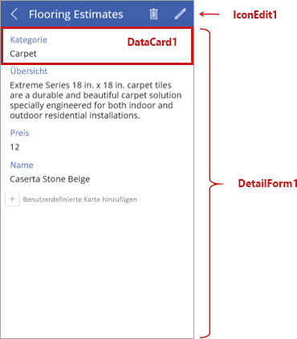
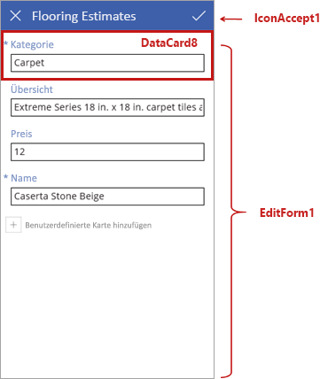

In dieser Einheit sehen wir uns die Bildschirme und Steuerelemente an, die das Verhalten der von Microsoft PowerApps generierten Apps bestimmen.We're now going to look more closely at the screens and other controls that define the behavior of apps that Microsoft PowerApps generates. Wir werden nicht auf jedes einzelne Details eingehen, die Einblicke in die Funktionsweise dieser Apps werden Ihnen aber beim Erstellen Ihrer eigenen Apps nützlich sein.We won't go through all the details, but knowing more about how these apps work will help you build your own apps.

## Grundlegendes zu Steuerelementen in PowerAppsUnderstand controls in PowerApps
Ein Steuerelement ist nur ein Element der Benutzeroberfläche, das eine Aktion auslöst oder Informationen anzeigt.A control is just a UI element that produces an action or shows information. Viele der Steuerelemente in PowerApps funktionieren genauso wie die Steuerelemente, die Sie aus anderen Apps kennen: Bezeichnungen, Texteingabefelder, Dropdownlisten, Navigationselemente usw.Many of the controls in PowerApps are just like controls that you've used in other apps: labels, text-input boxes, drop-down lists, navigation elements, and so on.

Zusätzlich zu diesen üblichen Steuerelementen bietet PowerApps spezifischere Steuerelemente, die Sie auf der Registerkarte **Einfügen** finden.In addition to these typical controls, PowerApps has more specialized controls, which you can find on the **Insert** tab.

Im Folgenden werden einige der Steuerelemente aufgeführt, die Ihre Apps interessanter und nützlicher gestalten können:Here are just a few of the controls that can add interest and impact to your apps:

- **Kataloge**: Bei diesen Steuerelementen handelt es sich um Layoutcontainer mit Steuerelementen, die Daten aus einer Datenquelle zeigen.**Galleries**: These controls are layout containers that hold a set of controls that show data from a data source.
- **Formulare**: Diese Steuerelemente zeigen Details zu Ihren Daten an und ermöglichen Ihnen das Erstellen und Bearbeiten von Elementen.**Forms**: These controls show details about your data and let you create and edit items.
- **Medien**: Mit diesen Steuerelementen können Sie Hintergrundbilder, eine Kameraschaltfläche (damit Benutzer über die App Bilder aufnehmen können) und einen Barcodeleser (für die schnelle Erfassung und Identifizierung von Informationen) hinzufügen.**Media**: These controls let you add background images and include a camera button (so that users can take pictures from the app) and a barcode reader for quickly capturing identification information.
- **Diagramme**: Mit diesen Steuerelementen können Sie Diagramme hinzufügen, sodass Benutzer unterwegs sofort Analysen durchführen können.**Charts**: These controls let you add charts so that users can do instant analysis while they're on the road.

Verschaffen Sie sich einen Überblick über die verfügbaren Optionen, indem Sie die Registerkarte **Einfügen** auswählen und sich die einzelnen Optionen ansehen.To see what's available, select the **Insert** tab, and then select each option in turn.

## Elemente des Bildschirms zum DurchsuchenExplore the browse screen

Jeder Bildschirm in der App weist mehrere Steuerelemente auf, eins nimmt jedoch den größten Teil des Bildschirms ein.Each screen in the app has multiple controls, but one control takes up most of the screen space. Der erste Bildschirm in der App ist der Bildschirm zum Durchsuchen, dem standardmäßig der Name **BrowseScreen1** zugewiesen ist.The first screen in the app is the browse screen, which is named **BrowseScreen1** by default.

Hier finden Sie einige der Steuerelemente für den Bildschirm zum Durchsuchen, mit denen Sie sich vertraut machen sollten:Here are some of the controls that you'll want to become familiar with for the browse screen:

- **BrowseGallery1**: Dieses Steuerelement nimmt den größten Teil des Bildschirms ein und zeigt Daten aus Ihrer Datenquelle an.**BrowseGallery1**: This control takes up most of the screen and shows data from your data source.
- **NextArrow1**: Beim Klicken auf dieses Steuerelement wird der Detailbildschirm geöffnet.**NextArrow1**: When this control is selected, it opens the details screen.
- **IconNewItem1**: Beim Klicken auf dieses Steuerelement wird der Bildschirm zum Bearbeiten/Erstellen geöffnet.**IconNewItem1**: When this control is selected, it opens the edit/create screen.

## Elemente des DetailbildschirmsExplore the details screen
Der nächste Bildschirm ist der Detailbildschirm, der standardmäßig **DetailScreen1** benannt ist.Next is the details screen, which is named **DetailScreen1** by default. Hier finden Sie einige der Steuerelemente dieses Bildschirms:Here are some of its controls:

- **DetailForm1**: Dieses Steuerelement enthält andere Steuerelemente.**DetailForm1**: This control contains other controls.
- **DataCard1**: Dies ist ein Kartensteuerelement.**DataCard1**: This is a card control. In diesem Fall wird eine Kategorie für Bodenbeläge aus der Tabelle „Flooring Estimates“ angezeigt – diese wurde in der vorherigen Einheit behandelt.In this case, it shows a flooring category from the Flooring Estimates table, as seen in the previous unit.
- **IconEdit1**: Beim Klicken auf dieses Steuerelement wird der Bildschirm zum Bearbeiten/Erstellen geöffnet, damit der Benutzer das aktuelle Element bearbeiten kann.**IconEdit1**: When this control is selected, it opens the edit/create screen so that the user can edit the current item.

## Elemente des Bildschirms zum Bearbeiten/ErstellenExplore the edit/create screen
Der dritte Bildschirm in der App heißt **EditScreen1**.The third screen in the app is **EditScreen1**. Hier finden Sie einige der Steuerelemente dieses Bildschirms:Here are some of its controls:

- **EditForm1**: Dieses Steuerelement enthält andere Steuerelemente.**EditForm1**: This control contains other controls.
- **DataCard8**: Dies ist ein weiteres Kartensteuerelement, das eine Kategorie für Bodenbeläge aus der Tabelle „Flooring Estimates“ anzeigt – diese wurde in der vorherigen Einheit behandelt.**DataCard8**: This is another card control that shows a flooring category from the Flooring Estimates table, as seen in the previous unit.
- **IconAccept1**: Wenn dieses Steuerelement ausgewählt wird, werden die Änderungen des Benutzers gespeichert.**IconAccept1**: When this control is selected, it saves the user's changes.

In diesem Modul haben Sie einen Überblick über die verschiedenen Steuerelemente auf den einzelnen Bildschirmen dieser App erhalten.Hopefully, this unit gives you a good idea of what controls are on each screen of this app.