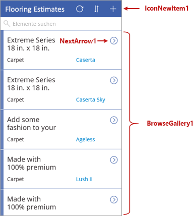

In dieser Einheit sehen wir uns die Bildschirme und Steuerelemente an, die das Verhalten der von Microsoft PowerApps generierten Apps bestimmen. Wir werden nicht auf jedes einzelne Details eingehen, die Einblicke in die Funktionsweise dieser Apps werden Ihnen aber beim Erstellen Ihrer eigenen Apps nützlich sein.

## Grundlegendes zu Steuerelementen in PowerApps
Ein Steuerelement ist nur ein Element der Benutzeroberfläche, das eine Aktion auslöst oder Informationen anzeigt. Viele der Steuerelemente in PowerApps funktionieren genauso wie die Steuerelemente, die Sie aus anderen Apps kennen: Bezeichnungen, Texteingabefelder, Dropdownlisten, Navigationselemente usw.

Zusätzlich zu diesen üblichen Steuerelementen bietet PowerApps spezifischere Steuerelemente, die Sie auf der Registerkarte **Einfügen** finden.

Im Folgenden werden einige der Steuerelemente aufgeführt, die Ihre Apps interessanter und nützlicher gestalten können:

- **Kataloge**: Bei diesen Steuerelementen handelt es sich um Layoutcontainer mit Steuerelementen, die Daten aus einer Datenquelle zeigen.
- **Formulare**: Diese Steuerelemente zeigen Details zu Ihren Daten an und ermöglichen Ihnen das Erstellen und Bearbeiten von Elementen.
- **Medien**: Mit diesen Steuerelementen können Sie Hintergrundbilder, eine Kameraschaltfläche (damit Benutzer über die App Bilder aufnehmen können) und einen Barcodeleser (für die schnelle Erfassung und Identifizierung von Informationen) hinzufügen.
- **Diagramme**: Mit diesen Steuerelementen können Sie Diagramme hinzufügen, sodass Benutzer unterwegs sofort Analysen durchführen können.

Verschaffen Sie sich einen Überblick über die verfügbaren Optionen, indem Sie die Registerkarte **Einfügen** auswählen und sich die einzelnen Optionen ansehen.

## Elemente des Bildschirms zum Durchsuchen

Jeder Bildschirm in der App weist mehrere Steuerelemente auf, eins nimmt jedoch den größten Teil des Bildschirms ein. Der erste Bildschirm in der App ist der Bildschirm zum Durchsuchen, dem standardmäßig der Name **BrowseScreen1** zugewiesen ist.

Hier finden Sie einige der Steuerelemente für den Bildschirm zum Durchsuchen, mit denen Sie sich vertraut machen sollten:

- **BrowseGallery1**: Dieses Steuerelement nimmt den größten Teil des Bildschirms ein und zeigt Daten aus Ihrer Datenquelle an.
- **NextArrow1**: Beim Klicken auf dieses Steuerelement wird der Detailbildschirm geöffnet.
- **IconNewItem1**: Beim Klicken auf dieses Steuerelement wird der Bildschirm zum Bearbeiten/Erstellen geöffnet.

## Elemente des Detailbildschirms
Der nächste Bildschirm ist der Detailbildschirm, der standardmäßig **DetailScreen1** benannt ist. Hier finden Sie einige der Steuerelemente dieses Bildschirms:

- **DetailForm1**: Dieses Steuerelement enthält andere Steuerelemente.
- **DataCard1**: Dies ist ein Kartensteuerelement. In diesem Fall wird eine Kategorie für Bodenbeläge aus der Tabelle „Flooring Estimates“ angezeigt – diese wurde in der vorherigen Einheit behandelt.
- **IconEdit1**: Beim Klicken auf dieses Steuerelement wird der Bildschirm zum Bearbeiten/Erstellen geöffnet, damit der Benutzer das aktuelle Element bearbeiten kann.

## Elemente des Bildschirms zum Bearbeiten/Erstellen
Der dritte Bildschirm in der App heißt **EditScreen1**. Hier finden Sie einige der Steuerelemente dieses Bildschirms:

- **EditForm1**: Dieses Steuerelement enthält andere Steuerelemente.
- **DataCard8**: Dies ist ein weiteres Kartensteuerelement, das eine Kategorie für Bodenbeläge aus der Tabelle „Flooring Estimates“ anzeigt – diese wurde in der vorherigen Einheit behandelt.
- **IconAccept1**: Wenn dieses Steuerelement ausgewählt wird, werden die Änderungen des Benutzers gespeichert.

In diesem Modul haben Sie einen Überblick über die verschiedenen Steuerelemente auf den einzelnen Bildschirmen dieser App erhalten.