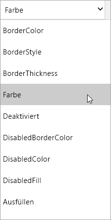

Wenn Sie Microsoft PowerApps verwenden, müssen Sie komplexe Anwendungen nicht auf die herkömmliche Weise programmieren.When you use Microsoft PowerApps, you don't have to write complicated application code the way a traditional developer does. Weiterhin erforderlich ist jedoch, dass Sie Logik in einer App ausdrücken und die Navigation, Filterung, Sortierung und andere Funktionen einer App steuern.But you still must express logic in an app and control its navigation, filtering, sorting, and other functionality. Hier kommen Formeln ins Spiel.This is where formulas come in.

Wenn Sie schon einmal Microsoft Excel-Funktionen verwendet haben, sollte Ihnen der Ansatz von PowerApps vertraut vorkommen.If you've used Microsoft Excel functions, you should recognize the approach that PowerApps takes. In dieser Einheit werden einige einfache Formeln für die Textformatierung demonstriert. Anschließend werden drei Formeln vorgestellt, die PowerApps beim Erstellen einer App integriert.In this unit, we'll show a couple of basic formulas for text formatting and then walk through three of the formulas that PowerApps includes when it generates an app. Sie erhalten einen Eindruck davon, was mit Formeln möglich ist, und schreiben außerdem Ihre eigenen.You'll get a taste of what formulas can do and also start to write your own.

## Erste Schritte mit Formeln und EigenschaftenGet started with formulas and properties
In der vorherigen Einheit wurden Steuerelemente auf allen drei Bildschirmen der App vorgestellt, die von PowerApps generiert wurde.In the previous unit, we explored controls in all three screens of an app that PowerApps generated. In diesem Abschnitt wird der Preis formatiert, den Sie zuvor dem Bildschirm zum Durchsuchen hinzugefügt haben.In this section, we'll format the price that we added to the browse screen earlier.

Der Preis wird standardmäßig als einfache Zahl ohne Währungssymbol angezeigt.By default, the price appears as a plain number without a currency symbol. Angenommen, Sie möchten ein Dollarzeichen hinzufügen und die Textfarbe abhängig vom Preis des Artikels ändern (z.B. Rot bei mehr als 5 $, andernfalls Grün).But suppose that we want to add a dollar sign and change the text color based on the item's cost (for example, red if it's more than $5 but green otherwise). Auf der folgenden Abbildung wird das erwartete Ergebnis angezeigt.This graphic shows the expected result.

Beginnen wir mit der Währungsformatierung.Let's start with the currency formatting. Standardmäßig ruft PowerApps lediglich einen Preiswert für jedes Angebot ab.By default, PowerApps just pulls in a price value for each item. Dieser Wert wird als die **Text**-Eigenschaft der Beschriftung festgelegt, die den Preis anzeigt.This value is set as the **Text** property of the label that shows the price.

1. Wählen Sie auf dem Bildschirm **BrowseScreen1** den Preis des ersten Elements aus.In **BrowseScreen1**, select the price of the first item.

    

1. Wählen Sie in der Dropdownliste mit den Eigenschaften **Text** aus.In the drop-down list of properties, select **Text**.

    

1. Legen Sie für die **Text**-Eigenschaft die folgende Formel fest, um das Währungssymbol für US-Dollar hinzuzufügen:To add the currency symbol for US dollars, set the **Text** property to this formula:

    `Text(Price, "[$-en-US]$ ##.00")`

Mit der **Text**-Funktion wird festgelegt, wie die Zahl formatiert werden soll.The **Text** function specifies how to format the number. Diese Formel ist mit einer Excel-Funktion vergleichbar. PowerApps Formeln verweisen jedoch auf Steuerelemente und andere App-Elemente statt auf Zellen in einer Arbeitsmappe.The formula is like an Excel function, but PowerApps formulas refer to controls and other app elements instead of cells in a workbook.

Wenn Sie ein Steuerelement auswählen und dann die Dropdownliste mit den Eigenschaften aufrufen, wird Ihnen eine Liste von Eigenschaften angezeigt, die für dieses Steuerelement relevant sind.If you select a control and then open the property drop-down list, you'll see a list of properties that are relevant to the control. Der folgende Listenausschnitt enthält einige der Eigenschaften für das **Beschriftungssteuerelement**.For example, here is a partial list of the properties for a **Label** control. Manche Eigenschaften sind für eine Vielzahl von Steuerelementen relevant, während andere nur für ein spezifisches Steuerelement von Bedeutung sind.Some properties are relevant across a wide range of controls, but others are relevant only for a specific control.

Legen Sie für die **Color**-Eigenschaft des **Preis-Beschriftungssteuerelements** die folgende Formel fest, um eine bedingte Formatierung der Farbe durchzuführen:To conditionally format the price's color, set the **Color** property of the price's **Label** control to this formula:

`If(Price > 5, Color.Red, Color.Green)`

## Formeln in der generierten AppFormulas included in the generated app
Nachdem Sie nun gesehen haben, wie Formeln in Verbindung mit Eigenschaften verwendet werden, werden im Folgenden Beispiele für Formeln vorgestellt, die PowerApps in jeder generierten App verwendet.Now that you understand how to use formulas in conjunction with properties, we'll look at a couple of formulas that PowerApps uses in every app it generates. Beide Beispiele wurden bereits für den Bildschirm zum Durchsuchen verwendet und nutzen die **OnSelect**-Eigenschaft.Both the examples are from the browse screen and work with the **OnSelect** property. Mit dieser Eigenschaft wird festgelegt, welche Aktion ausgeführt wird, wenn ein Benutzer ein Steuerelement auswählt (z.B. durch Klicken mit der Maus).This property defines what happens when a user selects a control (for example, by clicking it with a mouse).

* Die erste Formel ist dem **IconNewItem1**-Steuerelement zugeordnet .The first formula is associated with the **IconNewItem1** control . Wenn Sie dieses Steuerelement auswählen, wird der Bildschirm zum Erstellen und Bearbeiten eines Elements geöffnet.You select this control to open the edit/create screen where you can create an item. Die Formel lautet wie folgt:The formula is:

    `NewForm(EditForm1);Navigate(EditScreen1, ScreenTransition.None)`

    Die Formel instanziiert ein Bearbeitungsformular auf dem Bildschirm zum Bearbeiten und Erstellen eines Elements.The formula instantiates an edit form on the edit/create screen so that users can create an item. Durch den Wert `ScreenTransition.None` wird angegeben, dass kein Übergang zwischen den Bildschirmen (beispielsweise durch Ausblenden) erfolgen soll.A value of `ScreenTransition.None` means there's no transition, such as a fade, between screens.

* Die zweite Formel ist dem **IconSortUpDown1**-Steuerelement zugeordnet .The second formula is associated with the **IconSortUpDown1** control . Wenn Sie dieses Steuerelement auswählen, werden die Elemente im Katalog sortiert.You select this control to sort the items in the gallery. Die Formel lautet wie folgt:The formula is:

    `UpdateContext({SortDescending1: !SortDescending1})`

    Die Formel verwendet `UpdateContext` zum Aktualisieren einer Variable mit der Bezeichnung `SortDescending1`.The formula uses `UpdateContext` to update a variable called `SortDescending1`. Der Wert der Variablen wechselt jeweils beim Klicken auf das Steuerelement.The value of the variable switches back and forth as you select the control. Mithilfe dieser Variable wird dem Katalog auf diesem Bildschirm mitgeteilt, wie die Elemente sortiert werden sollen.This variable tells the gallery on this screen how to sort the items.

Es gibt viele andere Formeln in der App, nehmen Sie sich also ein wenig Zeit, klicken Sie auf Steuerelemente und sehen sich an, welche Formeln für verschiedene Eigenschaften festgelegt wurden.There are many other formulas in the app, so take some time to select controls and see what formulas are set for various properties.

Weitere Informationen zu diesen und anderen Funktionen finden Sie in der [Referenz zu Formeln](https://docs.microsoft.com/powerapps/maker/canvas-apps/formula-reference).For more information about these and other functions, see the [formula reference](https://docs.microsoft.com/powerapps/maker/canvas-apps/formula-reference).

## ZusammenfassungWrapping it all up
Sie haben sich in dieser Einheit ausführlich mit der generierten App auseinandergesetzt und einen Blick auf Bildschirme, Steuerelemente, Eigenschaften und Formeln geworfen, die die Funktionen der App und deren individuelles Verhalten bestimmen.This brings us to the end of our exploration of the generated app and our behind-the-scenes look at the screens, controls, properties, and formulas that give the app its capabilities—and even its personality. Wenn Sie die Vorgehensweise bis hierhin verfolgt haben, sollten Sie nun über ein tiefgreifenderes Verständnis der Funktionsweise einer generierten App verfügen.If you've followed along, you should have a better understanding of how a generated app works. Sie können dieses Wissen nun anwenden, um Ihre eigene App zu erstellen.You can now take this understanding and use it to create your own app.