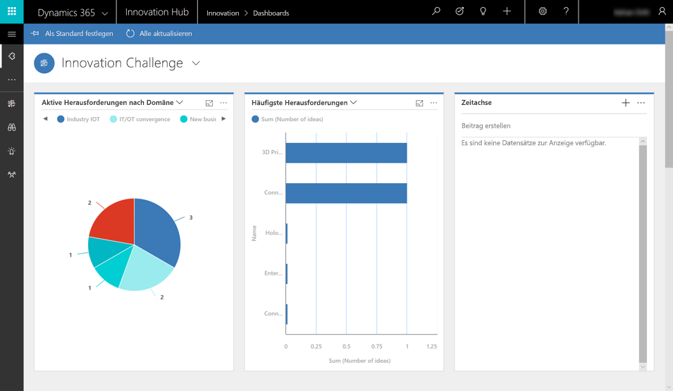
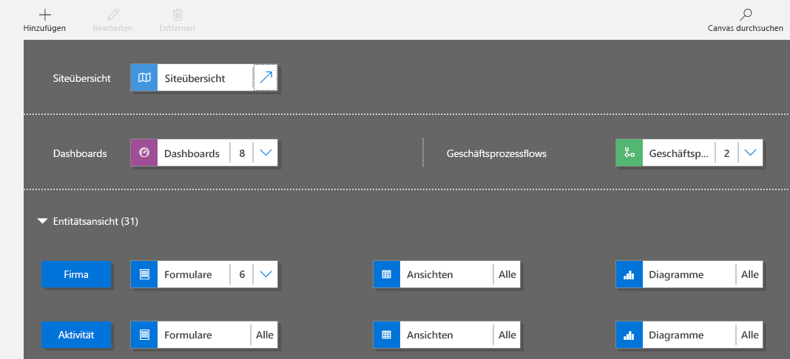

Model-driven app design is an approach that focuses on adding dashboards, forms, views, and charts to your apps. With no code, or very little, you can build apps that are simple or very complex. 

In canvas apps, the designer has total control over app layout. In model-driven apps, on the other hand, much of the layout is determined by the components you add. The emphasis is more on quickly viewing your business data and making decisions than on intricate app design.

Here are some of the benefits of model-driven apps:

- Create rich, component-focused environments.
- No code (or very little) is needed. 
- Create complex responsive apps that look great on a variety of devices, while developing them in one environment.
- Design capabilities are similar to what's available in the Microsoft Dynamics 365 Customer Engagement platform.
- Your app can be distributed as a solution.
 
## The approach to making model-driven apps
Model-driven apps have three design phases:

1. Model your business data.
1. Define your business processes.
1. Build the app.

### Model your business data
Model-driven design uses a metadata-driven architecture so that designers can customize the app without writing code. To model business data, you determine what data the app will need and how that data will relate to other data. Metadata means "data about data," and it defines the structure of the data stored in Common Data Service for Apps.

### Define your business processes
Defining and enforcing consistent business processes is a key aspect of model-driven app design. Consistent processes help ensure that your app users can focus on their work, not on remembering to perform a set of manual steps. Processes can be simple or complex, and they often change over time.

### Build the app
After modeling data and defining processes, you build your app by selecting and setting up the components you need in the App Designer.

