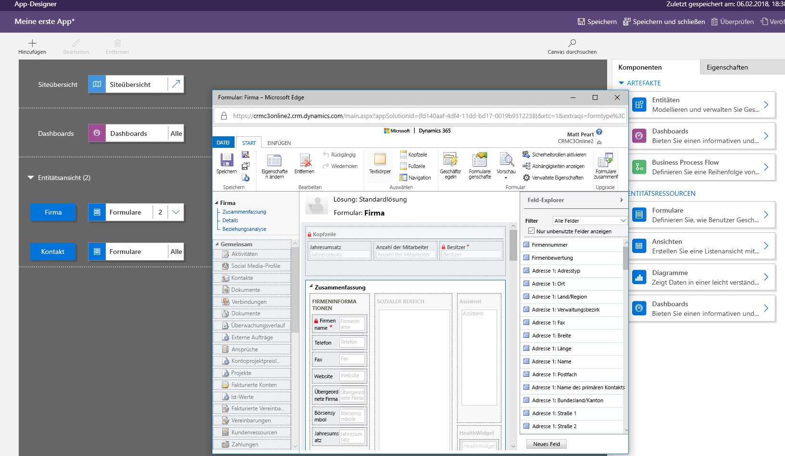
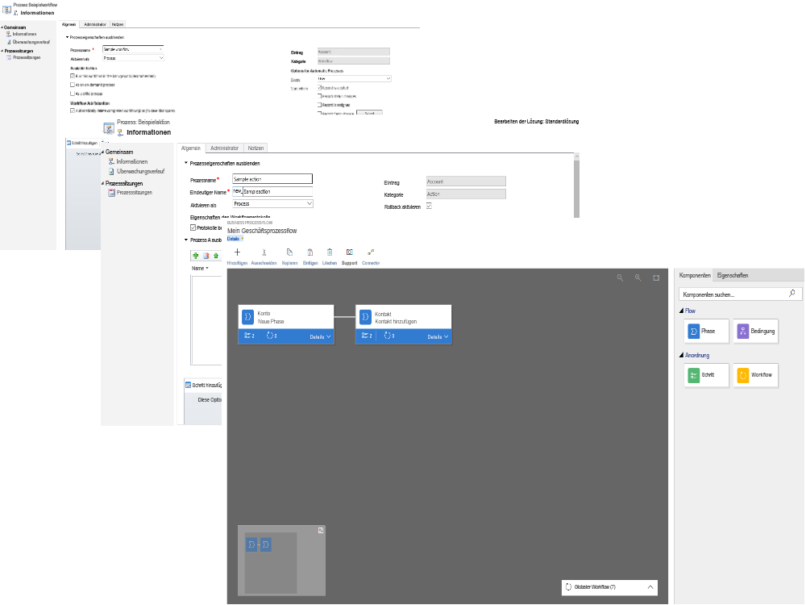
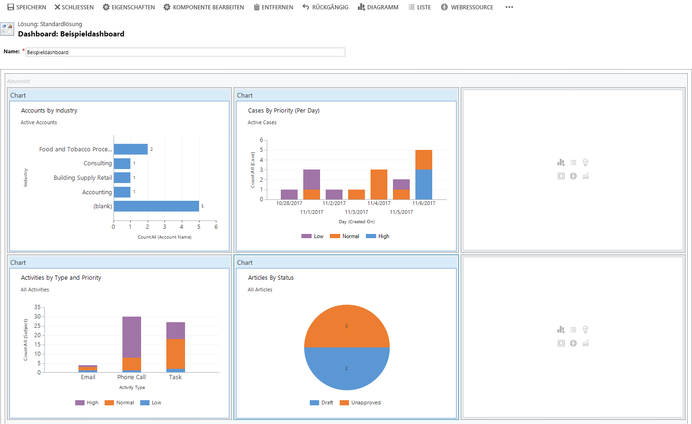
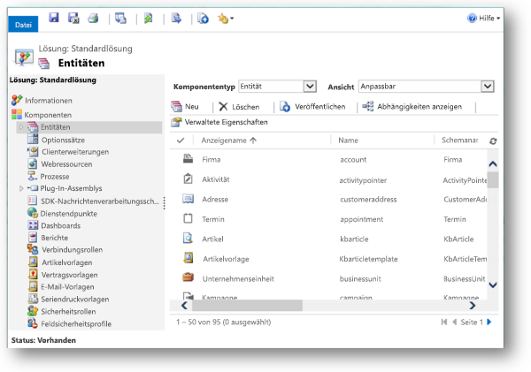

A model-driven app consists of several components that you select by using the App Designer. The components and component properties become the metadata. Let's look more closely at these components.

## Data
The data components determine what data the app will be based upon.

| Component        | Description | Designer |
|------------------|-------------|----------|
| Entity           | Entities are items with properties that you track. Examples include contacts and accounts. Many standard entities are available. You can customize a non-system standard entity (or production entity). You can also create a custom entity from scratch. | Entity designer |
| Field            | Fields are properties that are associated with an entity and help define that entity. A field is defined by a data type, which determines the type of data that can be entered or selected. Examples of data types include text, number, date and time, currency, and lookup (which creates a relationship with another entity). Fields are typically used with forms, views, and searches. | Entity designer |
| Relationship     | Relationships define how entities can be related to each other. There are 1:N (one-to-many), N:1 (many-to-one), and N:N (many-to-many) relationships. For example, adding a lookup field to an entity creates a new 1:N relationship between the two entities and lets you add that lookup field to a form. | Entity designer |
| Option set field | This type of field shows a control that lets the user select among predefined options. Each option has a number value and a label. Option set fields can require either a single value or multiple values. | Entity designer|

## User interface
The user interface components determine how users interact with the app. 

| Component | Description | Designer |
|-----------|-------------|----------|
| App       | Apps determine the app fundamentals, like components, properties, the client type, and the URL. | App designer |
| Site map  | A site map specifies the navigation for your app. | Site map designer |
| Form      | Forms include a set of data entry fields for a given entity. This set of data entry fields matches the items that your organization tracks for the entity. One example is a set of data entry fields where users enter relevant information to track a customer's previous orders together with specific requested reorder dates. | Form designer |
| View      | Views define how a list of records for a specific entity appears in your app. A view defines the columns to show, the width of each column, the sort behavior, and the default filters. | View designer |

## Logic
The logic components determine what business processes, rules, and automation the app will have. Microsoft PowerApps makers use a designer that's specific to the type of process or rule.

| Type of logic         | Description | Designer |
|-----------------------|-------------|----------|
| Business process flow | Business process flows walk users through a standard business process. Use a business process flow if you want everyone to handle customer service requests the same way. Or you can use a business process flow to require staff to gain approval for an invoice before submitting an order. | Business process flow designer |
| Workflow              | Workflows automate business processes without a user interface. Designers use workflows to initiate automation that doesn't require any user interaction. | Workflow designer |
| Actions               | Actions are a type of process that lets you manually invoke actions, including custom actions, directly from a workflow. | Process designer |
| Business rule         | Business rules apply rules or recommendation logic to a form to set field requirements, hide fields, validate data, and more. App designers use a simple interface to implement and maintain fast-changing and commonly used rules. | Business rule designer |
| Flow                  | Microsoft Flow is a cloud-based service that lets you create automated workflows between apps and services to get notifications, synchronize files, collect data, and more. | Microsoft Flow |

## Visualization
The visualization components determine what type of data and reporting the app will show.

| Component                   | Description | Designer |
|-----------------------------|-------------|----------|
|Chart                        | Charts are individual graphical visualizations that can appear in a view or a form, or that can be added to a dashboard. | Chart designer |
|Dashboard                    | Dashboards show one or more graphical visualizations that provide an overview of actionable business data. | Dashboard designer |
| Embedded Microsoft Power BI | Power BI adds embedded Power BI tiles and dashboards to your app. Power BI is a cloud-based service that provides business intelligence (BI) insight. | A combination of chart designer, dashboard designer, and Power BI |

## Advanced model-driven apps
Solution Explorer is used for making advanced model-driven apps. By using the navigation pane on the left side of the tool, you can navigate a hierarchy that consists of all app components.

