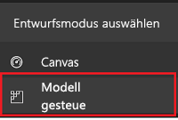
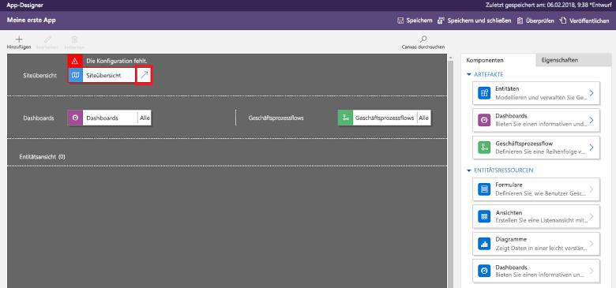
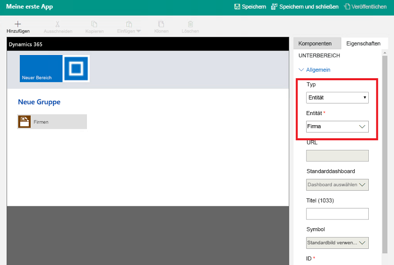
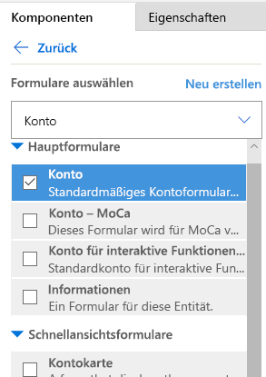
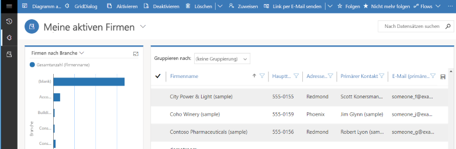

In this unit, you'll create a model-driven app by using one of the standard entities that's available in your Microsoft PowerApps environment.

## Create your model-driven app

1. Sign in to [PowerApps](https://web.powerapps.com/) by using your organizational account.
1. Select the environment you want, or go to the [PowerApps admin center](https://admin.powerapps.com/) to create a new one.
1. At the bottom of the left pane, select **Model-driven** as the design mode. 

    

    > [!IMPORTANT]
    > If the **Model-driven** design mode isn't available, you might need to [create an environment](https://docs.microsoft.com/powerapps/administrator/create-environment).

1. In the left pane, select **Apps**, and then select **Create an app**.
1. On the **Create a New App** page, enter a name and description for the app.
1. Select **Done**. Your new app appears in the App Designer, and you can now add components to it.

## Add components to your app
You add components to your app by using the App Designer.

1. Select the **Open the Site Map Designer** arrow to open the site map designer. 

    

2. In the site map designer, select **New Subarea**, and then, in the right pane, on the **Properties** tab, select the following properties:

    - **Type**: Entity
    - **Entity**: Account

    

3. Select **Save And Close**.
4. In the App Designer, select **Forms**, and then, in the right pane, under **Main Forms**, select the **Account** form.

    

5. In the App Designer, select **Views**, and then select the following properties:

    - Active Accounts
    - All Accounts
    - My Active Accounts

6. In the App Designer, select **Charts**, and then select the **Accounts by Industry** chart.
7. On the App Designer toolbar, select **Save**.

<!-- ##  Validate your app
This step checks for component dependencies that are required for the app to work, but haven't yet been added to the app. 

1. On the app designer canvas, select the component that indicates a dependency, such as the **Forms** component. Then, on the right-pane select the **Required** tab, expand **Entity Dependencies** and then select all required dependencies. 

    

2. Select **Add Dependencies**.
3. On the app designer toolbar, select **Save**.  -->

## Publish your app
On the App Designer toolbar, select **Publish**.

After you publish the app, it's ready for you to run or share with others.

