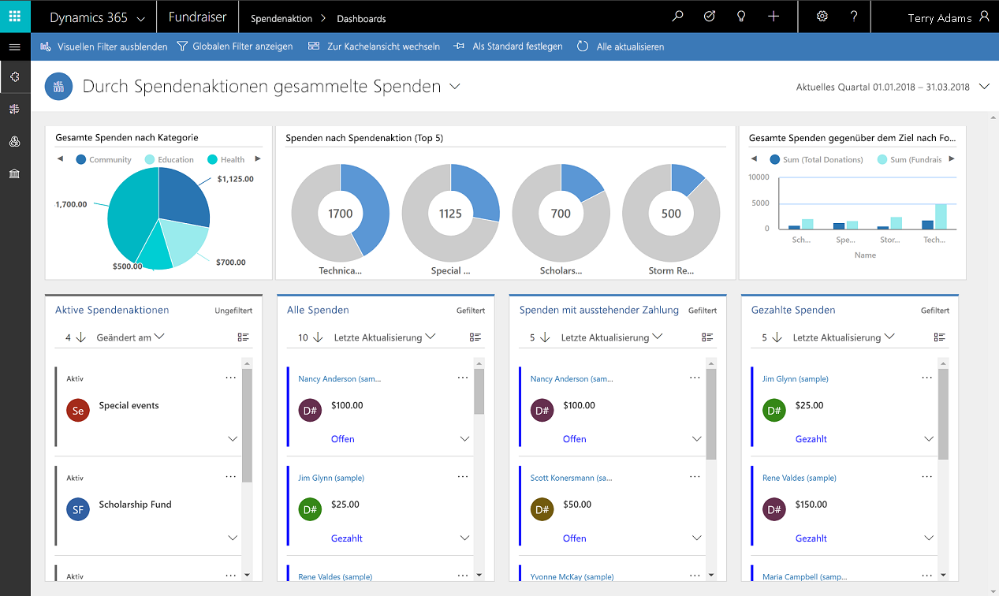
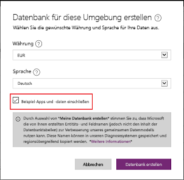
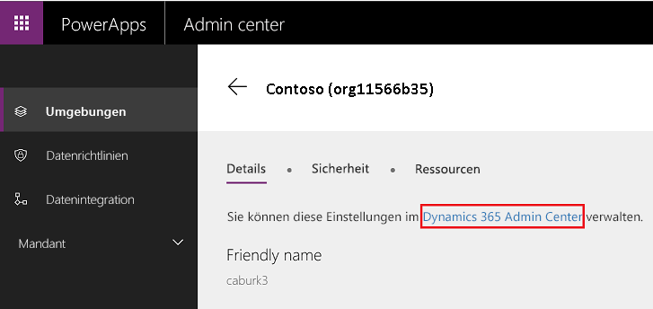
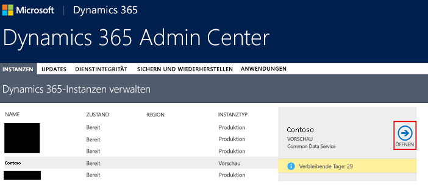
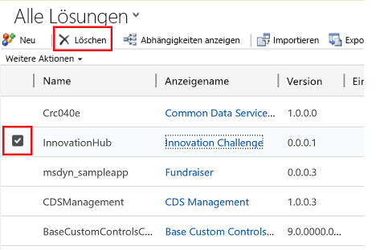
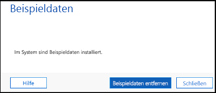

On [powerapps.com](https://powerapps.com), you can use a sample app to explore design possibilities. You'll also discover concepts that you can apply as you develop your own apps. Every sample app uses fictitious data to showcase a real-world scenario. 

For more details, be sure to check out the documentation that's specific to each sample app. 

## Get sample apps

To play around with or edit model-driven sample apps, you must first set up the apps in a Common Data Service database. First create a trial environment and database, and be sure to select the **Include sample apps and data** check box.

> [!IMPORTANT]
> By selecting this check box, you install all available sample apps in your database. Sample apps are for educational and demonstration purposes. We don't recommend installing them in production databases. 

## Customize a sample app

1. Sign in to [powerapps.com](https://powerapps.com), and select **Model-driven** as the design mode. 

    

2. On the home page, hover over a sample app, and select **Customize**.

    The App Designer opens, providing multiple options for customizing the app.

3. For more customization options, select **Advanced** in the left pane.

## Remove sample apps and data 
Keep these points in mind when removing samples apps and data:

- Deleting a sample app requires deleting the corresponding [managed solution](https://docs.microsoft.com/dynamics365/customer-engagement/developer/uninstall-delete-solution). 
- Deleting the solution also deletes any sample data that's specific to the custom entities for the app.
- If customizations were made to the sample app, there might be [dependencies](https://docs.microsoft.com/dynamics365/customer-engagement/developer/dependency-tracking-solution-components) that must be removed before the solution can be deleted.

To remove sample apps and data, follow these steps.

1. Sign in to the [Microsoft PowerApps admin portal](https://admin.powerapps.com).
2. Select an environment.
3. Select **Dynamics 365 Administration Center**.

    

4. Select your database in the list, and then select **Open**.

    

5. Go to **Settings \> Solutions**.
6. Select the solution for the app that must be deleted, and then select **Delete**.

    

You can also go to the list of solutions by selecting **Advanced** in the maker portal and then deleting everything in the URL after **.dynamics.com/**.

> [!IMPORTANT]
> Don't delete other system solutions unless you're aware of the effect.

## Install or uninstall sample data
1. Sign in to the [PowerApps admin portal](https://admin.powerapps.com).
1. Select an environment.
1. Select **Dynamics 365 Administration Center**.

    

1. Select your database in the list, and then select **Open**.

    

1. Go to **Settings \> Data Management \> Sample Data**.
1. If sample data is installed, the option to remove it is available. Otherwise, the option to install sample data is available. 

    
