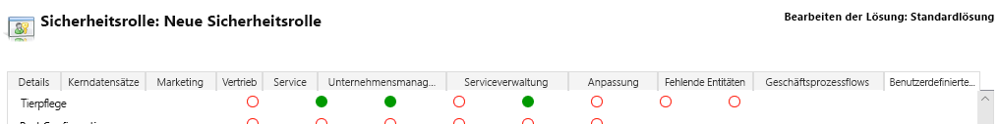
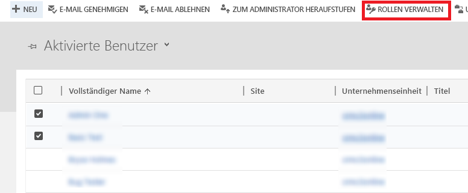
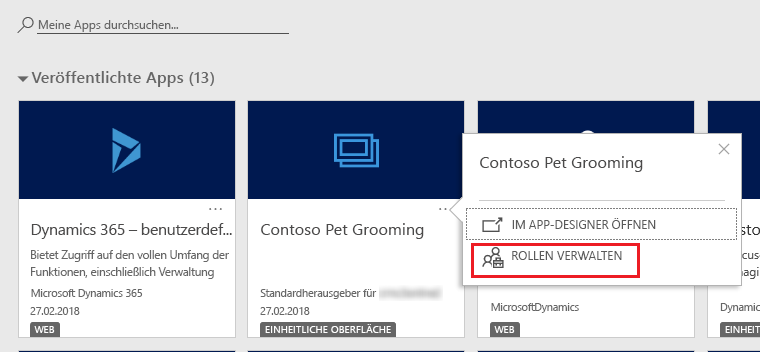
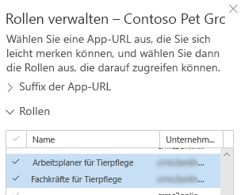
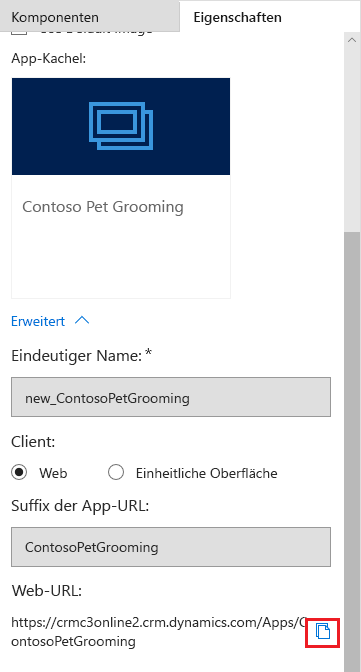

Microsoft PowerApps uses role-based security for sharing. A security role includes privileges that define a set of actions that can be performed in the app. All app users must be assigned to one or more predefined or custom security roles. 

Roles can be assigned to individual users or to teams. When a user or a team is assigned to a role, that user or all members of that team are granted the set of privileges associated with the role. 

In this unit, you'll learn how to share a model-driven app so that others can use it. 

Specifically, you'll learn how to:

- Create a custom security role.
- Assign users to the custom security role.
- Assign the security role to an app.

To share an app, you must have the Environment Admin or System Admin role. 

## Scenario
This unit uses the example of a company named Contoso, which has a pet grooming business that services dogs and cats. An app that has a custom entity for tracking the pet grooming business has already been created and published. 

The app must be shared so that the pet grooming staff can use it. To share the app, an admin or app maker assigns one or more security roles to users and to the app.

## Create or set up a security role
The PowerApps environment includes predefined security roles. These roles reflect common user tasks, and the access levels that are defined follow the security best practice of providing access to the minimum amount of business data that's required to use the app. 

Remember that the Contoso pet grooming app is based on a custom entity. Because the entity is custom, privileges must be explicitly specified before users can work in it. To do this, you can use either of the following approaches:

- Expand an existing predefined security role so that it includes privileges on records that are based on the custom entity. 
- Create a custom security role to manage privileges for users of the app. 

Because the environment that will maintain the pet grooming records is also used for other apps that the Contoso company runs, a custom security role that's specific to the pet grooming app will be created. Additionally, two different sets of access privileges are required:

- Pet grooming technicians just need to read, update, and attach other records. Therefore, their security role will have read, write, and append privileges. 
- Pet grooming schedulers need all the privileges that pet grooming technicians have. In addition, they must be able to create, append to, delete, and share records. Therefore, their security role will have create, read, write, append, delete, assign, append to, and share privileges.

To learn more about access and the scope of the different privileges, see [Security roles](https://docs.microsoft.com/dynamics365/customer-engagement/admin/security-roles-privileges#security-roles).

## Create a custom security role
1. Sign in to [PowerApps](https://powerapps.microsoft.com/) by using your organizational account. If you don't already have an account, select **Get started free**.
1. On the PowerApps home page, select **Model-driven**.
1. For the app you want to share, select the **More Commands** button (**...**), and then select **Share link**.
1. In the **Share this app** dialog box, under **Create a security role**, select **Security Setting**.
1. On the **Settings** page, select **New**.
1. In the Security Role designer, select actions, like read, write, or delete.
1. Select the scope for performing those actions. Scope determines how deep or high in the environments hierarchy a user can perform a particular action. In the **Role Name** box, enter *Pet Grooming Technicians*.
1. On the **Custom Entities** tab, find the custom entity you want. For this example, the custom entity named **Pet** is used. 
1. On the **Pet** row, select each of the following privileges four times, until the global organization scope  is selected: **Read**, **Write**, and **Append**.

    

1. The pet grooming app also has a relationship with the account entity. Therefore, on the **Core Records** tab, on the **Account** row, select the **Read** privilege four times, until the global organization scope  is selected. 
1. Select **Save and Close**. 
1. In the Security Role designer, in the **Role Name** box, enter *Pet Grooming Schedulers*. 
1. On the **Custom Entities** tab, find the **Pet** entity. 
1. On the **Pet** row, select each of the following privileges four times, until the global organization scope  is selected: **Create**, **Read**, **Write**, **Delete**, **Append**, **Append To**, **Assign**, and **Share**.
1. The pet grooming app also has a relationship with the account entity, and schedulers must be able to create and change account records. Therefore, on the **Core Records** tab, on the **Account** row, select each of the following privileges four times, until the global organization scope  is selected: **Create**, **Read**, **Write**, **Delete**, **Append**, **Append To**, **Assign**, and **Share**.
1. Select **Save and Close**.

## Assign security roles to users
Security roles control a user's access to data through a set of access levels and permissions. The combination of access levels and permissions that are included in a specific security role sets limits on the user's view of data and interactions with that data.

### Assign a security role to the pet grooming technicians
1. In the **Share this app** dialog box, under **Assign users to the security role**, select **Security Users**.
2. In the list that appears, select the pet groomers.
3. Select **Manage Roles**.

    

4. In the **Manage User Roles** dialog box, select the **Pet Grooming Technicians** security role you created earlier, and then select **OK**.

### Assign a security role to the pet grooming schedulers
1. In the **Share this app** dialog box, under **Assign users to a security role**, select **Security Users**.
2. In the list that appears, select the pet grooming schedulers.
3. Select **Manage Roles**.
4. In the **Manage User Roles** dialog box, select the **Pet Grooming Schedulers** security role you created earlier, and then select **OK**.

## Add security roles to the app
Next, one or more security roles must be assigned to the app. The apps that users can use will depend on the security roles they're assigned to.

1. In the **Share this app** dialog box, under **Add the security role to your app**, select **My Apps**.
2. On the tile for the Contoso Pet Grooming app, select the **More options** button (**...**), and then select **Manage Roles**.

    

3. In the **Roles** section, you can choose whether to give app access to all security roles or just selected roles. Select the **Pet Grooming Schedulers** and **Pet Grooming Technicians** roles you created earlier.

    

4. Select **Save**.
 
## Share the link to your app
1. In the **Share this app** dialog box, under **Share the link to your app directly with users**, copy the URL that's shown.
1. Select **Close**.
1. Paste the URL in a location where your users can access it. For example, you can post the URL on a Microsoft SharePoint site or send it in an email.

You can also find the app URL on the **Properties** tab in the App Designer.

## About predefined security roles
The following predefined roles are available with a PowerApps environment. Unless otherwise noted, all the privileges have global scope.

| Security role            | Privileges | Description |
|--------------------------|------------|-------------|
| Environment Maker        | None | Users who have this role can create new resources that are associated with an environment, including apps, connections, custom application programming interfaces (APIs), gateways, and flows that use Microsoft Flow. However, they can't access the data in an environment. To learn more about environments, see [Announcing PowerApps environments](https://powerapps.microsoft.com/blog/powerapps-environments/). |
| System Administrator     | Create, Read, Write, Delete, Customize | This role has full permission to customize or administer the environment, including creating, changing, and assigning security roles. User who have this role can view all data in the environment. To learn more, see [Privileges required for customization](https://docs.microsoft.com/dynamics365/customer-engagement/customize/privileges-required-customization). |
| System Customizer        | Create (self), Read (self), Write (self), Delete (self), Customizations | This role has full permission to customize the environment. But users who have this role can view records only for environment entities that they create. To learn more, see [Privileges required for customization](https://docs.microsoft.com/dynamics365/customer-engagement/customize/privileges-required-customization). |
| Common Data Service User | Read, Create (self), write (self), delete (self) | Users who have this role can run an app in the environment and perform common tasks for the records they own. |
| Delegate                 | Act on behalf of another user | This role lets code run as or impersonate another user. This role is typically used with another security role to provide access to records. To learn more, see [Impersonate another user](https://docs.microsoft.com/dynamics365/customer-engagement/developer/org-service/impersonate-another-user). |
