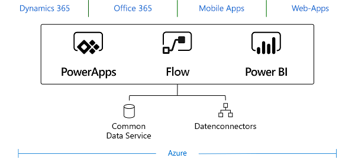
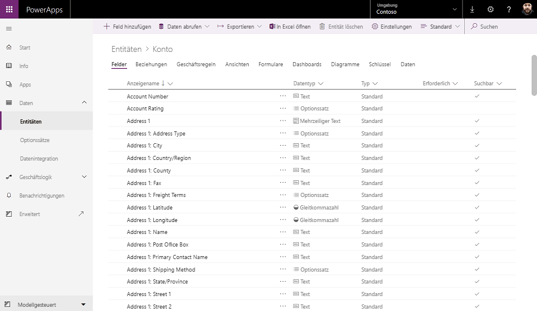

Common Data Service (CDS) for Apps lets you securely store and manage data used by business applications. 

## Entities
Data within CDS for Apps is stored within a set of records called entities. An **entity** is a set of records used to store data, similar to how a table stores data within a database.

CDS for Apps includes a base set of standard entities that support common business scenarios that connect to Dynamics 365 application data. You can also create custom entities specific to your organization and populate them with data that you import from lists in SharePoint, from Excel, or from PowerQuery. App makers can then use PowerApps to build rich applications using this data.

Dynamics 365 applications, including Dynamics 365 for Sales, Service, and Talent, use CDS for Apps to store and secure data used by the applications. This means you can build apps using PowerApps and CDS for Apps directly against your core business data already used within Dynamics 365 without the need for manual integration.

    > [!NOTE]
    > Dynamics 365 for Finance and Operations and Dynamics 365 for Retail currently require the configuration of the Data Integrator to make your business data available within CDS for Apps.

For most organizations it is to your advantage to use the standard entities and attributes for the purposes they were provided. To meet your business needs, you can extend the functionality of standard entities by creating one or more custom entities to store information that's unique to your organization. 

## Logic and validation
Entities within CDS for Apps can leverage rich server-side logic and validation to ensure data quality. You can also reduce repetitive code in each app that creates and uses data within an entity.

* **Business rules**: Business rules validate data across multiple fields and entities and provide warning and error messages, regardless of the app used to create the data. 
* **Business process flows**: Business process flows guide users to ensure they enter data consistently and follow the same steps every time. Business process flows are currently only supported for model-driven apps.
* **Workflows**: Workflows automate business processes without user interaction. 
* **Business logic with code**: Business logic supports advanced developer scenarios that extend the application directly through code. 

## Security
Data in CDS for Apps is securely stored so that users can see it only if you grant them access. Role-based security, based on the Dynamics 365 system allows you to control access to entities for different users within your organization.