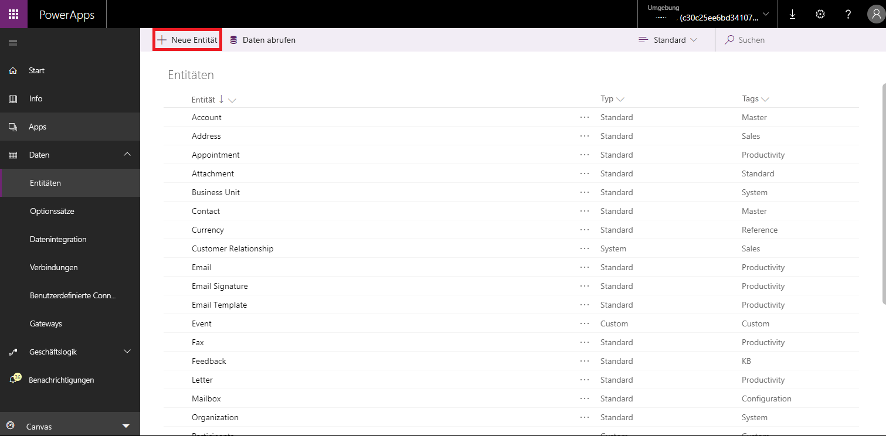
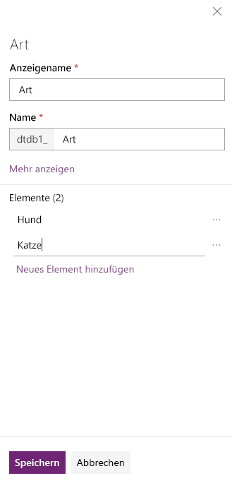
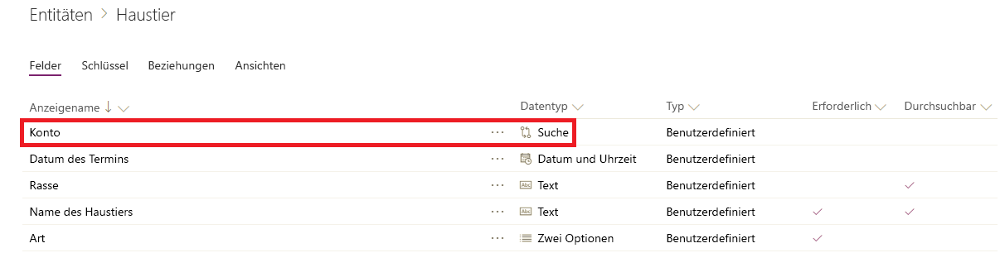
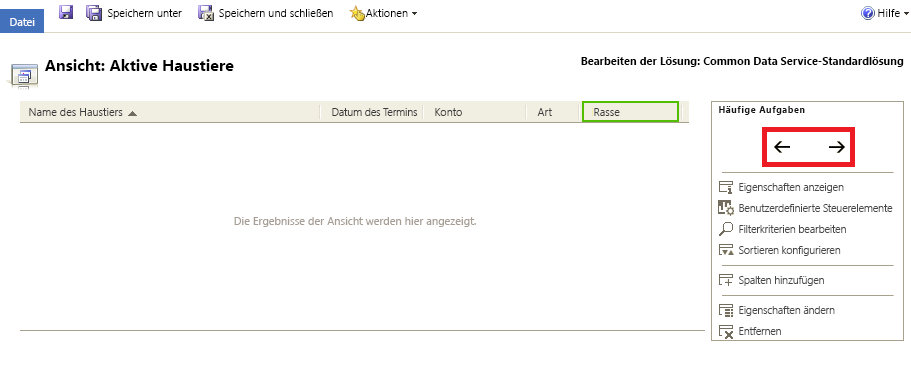
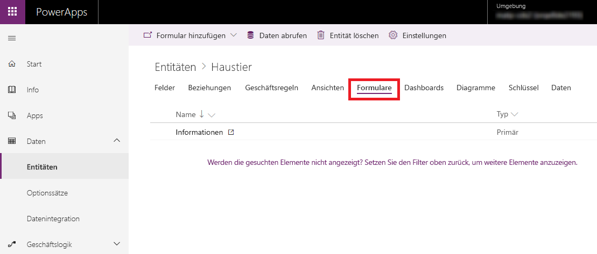
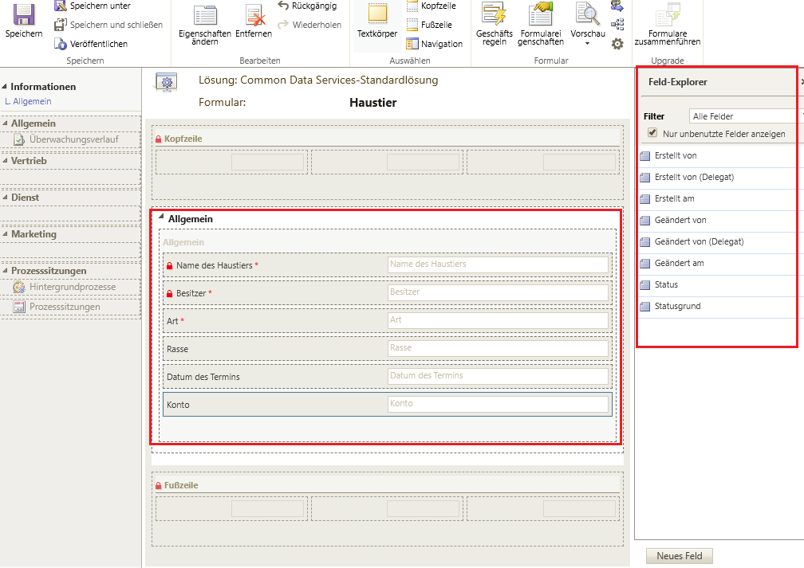

In dieser Lektion erstellen Sie eine Entität und passen anschließend wichtige Komponenten wie Felder, Beziehungen, Ansichten und Formulare an.In this unit, you'll create an entity and then customize key components, like fields, relationships, views, and forms. Sie lernen Folgendes:You'll learn how to:

- Erstellen einer benutzerdefinierten EntitätCreate a custom entity.
- Hinzufügen benutzerdefinierter Felder zur EntitätAdd custom fields to your entity.
- Hinzufügen einer EntitätsbeziehungAdd an entity relationship.
- Anpassen einer AnsichtCustomize a view.
- Anpassen eines FormularsCustomize a form.

Dieses Tutorial orientiert sich am Unternehmen Contoso, das einen Haustierpflegedienst für Hunde und Katzen betreibt.The tutorial follows the Contoso company, which is a pet grooming business that grooms dogs and cats. Contoso benötigt eine App zum Nachverfolgen von Kunden und Haustieren, die von den Mitarbeitern auf einer Vielzahl von Geräten genutzt werden kann.Contoso needs an app for client and pet tracking that can be used by employees on a variety of devices.

## VoraussetzungenPrerequisites

Melden Sie sich bei [Microsoft PowerApps](https://web.powerapps.com/?utm_source=padocs&utm_medium=linkinadoc&utm_campaign=referralsfromdoc) an.Sign in to [Microsoft PowerApps](https://web.powerapps.com/?utm_source=padocs&utm_medium=linkinadoc&utm_campaign=referralsfromdoc). Wenn Sie nicht bereits über ein PowerApps-Konto verfügen, klicken Sie auf [powerapps.com](https://web.powerapps.com/?utm_source=padocs&utm_medium=linkinadoc&utm_campaign=referralsfromdoc) auf den Link **Steigen Sie kostenlos ein**.If you don't already have a PowerApps account, select the **Get started free** link on [powerapps.com](https://web.powerapps.com/?utm_source=padocs&utm_medium=linkinadoc&utm_campaign=referralsfromdoc).

## Erstellen einer benutzerdefinierten EntitätCreate a custom entity

1. Erweitern Sie im linken Navigationsbereich **Daten**. Wählen Sie **Entitäten** und dann **Neue Entität** erstellen aus.In the left navigation pane, expand **Data**, select **Entities**, and then select **New entity**.

    > [!div class="mx-imgBorder"]
    > 

2. Geben Sie die folgenden Werte ein:Enter the following values:

    - **Anzeigename**: *Haustier***Display name**: *Pet*
    - **Beschreibung**: *Benutzerdefinierte Entität zum Nachverfolgen von Dienstleistungen für Haustiere***Description**: *Custom entity to track pet services*

3. Klicken Sie auf **Weiter**, und wählen Sie dann, nachdem die Standardfelder eingeblendet wurden, **Entität speichern** aus.Select **Next**, and then, after the default fields are shown, select **Save Entity**.

## Hinzufügen und Anpassen von FeldernAdd and customize fields

1. Wählen Sie in der Liste der Entitäten die Entität **Haustier** aus, die Sie im vorherigen Abschnitt erstellt haben.In the list of entities, select the **Pet** entity that you created in the previous section.
2. Wählen Sie auf der Registerkarte **Felder** das Feld **Haustier** aus.On the **Fields** tab, select the **Pet** field.
3. Nehmen Sie im rechten Bereich folgende Änderungen am Feld **Anzeigename** vor:In the right pane, make the following changes to the **Display name** field:

    - Ändern Sie den Wert **Anzeigename** von *Haustier* in *Name des Haustiers*.Change the **Display name** value from *Pet* to *Pet Name*.
    - Aktivieren Sie das Kontrollkästchen **Durchsuchbar**.Select **Searchable**.

    > [!div class="mx-imgBorder"]
    > 

3. Klicken Sie auf **Fertig**.Select **Done**.
4. Klicken Sie auf der Registerkarte **Felder** auf der Entity Designer-Symbolleiste auf **Feld hinzufügen**.On the **Fields** tab, on the entity designer toolbar, select **Add field**.
5. Geben Sie im Bereich **Feldeigenschaften** die folgenden Werte ein:In the **Field properties** pane, enter the following values:

    - **Anzeigename**: *Art***Display name**: *Species*
    - **Datentyp**: *Optionssatz***Data type**: *Option Set*
    - **Optionssatz**: *Neuer Optionssatz***Option set**: *New option set*

6. Erstellen Sie den Optionssatz:Create the option set:

    1. Klicken Sie auf **Neues Element hinzufügen**.Select **Add new item**.
    2. Ersetzen Sie *Neue Option* durch *Hund*.Replace *New option* with *Dog*.
    3. Klicken Sie auf **Neues Element hinzufügen**.Select **Add new item**.
    4. Ersetzen Sie *Neue Option* durch *Katze*.Replace *New option* with *Cat*.
    5. Klicken Sie auf **Speichern**.Select **Save**.

    > [!div class="mx-imgBorder"]
    > 

7. Aktivieren Sie **Durchsuchbar**, und klicken Sie dann auf **Fertig**.Select **Searchable**, and then select **Done**.
8. Klicken auf der Entity Designer-Symbolleiste auf **Feld hinzufügen**.On the entity designer toolbar, select **Add field**.
9. Geben Sie im Bereich **Feldeigenschaften** die folgenden Werte ein, und klicken Sie dann auf **Fertig**:In the **Field properties** pane, enter the following values, and then select **Done**:

    - **Anzeigename**: *Rasse***Display name**: *Breed*
    - **Datentyp**: *Text***Data type**: *Text*
    - **Durchsuchbar**: *Ja***Searchable**: *Yes*

10. Klicken auf der Entity Designer-Symbolleiste auf **Feld hinzufügen**.On the entity designer toolbar, select **Add field**.
11. Geben Sie im Bereich **Feldeigenschaften** die folgenden Werte ein, und klicken Sie dann auf **Fertig**:In the **Field properties** pane, enter the following values, and then select **Done**:

    - **Anzeigename**: *Datum des Termins***Display name**: *Appointment date*
    - **Datentyp**: *Datum und Uhrzeit***Data type**: *Date and time*

12. Klicken Sie auf **Entität speichern**.Select **Save Entity**.

## Hinzufügen einer BeziehungAdd a relationship

1. Klicken Sie auf der Registerkarte **Beziehungen** auf der Entity Designer-Symbolleiste auf **Beziehung hinzufügen**, und wählen Sie dann **n:1** aus.On the **Relationships** tab, on the entity designer toolbar, select **Add relationship**, and then select **Many-to-one**.
2. Wählen Sie im rechten Bereich in der Liste **Verknüpft** den Eintrag **Konto** aus.In the right pane, in the **Related** list, select **Account**.
3. Klicken Sie auf **Fertig**.Select **Done**.
4. Klicken Sie auf **Entität speichern**.Select **Save Entity**.

    Beachten Sie, dass beim Hinzufügen einer n-:1-Beziehung ein Feld des Typs **Konto** mit dem Datentyp **Suche** automatisch zu Ihrer Liste der Felder auf der Registerkarte **Felder** hinzugefügt wird.Notice that when you add a many-to-one relationship, an **Account** field of the **Lookup** data type is automatically added to your list of fields on the **Fields** tab.

    > [!div class="mx-imgBorder"]
    > 

## Anpassen einer AnsichtCustomize a view

1. Wählen Sie auf der Registerkarte **Ansichten** die Ansicht **Aktive Haustiere** aus.On the **Views** tab, select the **Active Pets** view. Wenn die Ansicht **Aktive Haustiere** nicht angezeigt wird, wählen **Filter entfernen** aus.If you don't see the **Active Pets** view, select **Remove filter**.
2. Wählen Sie im Ansicht-Designer **Spalten hinzufügen** und dann die folgenden Spalten aus. Klicken Sie anschließend auf **OK**:In the view designer, select **Add Columns**, select the following columns, and then select **OK**:

    - KontoAccount
    - Datum des TerminsAppointment date
    - RasseBreed
    - ArtSpecies

3. Klicken Sie auf die Spalte **Erstellt am**, dann auf **Entfernen** und anschließend auf **OK**, um das Entfernen der Spalte zu bestätigen.Select the **Created On** column, select **Remove**, and then select **OK** to confirm the column removal.
4. Um die Spalten anzuordnen, wählen Sie die zu verschiebende Spalte aus, und klicken Sie dann auf die Pfeiltasten (**\<-** und **-\>**), bis Ihre Ansicht so aussieht.To arrange the columns, select the column to move, and then use the arrow buttons (**\<-** and **-\>**) until your view looks like this.

    > [!div class="mx-imgBorder"]
    > 

5. Klicken Sie auf der Symbolleiste des Ansicht-Designers auf **Speichern und schließen**.On the view designer toolbar, select **Save and Close**.

## Anpassen des HauptformularsCustomize the main form

1. Wählen Sie in PowerApps im linken Navigationsbereich **Modellgesteuert** aus.In PowerApps, in the left navigation pane, select **Model-driven**.
2. Erweitern Sie im linken Navigationsbereich **Daten**. Wählen Sie **Entitäten** und dann **Haustier** aus.In the left navigation pane, expand **Data**, select **Entities**, and then select **Pet**.
3. Wählen Sie auf der Registerkarte **Formulare** den Eintrag **Informationen** neben dem Typ **Hauptformular** aus, um den Formular-Editor zu öffnen.On the **Forms** tab, select **Information** next to the **Main** form type to open the form editor.

    > [!div class="mx-imgBorder"]
    > 

4. Ziehen Sie im Formular-Editor die Felder **Art**, **Rasse**, **Datum des Termins** und **Konto** aus dem Bereich **Feld-Explorer** in den Abschnitt **Allgemein** des Formularzeichenbereichs, bis das Formular so aussieht.In the form editor, drag the **Species**, **Breed**, **Appointment date**, and **Account** fields from the **Field Explorer** pane to the **General** section of the form canvas, so that the form looks like this.

    > [!div class="mx-imgBorder"]
    > 

5. Klicken Sie auf **Speichern**.Select **Save**.
6. Klicken Sie auf **Veröffentlichen**.Select **Publish**.
7. Klicken Sie auf **Speichern und schließen**, um den Formulardesigner zu schließen.Select **Save and close** to close the form designer.
