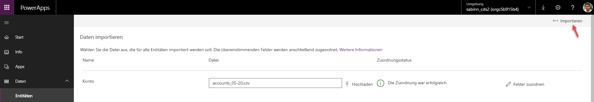

Sie können Daten in einem Massenvorgang aus Microsoft Excel- oder CSV-Dateien in Ihre Common Data Service for Apps-Datenbank importieren.

Jede Entität verfügt über Pflichtfelder, die in Ihrer Eingabedatei vorhanden sein müssen. Es wird empfohlen, eine Vorlage zu erstellen. Eine Vorlage spart Ihnen Zeit und Mühe. Exportieren Sie zuerst Daten aus der Entität. Sie nutzen die gleiche Datei (die mit Ihren Daten aktualisiert wurde), um Daten in die Entität zu importieren.

## Erstellen einer Dateivorlage
Sie können einen einmaligen Datenexport aus einer Standard- oder benutzerdefinierten Entität durchführen und Daten aus mehr als einer Entität gleichzeitig exportieren. Wenn Sie Daten aus mehr als einer Entität exportieren, wird jede Entität in ihre eigene Microsoft CSV-Datei exportiert. In diesem Beispiel erstellen Sie Vorlagen für die Entitäten **Haustier** und **Konto**.

1. Wählen Sie auf [powerapps.com](https://web.powerapps.com/) in der Liste **Entitäten** den Eintrag **Daten exportieren** aus.
1. Wählen Sie die Entitäten **Konto** und **Haustier** und dann **Daten exportieren** aus.
1. Wählen Sie nach Abschluss des Exports **Exportierte Daten herunterladen** aus, und speichern Sie die Dateien.

## Kopieren von Daten in die Vorlage
Wenn Sie einer Vorlagendatei Daten hinzufügen, müssen Sie sicherstellen, dass die Daten eindeutig sind. Sie können entweder *Primärschlüssel* oder *alternative Schlüssel* verwenden.

1. Öffnen Sie die CSV-Dateien, die Sie im vorherigen Abschnitt erstellt haben.
1. Fügen Sie mindestens eine neue Zeile mit Daten hinzu.
1. Speichern Sie die Datei.

## Importieren der Datei
1. Erweitern Sie im linken Navigationsbereich **Daten**, und wählen Sie dann **Entitäten** aus.
1. Wählen Sie die Entität **Haustiere** aus. Klicken Sie auf **Daten abrufen**, und wählen Sie dann **Daten aus Excel abrufen** aus.
1. Wählen Sie die von Ihnen erstellte Datei aus.
1. Sobald die Datei hochgeladen wurde und das Feld **Zuordnungsstatus** angibt, dass die Zuordnung erfolgreich war, wählen Sie rechts oben **Importieren** aus.

    > [!div class="mx-imgBorder"]
    > 

1. Wenn der Import erfolgreich war, wird die Gesamtanzahl von Einfügungen und Aktualisierungen angezeigt.
