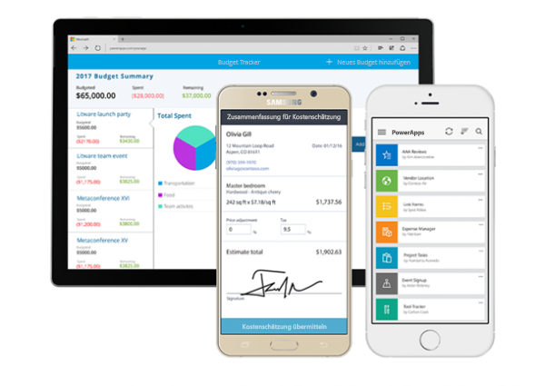

Willkommen bei Microsoft PowerApps.Welcome to Microsoft PowerApps. In diesem Onlinemodul machen Sie sich in Ihrem eigenen Arbeitstempo mit den grundlegenden Schritte zum Erstellen einer App vertraut.This self-paced online module helps you build apps from the ground up.

In diesem Einführungsmodul erfahren Sie, wie Sie aus den Daten in einer Microsoft Excel-Arbeitsmappe eine App erstellen.With this introductory module, you'll learn how to create an app from data in a Microsoft Excel workbook. Zur Vorbereitung laden Sie die Arbeitsmappe herunter, die die Beispieldaten enthält.As a prerequisite, you'll download the workbook, which contains sample data. Dann laden Sie die Arbeitsmappe auf Microsoft OneDrive for Business hoch – dort können Sie die Daten für andere Benutzer freigeben.Then you'll upload the workbook to Microsoft OneDrive for Business, where you can share the data with others. Anschließend erstellen Sie die App, ohne dabei eine traditionelle Programmiersprache wie z.B. C# verwenden zu müssen.Then you'll build the app without using a traditional programming language such as C#.

PowerApps bietet folgende Möglichkeiten:With PowerApps, you can:

- Sie können mit Ihren bereits vorhandenen Kenntnissen innerhalb kürzester Zeit eine App erstellen.Quickly build an app by using the skills that you already have.
- Sie können eine Verbindung mit den Clouddiensten und Datenquellen herstellen, die Sie bereits nutzen.Connect to the cloud services and data sources that you're already using.
- Sie können Ihre Apps freigeben, sodass Mitarbeiter und Kollegen im gesamten Unternehmen oder überall auf der Welt Ihre Apps auf ihren Smartphones und Tablets verwenden können.Instantly share your apps so that co-workers across the company or across the world can use them on their phones and tablets.

PowerApps bietet Ihnen nahezu unbeschränkte Möglichkeiten, um Aufgaben effizient auszuführen und alle Beteiligten auf dem Laufenden zu halten.The sky's the limit when it comes to using PowerApps to get things done and keep people informed. Die folgenden Beispiele vermitteln Ihnen einen Eindruck davon, wie Sie in Ihrem Business eine App anstelle von herkömmlichen Papierdokumenten einsetzen können:These examples can help you think about how to use an app, instead of traditional paper notes, to run your business:

- **Geräte vor Ort bei Kunden**: Unternehmensvertreter, die Kunden vor Ort besuchen, verwenden häufig Klemmbretter mit Dokumenten, auf denen Bauteile und Datumsangaben für deren Austausch dokumentiert sind.**Equipment in the field**: Often, company representatives who visit customers in the field carry clipboards to help guarantee a paper trail of parts with scheduled replacement dates. Mit einer App auf einem Tablet können diese Vertreter schnell nachsehen, welche Komponenten beim Kunden im Einsatz sind. Zudem können sie Bilder eines Teils ansehen, dieses Teil testen und analysieren und dann neue Teile bestellen.By running an app on a tablet, reps can look up the customer's equipment, see a picture of a part, test and analyze the part, and then order new parts. Die Vertreter können diese Aufgaben direkt am Kundenstandort ausführen, ohne ins Büro zurückkehren zu müssen.Reps can perform these tasks on site instead of leaving the customer's warehouse.
- **Mitarbeiterführung in einem Restaurant**: Die Mitarbeiter eines großen Restaurants führen ihre Arbeits- und Urlaubspläne möglicherweise noch auf Papier und heften die Pläne dann an die Wand.**Restaurant employee management**: Employees of a large restaurant might fill out work schedules and vacation requests on paper that's stapled to a wall. Wenn PowerApps auf den Smartphones der Mitarbeiter ausgeführt wird, können diese dieselben Informationen mithilfe einer App erfassen. Wo sich die Mitarbeiter befinden und zu welchem Zeit sie Informationen eingeben, spielt dabei keine Rolle.With PowerApps running on everyone's smartphone, employees now just open the app to record the same information, anywhere, any time. Die App kann sogar eine Erinnerung zum Arbeitsbeginn am nächsten Tag senden.The app can even send reminders for the start of the next day's shift.

Wenn Sie noch nicht mit PowerApps vertraut sind, erleichtert Ihnen dieses Modul die ersten Schritte.If you're a beginner with PowerApps, this module gets you going quickly. Wenn Sie bereits mit PowerApps gearbeitet haben, unterstützt Sie das Modul durch zusätzliche Informationen und vermittelt Ihnen, wie unterschiedliche Konzepte zusammenhängen.If you're familiar with PowerApps, it ties concepts together and fills in the gaps.

## PowerApps-BausteinePowerApps building blocks
PowerApps umfasst Dienste, Apps und Connectors, die miteinander interagieren – so erhalten Sie viel mehr Möglichkeiten, mit Ihren Daten zu arbeiten.PowerApps is a collection of services, apps, and connectors that work together to let you do much more than just view your data. Sie können auf Grundlage Ihrer Daten Maßnahmen einleiten und diese Daten an jedem Ort der Welt und mit jedem Gerät aktualisieren.You can act on your data and update it anywhere and on any device.

Zum Erstellen, Freigeben und Verwalten von Apps verwenden Sie diese Websites:To create, share, and administer apps, you'll use these sites:

1. [web.powerapps.com](https://web.powerapps.com): Hier können Sie Apps öffnen, den Typ der App angeben, die Sie erstellen möchten, und Datenverbindungen und Flows erstellen.[web.powerapps.com](https://web.powerapps.com) In this site, you can open apps, specify the type of app that you want to create, and create data connections and flows.
1. **PowerApps Studio**: Hier erstellen Sie Apps, indem Sie Benutzeroberflächenelemente und Excel-ähnliche Formeln konfigurieren.**PowerApps Studio**: In this site, you build apps by configuring user interface (UI) elements and Excel-like formulas.
1. **PowerApps Admin Center**: Hier definieren Sie Umgebungen und Datenrichtlinien.**PowerApps admin center**: In this site, you'll define environments and data policies.

Wenn Sie all diese Aufgaben erledigt haben, können Sie Ihre Apps in einem Browser (über Microsoft Dynamics 365) oder in PowerApps Mobile (verfügbar für Windows-Tablets, iOS-Geräte und Android-Geräte) ausführen.When you're done with all that, you can run your apps in a browser (from Microsoft Dynamics 365) or in PowerApps Mobile (available for Windows tablets, iOS devices, and Android devices).

In dieser Einheit haben Sie einen Überblick über die Hauptkomponenten von PowerApps erhalten und erfahren, welche Möglichkeiten das Tool bietet.In this unit, you got an overview of what you can do with PowerApps what its main parts are. In der nächsten Einheit werden wir uns die PowerApps-Komponenten genauer ansehen.In the next unit, you'll look more closely at PowerApps components.