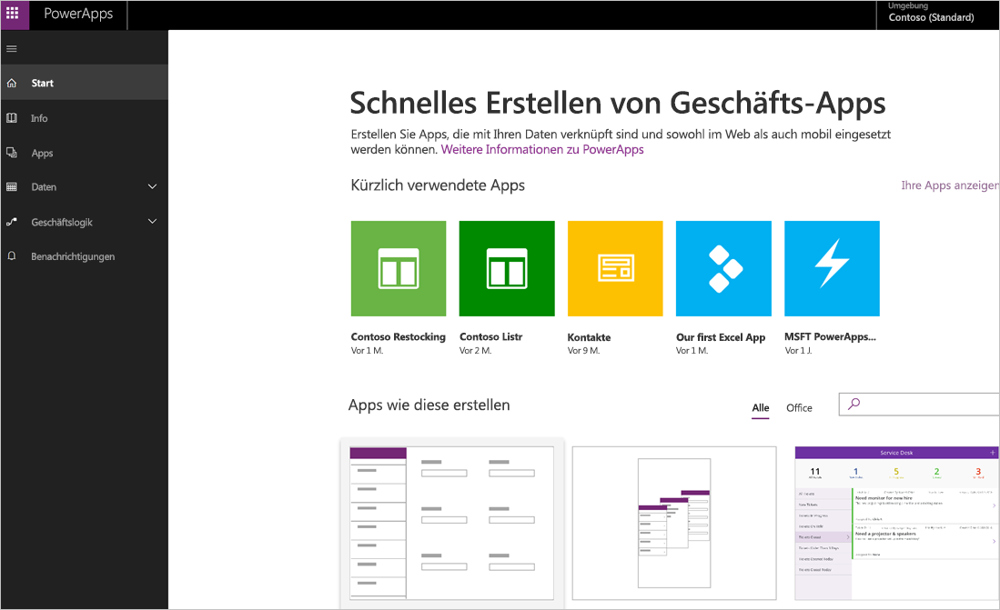
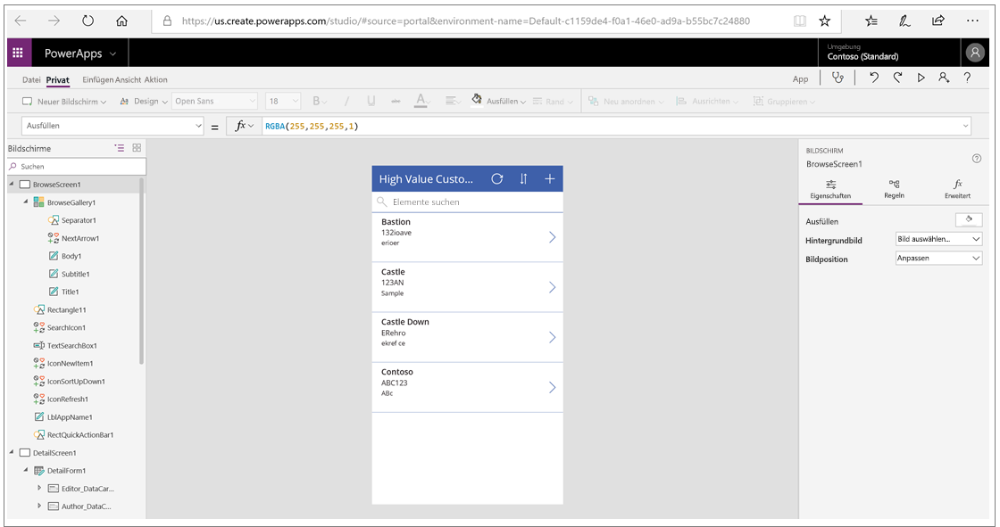
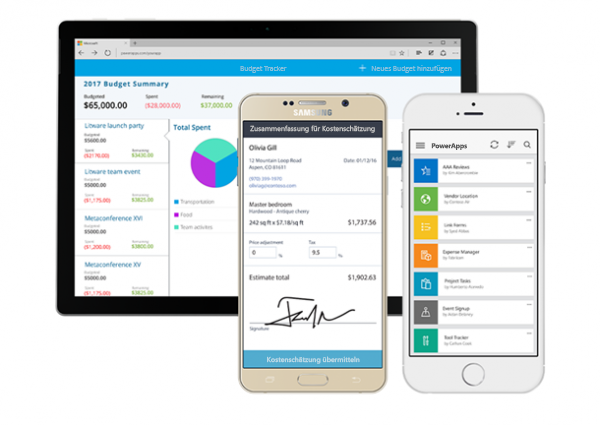
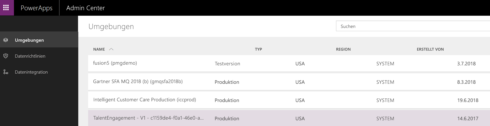

In der ersten Einheit haben Sie die wichtigsten Komponenten von Microsoft PowerApps kennengelernt.In the first unit, you learned about the main parts of Microsoft PowerApps. Nun sollen die einzelnen Komponenten näher erläutert werden.We're now going to dive deeper into each part. Die PowerApps-Komponenten:The PowerApps components are:

* **web.powerapps.com**: Hier ist der Startpunkt für Apps – unabhängig davon, ob Sie diese basierend auf Daten, aus einer Beispiel-App oder von Grund auf neu erstellen.**web.powerapps.com**: Apps start here, whether you build them from data, a sample app, or a blank screen.
* **PowerApps Studio**: Füllen Sie Ihre Apps mit Inhalten, indem Sie ganz einfach eine Verbindung mit Daten herstellen, Benutzeroberflächenelemente (sogenannte Steuerelemente) hinzufügen und anordnen und Formeln erstellen.**PowerApps Studio**: Flesh out your apps by easily connecting to data, adding and arranging user interface (UI) elements (known as controls), and building formulas.
* **PowerApps Mobile**: Führen Sie Ihre Apps auf Microsoft Windows-, Apple iOS- und Google Android-Geräten aus.**PowerApps Mobile**: Run your apps on Microsoft Windows, Apple iOS, and Google Android devices.
* **PowerApps Admin Center**: Verwalten Sie PowerApps-Umgebungen und anderen Komponenten.**PowerApps admin center**: Manage PowerApps environments and other components.

## web.powerapps.comweb.powerapps.com
Beim Erstellen einer App beginnen Sie hier.If you are building an app, you'll start here. Sie können Apps aus Beispiel-Apps, Vorlagen oder einem leeren Bereich erstellen.You can build apps from sample apps, from templates, or from a blank screen. Alle von Ihnen erstellten Apps sowie alle Apps, die von anderen Personen erstellt und für Sie freigegeben wurden, werden hier angezeigt.All the apps that you've built appear here, along with any apps that others have created and shared with you.

## PowerApps StudioPowerApps Studio
In PowerApps Studio gestalten Sie Ihre Apps, um aus diesen effektive und attraktive Geschäftstools zu entwickeln.PowerApps Studio is where you flesh out your apps to make them more effective as a business tool and to make them more attractive. PowerApps Studio enthält drei Bereiche, durch die das Erstellen von Apps mit dem Erstellen einer Foliengruppe in Microsoft PowerPoint vergleichbar ist:PowerApps Studio has three panes that make creating apps feel more like building a slide deck in Microsoft PowerPoint:

- Im linken Bereich wird eine hierarchische Ansicht aller Steuerelemente auf jedem Bildschirm bzw. eine Miniaturansicht für jeden Bildschirm in Ihrer App angezeigt.Left pane, which shows a hierarchical view of all the controls on each screen or a thumbnail for each screen in your app.
- Im mittleren Bereich wird die App angezeigt, an der Sie gerade arbeiten.Middle pane, which shows the app that you're working on.
- Im rechten Bereich legen Sie Optionen wie Layout und Datenquellen für bestimmte Steuerelemente fest.Right pane, where you set options such as the layout and data sources for certain controls.

## PowerApps MobilePowerApps Mobile
PowerApps Mobile für Windows-, iOS- und Android-Geräte bietet eine Umgebung, in der Sie Ihre Apps suchen und verwenden können.PowerApps Mobile for Windows, iOS, and Android devices provides an environment where you can find and use your apps. Sie müssen keine separaten App-Stores öffnen, um all die Apps zu verwenden, die Sie selbst erstellt haben oder die von anderen Personen erstellt und für Sie freigegeben wurden.You don't need to open separate app stores to use all the apps that you've created and that others have shared with you. Wenn Sie Apps in PowerApps Mobile verwenden, können Sie die Funktionen Ihres Geräts optimal nutzen, z.B. Kamerasteuerelemente und die GPS-Standortbestimmung.When you use apps in PowerApps Mobile, you get the most out of your device's capabilities: camera controls, GPS location, and more.

## Admin CenterAdmin center
Das PowerApps Admin Center ist der zentrale Ort zum Verwalten von PowerApps für ein Unternehmen.The PowerApps admin center is the centralized place for managing PowerApps for an organization. Auf dieser Seite können Sie unterschiedliche Umgebungen definieren, die die Apps enthalten.On this site, you define different environments that house the apps. Sie können ebenfalls Datenverbindungen und andere Elemente definieren.You also define data connections and other elements. Im Admin Center werden ebenfalls Berechtigungen und Datenrichtlinien verwaltet.The admin center is also where you manage permissions and data policies.

In der nächsten Einheit werden die verknüpften Technologien vorgestellt, die von PowerApps verwendet werden, um eine leistungsfähige Umgebung für die App-Entwicklung bereitzustellen.In the next unit, you'll learn about the set of related technologies that PowerApps works with to make a powerful ecosystem for app development.