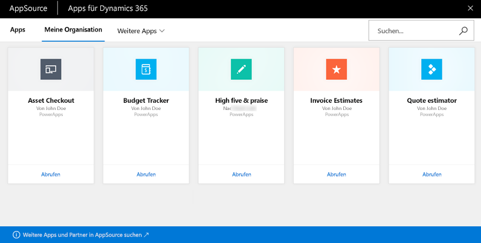
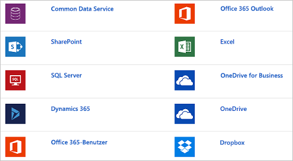

Microsoft PowerApps interagiert mit anderen Technologien und unterstützt Sie auf diese Weise, Apps zu erstellen und für Ihre gesamte Organisation freizugeben.Microsoft PowerApps works with other technologies to help you build and share apps across your organization. Einige dieser Technologien werden im Folgenden beschrieben:Let's take a look at some of these technologies:

- **Microsoft Dynamics 365**: Dynamics 365 bildet die Grundlage für Ihre Unternehmens-Apps und umfasst Microsoft Power BI, Microsoft Flow, Dynamics 365 for Talent und viele andere Lösungen.**Microsoft Dynamics 365**: Dynamics 365 is the home for all your business apps: Microsoft Power BI, Microsoft Flow, Dynamics 365 for Talent, and many others.
- **Microsoft AppSource**: Mit AppSource geben Sie Ihre eigenen Apps frei und laden andere Apps herunter, die Ihrem Unternehmen einen Mehrwert bieten.**Microsoft AppSource**: AppSource is where you share apps and download other apps that might be useful to your business.
- **Datenquellen**: Daten sind das Fundament Ihres Unternehmens.**Data sources**: Without data, you don't have a business. Über Datenquellen werden Ihre Apps mit lokalen Daten oder Daten aus der Cloud versorgt.Data sources bring cloud and on-premises data into your apps. Sie greifen über integrierte Verbindungen, benutzerdefinierte Connectors und Gateways auf Daten zu.You access data through built-in connections, custom connectors, and gateways.

## Dynamics 365Dynamics 365
Die Dynamics 365-Homepage bietet einen zentralen Ort, an dem Sie all Ihre Geschäfts-Apps ausführen können – unabhängig davon, ob sie von App-Erstellern in Ihrer Organisation, von Microsoft oder von externen Unternehmen stammen.The Dynamics 365 home page provides one place to run all your business apps, whether they come from app makers in your organization, Microsoft, or external companies.

## AppSourceAppSource
Mit AppSource suchen und bewerten Sie Apps von Kollegen, von Microsoft und von Microsoft-Partnern.AppSource is the place to find and evaluate apps from your colleagues, from Microsoft, and from our partners. In PowerApps geben Sie Apps für AppSource frei.In PowerApps, you share apps to AppSource. Benutzer können diese Apps in Dynamics 365 oder auf Mobilgeräten anzeigen und ausführen.Users can then view and run those apps in Dynamics 365 or on mobile devices. In AppSource können Sie Ihre Apps öffentlich zugänglich machen oder nur für Personen in Ihrer Organisation freigeben.In AppSource, you can make your apps available to the public or just to people in your organization.

## Datenquellen, Verbindungen und GatewaysData sources, connections, and gateways
In PowerApps können Sie Ihren Apps über integrierte oder benutzerdefinierte Connectors viele Datenquellen hinzufügen.In PowerApps, you can add many data sources to your apps through built-in or custom connectors. Die folgenden Datenquellen gehören zu den beliebtesten.These data sources are some of the most popular.

Bei vielen Datenquellen handelt es sich um Clouddienste wie Salesforce.Many data sources are cloud services, like Salesforce. Selbst Twitter kann eine Datenquelle sein, wenn Sie z.B. Hashtags Ihres Unternehmens nachverfolgen.Even Twitter can be a data source if, for example, you're tracking your company's hashtags. Connectors sind auf den ersten Blick nicht der coolste Teil der App-Entwicklung.Connectors might not feel like the coolest part of app development. Sie sind aber von entscheidender Bedeutung, wenn Sie mit Daten arbeiten, die Sie, Ihre Kollegen und Ihre Kunden benötigen.However, they're essential when you work with data that you, your colleagues, and your customers care about. Dass Connectors tatsächlich einen Mehrwert bieten, wird deutlich, wenn eine App zum ersten Mal Daten aus Ihrer Datenquelle anzeigt.And when an app shows up with your data source for the first time, you'll suddenly find they're very cool!

Für Daten, die lokal und nicht in der Cloud gespeichert sind, verwenden Sie ein Gateway, um eine zuverlässige Verbindung zwischen PowerApps und Ihrer Datenquelle bereitzustellen.For data that's stored on-premises instead of in the cloud, you use a gateway to provide a reliable connection between PowerApps and your data source. Das Gateway befindet sich auf einem lokalen Computer und kommuniziert mit PowerApps.The gateway sits on an on-premises computer and communicates with PowerApps.

Nun wissen Sie etwas mehr über die verschiedenen Komponenten von PowerApps und die damit verbundenen Technologien.You now know a little more about all the parts of PowerApps and related technologies. Im Verlauf dieses Moduls werden Sie noch mehr über die einzelnen Komponenten erfahren.As you go through this module, you'll continue to deepen your knowledge about each part.
