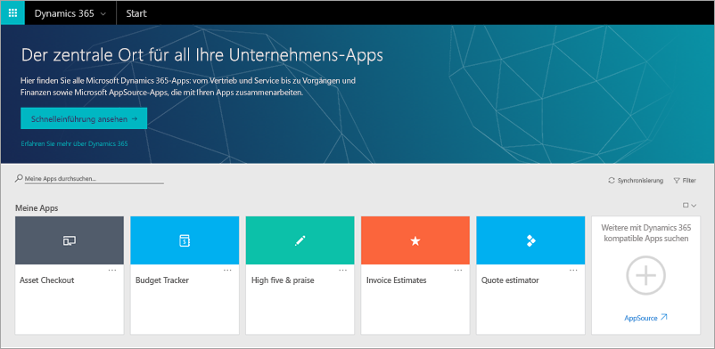

Microsoft PowerApps interagiert mit anderen Technologien und unterstützt Sie auf diese Weise, Apps zu erstellen und für Ihre gesamte Organisation freizugeben. Einige dieser Technologien werden im Folgenden beschrieben:

- **Microsoft Dynamics 365**: Dynamics 365 bildet die Grundlage für Ihre Unternehmens-Apps und umfasst Microsoft Power BI, Microsoft Flow, Dynamics 365 for Talent und viele andere Lösungen.
- **Microsoft AppSource**: Mit AppSource geben Sie Ihre eigenen Apps frei und laden andere Apps herunter, die Ihrem Unternehmen einen Mehrwert bieten.
- **Datenquellen**: Daten sind das Fundament Ihres Unternehmens. Über Datenquellen werden Ihre Apps mit lokalen Daten oder Daten aus der Cloud versorgt. Sie greifen über integrierte Verbindungen, benutzerdefinierte Connectors und Gateways auf Daten zu.

## Dynamics 365
Die Dynamics 365-Homepage bietet einen zentralen Ort, an dem Sie all Ihre Geschäfts-Apps ausführen können – unabhängig davon, ob sie von App-Erstellern in Ihrer Organisation, von Microsoft oder von externen Unternehmen stammen.

## AppSource
Mit AppSource suchen und bewerten Sie Apps von Kollegen, von Microsoft und von Microsoft-Partnern. In PowerApps geben Sie Apps für AppSource frei. Benutzer können diese Apps in Dynamics 365 oder auf Mobilgeräten anzeigen und ausführen. In AppSource können Sie Ihre Apps öffentlich zugänglich machen oder nur für Personen in Ihrer Organisation freigeben.

## Datenquellen, Verbindungen und Gateways
In PowerApps können Sie Ihren Apps über integrierte oder benutzerdefinierte Connectors viele Datenquellen hinzufügen. Die folgenden Datenquellen gehören zu den beliebtesten.

Bei vielen Datenquellen handelt es sich um Clouddienste wie Salesforce. Selbst Twitter kann eine Datenquelle sein, wenn Sie z.B. Hashtags Ihres Unternehmens nachverfolgen. Connectors sind auf den ersten Blick nicht der coolste Teil der App-Entwicklung. Sie sind aber von entscheidender Bedeutung, wenn Sie mit Daten arbeiten, die Sie, Ihre Kollegen und Ihre Kunden benötigen. Dass Connectors tatsächlich einen Mehrwert bieten, wird deutlich, wenn eine App zum ersten Mal Daten aus Ihrer Datenquelle anzeigt.

Für Daten, die lokal und nicht in der Cloud gespeichert sind, verwenden Sie ein Gateway, um eine zuverlässige Verbindung zwischen PowerApps und Ihrer Datenquelle bereitzustellen. Das Gateway befindet sich auf einem lokalen Computer und kommuniziert mit PowerApps.

Nun wissen Sie etwas mehr über die verschiedenen Komponenten von PowerApps und die damit verbundenen Technologien. Im Verlauf dieses Moduls werden Sie noch mehr über die einzelnen Komponenten erfahren.
