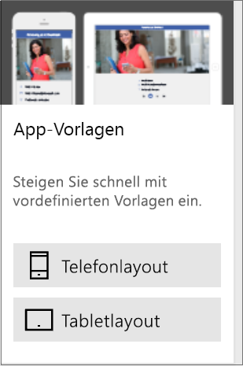
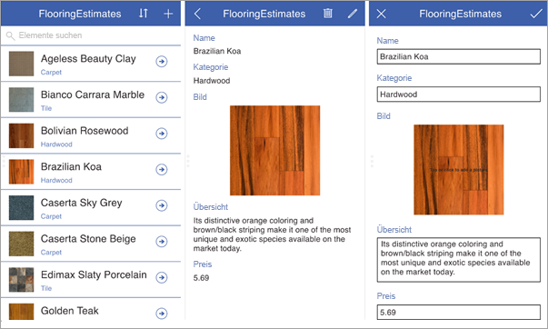

Da Sie nun mit den Grundlagen vertraut sind, erstellen wir jetzt eine App in Microsoft PowerApps.Now that you know the basics, let's get to building an app in Microsoft PowerApps.

## Erstellen von PowerApps-AppsWays to build PowerApps
In dieser Einheit wird erläutert, wie Sie eine App aus einer Beispiel-App, einer Vorlage, einer freigegebenen App oder einer Datenquelle erstellen.In this unit, we'll look at how to create an app from a sample app, a template, a shared app, or a data source. In der nächsten Einheit geht es dann um das Erstellen von Apps in der Praxis.In the next unit, we'll get more hands-on with app creation.

### Übersicht über Beispiel-AppsCheck out some sample apps
<<<<<<< KOPFTEIL Unter [https://web.powerapps.com](https://web.powerapps.com) werden Sie mit einer Reihe von Beispiel-Apps begrüßt, die Sie in Ihrem Webbrowser verwenden können.<<<<<<< HEAD On [https://web.powerapps.com](https://web.powerapps.com), you'll be greeted with several sample apps that you can use in your web browser. Sehen Sie sich diese Apps genauer an, um einen Eindruck von den Möglichkeiten zu erhalten, über die Ihr Unternehmen von PowerApps profitieren kann.Explore these apps to quickly get a sense of what's possible and how PowerApps can help your business.
======= Unter [https://web.powerapps.com] werden Sie mit einer Reihe von Beispiel-Apps begrüßt, die Sie in Ihrem Webbrowser verwenden können.======= On https://web.powerapps.com, you'll be greeted with several sample apps that you can use in your web browser. Sehen Sie sich diese Apps genauer an, um einen Eindruck von den Möglichkeiten zu erhalten, über die Ihr Unternehmen von PowerApps profitieren kann.Explore these apps to quickly get a sense of what's possible and how PowerApps can help your business.
>>>>>>> mastermaster

Jede Beispiel-App wurde für einen bestimmten Zweck entwickelt, z.B. für Folgendes:Each sample app is designed for a specific purpose, such as:

- Verwalten eines BudgetsManaging a budget.
- Überprüfen eines StandortsInspecting a site.
- Nachverfolgen eines ServiceticketsTracking service tickets.

Diese Beispiele enthalten auch Beispieldaten – nutzen Sie diese als Inspiration!These samples also contain sample data to inspire your thinking. Diese App kann Servicevertreter eines Unternehmens für Bodenbeläge dabei unterstützen, beim Besuch an einem Kundenstandort sofort einen genauen Kostenvoranschlag auszustellen.For example, this app can help service representatives for a flooring company give accurate and immediate cost estimates when they visit customer locations.

### Erstellen einer App aus einer VorlageCreate an app from a template
Eine weitere gute Möglichkeit zum Erstellen einer App ist das Verwenden einer Vorlage.Another good way to create an app is to start from a template. Vorlagen verwenden Beispieldaten, damit Sie eine Vorstellung von den vorhandenen Möglichkeiten bekommen.Templates use sample data to help you get a sense of what's possible. Indem Sie eine Vorlage in PowerApps Studio öffnen, lernen Sie durch praktische Anwendung, wie eine App erstellt wird.By opening them in PowerApps Studio, you can learn hands-on how an app is built.

Mit der Vorlage „Budget Tracker“ können Sie z.B. eine App erstellen, mit der Sie den Überblick über das Budget für Projekte und Veranstaltungen behalten. Dabei können Sie benutzerdefinierte Kategorien, eine einfache Dateneingabe und Visuals nutzen, die die Ausgaben zur einfachen Überprüfung hervorheben.For example, you can use the Budget Tracker template to create an app that helps you track the budget for projects and events with custom categories, easy data entry, and visuals that highlight expenditures for easy inspection.

### Verwenden von freigegebenen AppsUse shared apps
Falls Ihr Team mit dem Einsatz von PowerApps begonnen hat, wurden vielleicht schon Apps für Sie freigegeben.If your team has started to use PowerApps, others might have shared apps with you already. Wenn der Ersteller einer App Ihnen die Berechtigung erteilt hat, die App zu bearbeiten, wird diese in „web.powerapps.com“ angezeigt. Dort können Sie die App öffnen, anpassen und freigeben.If the app maker gave you permission to edit the app, it appears on web.powerapps.com, where you can open, customize, and share the app.

### Erstellen einer App aus einer DatenquelleCreate an app from a data source
Eine hervorragende Möglichkeit für den Einstieg ist das Generieren einer App aus Ihren eigenen Daten.A great way to get started is to generate an app from your own data. Geben Sie in PowerApps einfach die gewünschte Datenquelle an (z.B. eine Liste in Microsoft SharePoint), und sehen Sie zu, wie PowerApps automatisch eine App mit drei Bildschirmen erstellt.Just point PowerApps at the data source of your choice (for example, a list in Microsoft SharePoint), and watch as PowerApps automatically builds a three-screen app.

Diese App wurde aus einer SharePoint-Liste erstellt und ermöglicht Ihnen das Durchsuchen von Elementen in der Liste, das Anzeigen von Elementdetails und das Erstellen und Bearbeiten von Elementen.This app was created from a SharePoint list and lets you browse items in the list, view item details, and create and edit items. Nachdem PowerApps eine App generiert hat, können Sie damit beginnen, diese anzupassen, damit ihr Aussehen und Verhalten Ihren Anforderungen entspricht.After PowerApps generates an app, you can customize it to make it look and behave exactly the way you want.

### Neuerstellen von AppsBuild from the ground up
Sie können eine App auch von Grund auf neu erstellen und nach und nach alle erforderlichen Elemente hinzufügen.You can also build an app from scratch and add all the pieces as you go. Anschließend können Sie Ihrer Fantasie freien Lauf lassen.You can then branch out and let your imagination run wild. Im Verlauf dieses Moduls haben Sie dazu ausreichend Gelegenheit!There will be plenty of that later in this module!

Die einfachste Möglichkeit zum Kennenlernen von PowerApps besteht allerdings darin, mit einer Beispiel-App zu beginnen, eine Vorlage zu öffnen oder eine Verbindung mit Ihrer Datenquelle herzustellen und PowerApps das Generieren der App zu überlassen.The easiest way to learn about PowerApps is to start with a sample app, open a template, or connect to your data source and have PowerApps generate the app for you.

In der nächsten Einheit erfahren Sie, wie Sie eine App aus Daten generieren.In the next unit, you'll learn how to generate an app from data.
