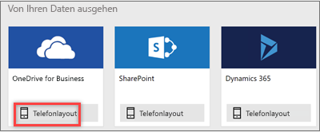
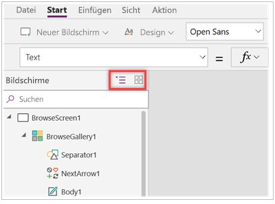
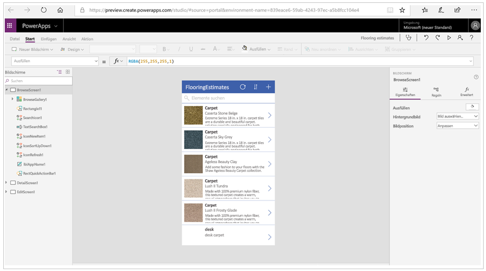

Kommen wir jetzt zu den ersten Schritten.OK, let's get started.

Da Sie nun die Komponenten von Microsoft PowerApps und die Optionen zum Erstellen von Apps kennen, wird es Zeit, eine eigene App zu erstellen.Now that you're familiar with all the parts of Microsoft PowerApps and the options for creating apps, it's time to actually build an app. In dieser Einheit erstellen Sie eine Smartphone-App, deren Datenquelle eine in Microsoft OneDrive for Business gespeicherte Microsoft Excel-Arbeitsmappe ist.In this unit, you'll generate a phone app where the data source is a Microsoft Excel workbook that's stored in Microsoft OneDrive for Business. In dieser Excel-Arbeitsmappe werden die Muster von Bodenbelägen eines Unternehmens einschließlich der zugehörigen Bilder und Preise aufgeführt.This Excel workbook lists a company's inventory of flooring samples with pictures and prices.

Denken Sie daran, dass Sie auch Daten aus verschiedenen anderen Quellen verwenden können, z.B. aus Microsoft SharePoint, Clouddiensten wie Salesforce und lokalen Quellen wie Microsoft SQL Server.Keep in mind that you can use data from lots of other sources, including Microsoft SharePoint, cloud services like Salesforce, and on-premises sources like Microsoft SQL Server.

## Herstellen einer Verbindung mit einer DatenquelleConnect to a data source

1. Laden Sie die Arbeitsmappe [Flooring Estimates](https://az787822.vo.msecnd.net/documentation/get-started-from-data/FlooringEstimates.xlsx) herunter, und speichern Sie sie in OneDrive for Business.Download the [Flooring Estimates workbook](https://az787822.vo.msecnd.net/documentation/get-started-from-data/FlooringEstimates.xlsx), and save it to OneDrive for Business.

1. Navigieren Sie zu [https://web.powerapps.com](https://web.powerapps.com), und melden Sie sich mit Ihrem Organisationskonto an.Go to [https://web.powerapps.com](https://web.powerapps.com), and sign in with your organizational account.

1. Klicken Sie im linken Bereich auf die Option **Apps**.In the left pane, select **Apps**.

1. Klicken Sie auf **Create an app** (App erstellen).Select **Create an app**.

1. Klicken Sie für die Datenquelle **OneDrive for Business** auf **Telefonlayout**.For the **OneDrive for Business** data source, select **Phone layout**.

    

    Generierte Apps basieren immer auf einer einzelnen Liste oder Tabelle, aber Sie können der App später weitere Daten hinzufügen.Generated apps are always based on a single list or table, but you can add more data to the app later. Die nächsten drei Schritte erläutern, wie Sie eine Verbindung mit der Excel-Arbeitsmappe herstellen.The next three steps explain how to connect to the Excel workbook.

1. Wählen Sie unter **Verbindungen** die Option **OneDrive for Business** aus.Under **Connections**, select **OneDrive for Business**.
1. Wählen Sie unter **Choose an Excel file** (Excel-Datei auswählen) die Excel-Arbeitsmappe aus.Under **Choose an Excel file**, select the Excel workbook.
1. Klicken Sie auf **Verbinden**.Select **Connect**.

Zum Generieren der App untersucht PowerApps Ihre Daten und gleicht sie mit den PowerApps-Funktionen ab, sodass Sie eine funktionierende App als Ausgangspunkt erhalten.PowerApps generates the app by inspecting your data and matching it with PowerApps capabilities so that you get a working app as a starting point.

## Komponenten der generierten AppExplore the generated app
Vorgang erfolgreich!Success! Ihre neue App mit drei Bildschirmen öffnet sich in PowerApps Studio.Your new three-screen app opens in PowerApps Studio.

Auf der linken Seite wird der Bereich **Bildschirme** angezeigt.On the left, you'll see the **Screens** pane. Wählen Sie in der oberen rechten Ecke des Bereichs „Bildschirme“ die Miniaturansicht aus.In the upper-right corner of the screens pane, select the thumbnail view.

Wählen Sie für jeden Bildschirm die Miniaturansicht aus, um die Steuerelemente des jeweiligen Bildschirms anzuzeigen.Select the thumbnail for each screen to view the controls on that screen. 

Hier sehen Sie das Hauptentwicklungsfenster in PowerApps Studio, zu dem Sie in späteren Einheiten weitere Informationen erhalten.Here is the main development window for PowerApps Studio, which you'll learn more about in later units.

Klicken Sie in der oberen rechten Ecke auf **Wiedergeben** , um die App auszuprobieren.Select **Play**  in the upper-right corner to try out the app. Wie Sie sehen, enthält die App alle Daten aus der Liste und ist in der Standardversion bereits gut zu bedienen.You'll see that it includes all the data from the list and provides a good default experience.

Alle aus Daten generierten Apps verfügen über dieselben Bildschirme, die Sie im Miniaturansichtbereich anzeigen können:All apps generated from data have the same set of screens that you can view from the Thumbnail pane:

* **Bildschirm zum Durchsuchen**: Dieser Bildschirm wird standardmäßig angezeigt.**Browse screen**: This screen appears by default. Hier können Sie die Daten aus Ihrer Datenquelle durchsuchen, sortieren, filtern und aktualisieren.In it, you can browse, sort, filter, and refresh the data from the data source. In diesem Bildschirm können Sie Elemente zur Datenquelle hinzufügen, indem Sie auf das Pluszeichen klicken (**+**).In the browse screen, you add items to the data source by selecting the plus sign (**+**).
* **Bildschirm mit Details**: Wählen Sie im Bildschirm zum Durchsuchen ein Element aus, um den Detailbildschirm zu öffnen, in dem alle Details zu einem Element angezeigt werden.**Details screen**: Select an item in the browse screen to open the details screen, which shows all details about an item. In diesem Bildschirm können Sie ein Element zum Bearbeiten öffnen oder ein Element löschen.In this screen, you can open an item for editing or delete it.
* **Bildschirm zum Bearbeiten/Erstellen**: in diesem Bildschirm bearbeiten Sie ein vorhandenes Element oder erstellen ein neues Element.**Edit/create screen**: In this screen, you edit an existing item, or you create one.

## Installieren der App auf Ihrem GerätInstall the app on your device
Sie sollten die App auf Ihrem Smartphone installieren, um sie zu testen.You'll want to install your app on your phone to see how it looks there.

1. Laden Sie PowerApps Mobile aus dem App-Store für die Plattform herunter, die Sie verwenden möchten.Download PowerApps Mobile from the app store for the platform that you want to use.

2. Melden Sie sich mit Ihrem Benutzernamen und dem zugehörigen Kennwort an.Sign in by using your user name and password.

3. Wenn Sie auf dem Smartphone oder Tablet arbeiten, führen Sie die App zur Berechnung von Kostenvoranschlägen für Bodenbeläge (Flooring Estimates) in PowerApps Mobile aus.On your phone or tablet, run the flooring-estimates app in PowerApps Mobile. Andernfalls führen Sie die App in einem Browser aus.Otherwise, run the app in a browser.

Sie haben innerhalb weniger Minuten gelernt, wie Sie eine Verbindung mit einer Datenquelle herstellen und eine App generieren.In just a few minutes, you learned how to connect to a data source and generate an app. Sie haben sich auch mit PowerApps Studio und den drei Bildschirmen in einer generierten App vertraut gemacht.You also got acquainted with PowerApps Studio and the three screens in a generated app. In späteren Modulen erfahren Sie, wie Sie generierte Apps anpassen können.In later modules, you'll learn how to customize generated apps.