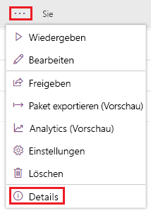
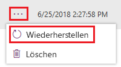

Microsoft PowerApps kann Ihnen helfen, wenn Sie versehentlich Änderungen an einer App gespeichert haben oder ein anderes Problem auftritt. Bei Apps, die Sie in der Cloud speichern, protokolliert PowerApps den Verlauf der Änderungen, die Sie vornehmen. Sie können jede gespeicherte Version anzeigen und bei Bedarf eine frühere Version der App wiederherstellen. Bei freigegebenen Apps erhalten auch die Personen, für die Sie die App freigegeben haben, die wiederhergestellte Version.

## Anzeigen von verschiedenen Versionen Ihrer App

1. Wählen Sie auf [web.powerapps.com](http://web.powerapps.com) am linken Rand die Option **Apps** aus.

1. Klicken Sie in der Liste der Apps auf die Auslassungspunkte (**...**) und dann auf **Details**.

    

1. Klicken Sie auf die Registerkarte **Versionen**.

    Die Registerkarte zeigt alle Versionen Ihrer App an, die Sie beim Entwickeln der App gespeichert haben.

## Wiederherstellen einer vorherigen Version

1. Klicken Sie auf eine der Schaltflächen mit Auslassungspunkten (**...**), und wählen Sie dann **Wiederherstellen** aus.

    

1. Klicken Sie erneut auf **Wiederherstellen**, um den Vorgang zu bestätigen.

    Der Liste wird eine neue Version hinzugefügt.

Wenn Sie eine App-Version wiederherstellen, erhält die zuletzt wiederhergestellte Version eine neue, inkrementierte Versionsnummer und wird oben in der Liste angezeigt. Eine neue Version überschreibt nie eine frühere Version.

Jetzt wissen Sie, wie Sie App-Versionen abrufen und bei Bedarf wiederherstellen können. In der nächsten Einheit erfahren Sie, wie Sie Ihre Apps freigeben können.