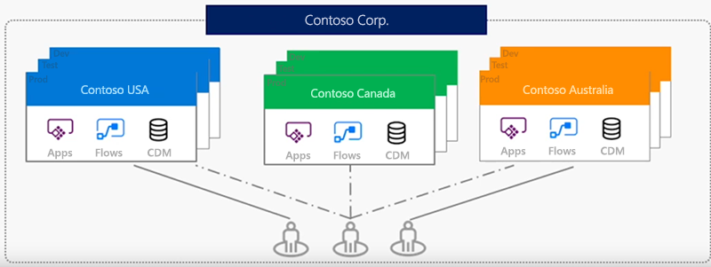
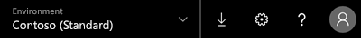

Eine Umgebung ist ein Container für Apps und andere Ressourcen wie Datenverbindungen und Flows aus Microsoft Flow.An environment is a container for apps and other resources, such as data connections and flows from Microsoft Flow. Sie stellt eine Möglichkeit dar, Elemente auf Grundlage Ihrer Geschäftsanforderungen zu gruppieren.It's a way to group things based on business requirements.

Wenn Sie dieses Modul bis hierhin gelesen haben, haben Sie bereits einige Zeit auf „web.powerapps.com“ gearbeitet.If you've followed along with this module so far, you've spent some time working in web.powerapps.com. Bewusst oder unbewusst haben Sie dabei die ganze Zeit in einer Umgebung gearbeitet.Whether you knew it or not, you've been working in a specific environment the whole time.

In der oberen rechten Ecke der Homepage von „web.powerapps.com“ können Sie sehen, in welcher Umgebung Sie sich aktuell befinden.In the upper-right corner of the web.powerapps.com home page, you can see your current environment.

Wenn Sie noch nicht viel mit Microsoft PowerApps gearbeitet haben, wird hier vermutlich nur die Standardumgebung angezeigt.If you're new to Microsoft PowerApps, you might have only the default environment at this point.

- Öffnen Sie das Menü, um zu sehen, ob andere Umgebungen verfügbar sind.Open the menu to see whether other environments are available.

## Vorteile von UmgebungenWhy use environments?
Es gibt verschiedene Gründe dafür, neben der Standardumgebung weitere Umgebungen zu erstellen:There are several reasons to create environments beyond the default one:

- **Trennen der App-Entwicklung nach Abteilungen**: In einem großen Unternehmen kann jede Abteilung in einer anderen Umgebung arbeiten.**Separate app development by department**: In a large organization, each department can work in a different environment. Auf diese Weise werden den Mitarbeitern in einer Abteilung nur die Apps und Unternehmensdaten angezeigt, die deren Anforderungen entsprechen.That way, department employees see only apps and company data that are appropriate to their needs.
- **Unterstützen von Application Lifecycle Management (ALM)**: Mit separaten Umgebungen können Sie Apps, die sich in den Entwicklungsphasen befinden, von denen trennen, die bereits freigegeben wurden.**Support application lifecycle management (ALM)**: Separate environments let you separate apps that are in development stages from those that have already been shared. Alternativ kann eine Testumgebung von Vorteil sein, damit Sie Feedback von Mitarbeitern erhalten können, bevor Sie die endgültige App bereitstellen.Or maybe you want a trial environment so that you can gain feedback from employees before rolling out the final app. Für einige Unternehmen kann das Anzeigen von Apps, bevor diese vollständig entwickelt und veröffentlicht wurden, zu Sicherheitsproblemen führen.For some organizations, showing apps before they're completely developed and published can present security concerns.
- **Verwalten des Zugriffs auf Daten**: Jede Umgebung kann über eine eigene Quelle von Unternehmensdaten verfügen, die als Common Data Service-Datenbank für Apps bezeichnet wird.**Manage data access**: Each environment can have its own source of business data, called a  database for Common Data Service for Apps. Andere Datenverbindungen sind spezifisch für eine Umgebung und können nicht umgebungsübergreifend freigegeben werden.Other data connections are specific to an environment and can't be shared across environments.

> [!NOTE]
> Beachten Sie, dass Umgebungen nur für App-Ersteller und PowerApps-Administratoren relevant sind.Keep in mind that environments are relevant only to app creators and PowerApps admins. Wenn Sie eine App für Benutzer freigeben, können diese Benutzer die App einfach ausführen, vorausgesetzt, sie verfügen über die erforderlichen Berechtigungen.When you share an app with users, those users just run the app, provided that they have the correct permissions. Sie müssen sich keine Gedanken darüber machen, aus welcher Umgebung die App stammt.They don't have to worry about what environment the app came from.

## Erstellen einer UmgebungCreate an environment

Nur Administratoren können Umgebungen erstellen.Only an admin can create environments. Wenn Sie kein Administrator sind, können diese Informationen trotzdem für Sie hilfreich sein, wenn Sie das Einrichten von Umgebungen mit Ihrem Administrator besprechen.If you aren't an admin, this information can still be helpful when you talk to your admin about setting up environments.

1. Klicken Sie auf der Homepage von „web.powerapps.com“ in der oberen rechten Ecke auf das Zahnradsymbol, und wählen Sie **Admin Center** aus.On the web.powerapps.com home page, select the gear icon near the upper-right corner, and then select **Admin center**.

    Sie können admin.powerapps.com auch direkt öffnen.You can also go directly to admin.powerapps.com.

2. Klicken Sie im PowerApps Admin Center auf **Neue Umgebung**.In the PowerApps admin center, select **New environment**. 
3. Geben Sie im Dialogfeld **Neue Umgebung** einen Namen für die Umgebung ein, und wählen Sie eine Region und einen Umgebungstyp aus.In the **New environment** dialog box, enter a name for the environment, and then select a region and an environment type.
4. Klicken Sie auf **Umgebung erstellen**.Select **Create environment**.

Das ist alles.That's it. Sie verfügen nun über eine neue Umgebung, in der Sie arbeiten können.You now have a new environment to work in. Wenn Sie zurück zu web.powerapps.com navigieren, wird sie in der Liste mit den Umgebungen angezeigt.If you go back to web.powerapps.com, you'll see it in the environments list.

## Verwalten des Zugriffs auf eine UmgebungManage access to an environment

Standardmäßig können Sie mit einer der folgenden Methoden auf eine Umgebung zugreifen:By default, you can access an environment in one of two ways:

- **Systemadministratoren**: Ein Systemadministrator verfügt über die vollständigen Berechtigungen zum Erstellen und Verwalten von Umgebungen.**System admin**: A system admin has full permissions to create and manage environments.
- **Umgebungsersteller**: Ein Umgebungsersteller kann alle Apps in dieser Umgebung anzeigen, Apps erstellen und mit Common Data Service für Apps arbeiten (hierfür sind weitere Berechtigungen erforderlich).**Environment maker**: An environment maker can see all apps in that environment, create apps, and work with Common Data Service for Apps (other permissions apply).

Administratoren können bei Bedarf weitere Sicherheitsrollen erstellen und diesen Benutzer zuweisen, wie in diesem Verfahren beschrieben.Admins can create other security roles as needed and, as this procedure describes, assign users to them.

1. Klicken Sie auf der linken Seite auf **Umgebungen**.Near the left edge, select **Environments**.
2. Wählen Sie eine Umgebung aus, und klicken Sie dann auf **Sicherheit für diese Instanz verwalten**.Select an environment, and then select **Manage security for this instance.**
3. Geben oder fügen Sie im Suchfeld rechts oben die E-Mail-Adresse der Person ein, der Sie Zugriff gewähren möchten.In the search box near the upper-right corner, type or paste the email address of the person to which you want to grant access.
4. Zeigen Sie auf das gewünschte Ergebnis, aktivieren Sie das entsprechende Kontrollkästchen, und wählen Sie dann **Rollen verwalten** aus.Hover over the result that you want, select its check box, and then select **Manage roles**.
5. Wählen Sie im Feld **Benutzerrollen verwalten** die Rollentypen für den Benutzer aus.In the **Manage User Roles** box, select the types of roles for the user. In diesem Beispiel wurde dem Benutzer die Rolle „Umgebungsersteller“ zugewiesen.In this example, the user has been assigned to the Environment Maker role.

    

6. Klicken Sie auf **OK**.Select **OK**.

In dieser Einheit wurde erläutert, welche Vorteile Umgebungen bieten, wie sie erstellt werden und wie der Zugriff auf sie gewährt wird.This unit explained what the benefits of environments are, how to create them, and how to grant access to them. Auch wenn Sie kein Administrator sind, können diese Informationen hilfreich sein.Even if you aren't an admin, it can be helpful to know how this works.